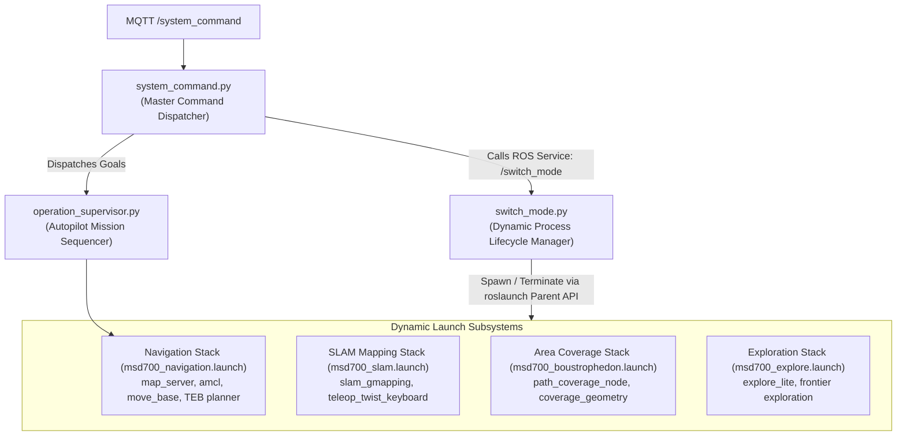
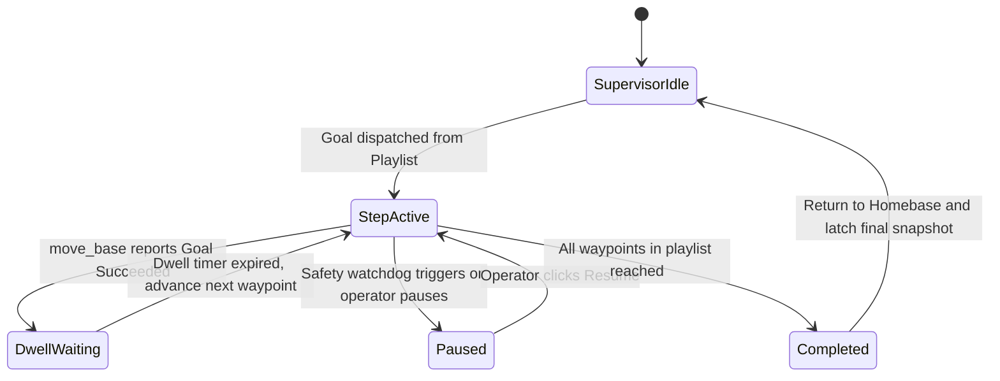

# 動的ノードとモード切り替えアーキテクチャ

<RoleBadge role="developer" />

このドキュメントでは、MSD700 ロボットが実行時にプライマリ ROS コアを再起動せずに `switch_mode.py`、`system_command.py`、`operation_supervisor.py` を使用して動作モード (`idle`、`navigation`、`mapping`、`coverage`、および `exploration`) を動的に切り替える方法について詳しく説明します。

## モード オーケストレーション トポロジ



---

## 動作モードとアクティブなノード スタック

|動作モード |アクティブな ROS ノード |非アクティブ/リープされたノード |メモリと CPU のフットプリント |
| --- | --- | --- | --- |
| **`idle`** | `roscore`、`serial_node`、`imu_filter`、`robot_state_publisher`、`aws_mqtt`、`camera_client`。 | `move_base`、`amcl`、`slam_gmapping`、`path_coverage_node`。 |最小 (約 5% CPU、200 MB RAM)。 |
| **`navigation`** |すべての `idle` ノード + `map_server`、`amcl`、`move_base`、`costmap_2d`。 | `slam_gmapping`、`explore_lite`。 |標準ナビゲーション (CPU 約 25%)。 |
| **`mapping`** |すべての `idle` ノード + `slam_gmapping`、`teleop`。 | `amcl`、`map_server` (代わりにライブマップを読み取ります)。 |中程度 (CPU の約 35%)。 |
| **`coverage`** |すべての `navigation` ノード + `path_coverage_node`。 | `explore_lite`。 |ミッション全体の負荷 (CPU の約 40%)。 |
| **`exploration`** |すべての `mapping` ノード + `explore_lite` フロンティア検索。 | `amcl`。 |高いアルゴリズム負荷 (CPU の約 45%)。 |

---

## `roslaunch` 親 API を介した動的プロセス ライフサイクル

`system("roslaunch ...")` のような切り離されたゾンビ プロセスを残すシェル コマンドを実行するのではなく、`switch_mode.py` はネイティブ Python `roslaunch.parent.ROSLaunchParent` API を利用します。

```python
import roslaunch
import rospy

class ModeSwitcher:
    def __init__(self):
        self.current_mode = "idle"
        self.active_launch_parent = None

    def transition_to(self, target_mode, launch_file_path):
        # 1. Gracefully terminate active launch stack
        if self.active_launch_parent is not None:
            rospy.loginfo(f"Stopping active stack for mode: {self.current_mode}")
            self.active_launch_parent.shutdown()
            self.active_launch_parent = None

        # 2. Instantiate and start new launch parent
        if target_mode != "idle":
            uuid = roslaunch.rlutil.get_or_generate_uuid(None, False)
            roslaunch.configure_logging(uuid)
            self.active_launch_parent = roslaunch.parent.ROSLaunchParent(
                uuid, [launch_file_path]
            )
            self.active_launch_parent.start()

        self.current_mode = target_mode
        rospy.loginfo(f"Successfully transitioned to mode: {target_mode}")
```

### 適切な撤去とゾンビの防止:
1. **SIGINT ディスパッチ**: `launch_parent.shutdown()` は、依存関係の逆順ですべての管理対象子プロセスに `SIGINT` を送信します。
2. **5 秒の猶予期間**: ノードにはディスク バッファをフラッシュするために最大 5 秒の時間が与えられます (例: `map_saver` `.pgm` および `.yaml` イメージを書き込む)。
3. **エスカレーション**: 猶予期間内にノードが正常に終了しない場合、親プロセスは `SIGTERM` および `SIGKILL` にエスカレートし、ROS マスター グラフにゾンビ ノードが残らないようにします。

---

## 自動操縦ミッション シーケンス (`operation_supervisor.py`)

`operation_supervisor.py` は、複数ステップのウェイポイント ルートとエリア カバレッジ プレイリストの自律実行を管理します。



### スーパーバイザーの主要な機能:
- **ラッチされた動作スナップショット**: ラッチされた QoS を使用して `/string/operation_snapshot` を公開します。オペレーターがブラウザー タブを開くと、アクティブなミッションの完全な状態 (アクティブなウェイポイント インデックス、残りのルート ピン、滞留タイマー) がミリ秒単位で回復されます。
- **オートパイロットの安全免除**: オートパイロットがオンに切り替わると、スーパーバイザーは 10 秒間のオペレーター切断一時停止を抑制し、長時間にわたる掃討ミッションを無人で続行できるようにします。

## 関連ドキュメント

- [ROS Package Registry](/ja/development/ros-packages): パッケージ構造と起動ファイル定義。
- [状態と動作](/ja/development/state-and-behavior): 有限ステート マシンとウォッチドッグ層の詳細。
- [メッセージ コントラクト](/ja/development/message-contracts): MQTT および操作同期メッセージ ペイロード。