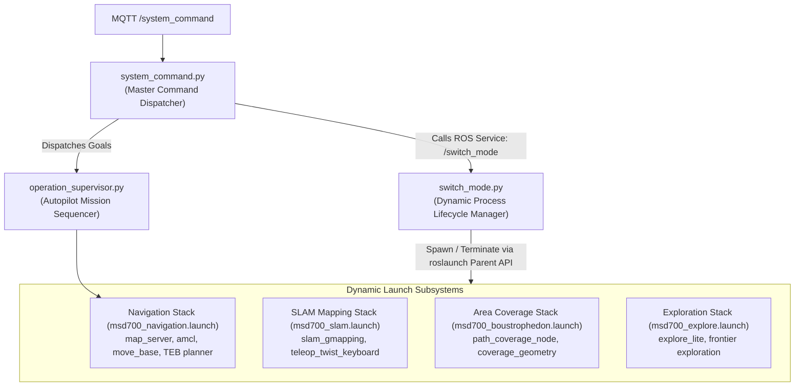
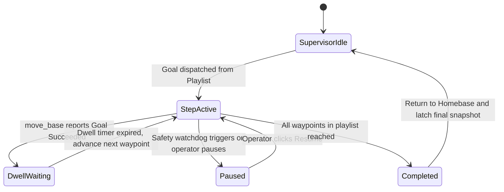

# Dynamic Node and Mode Switching Architecture

<RoleBadge role="developer" />

This document details how the MSD700 robot dynamically switches between operational modes (`idle`, `navigation`, `mapping`, `coverage`, and `exploration`) at runtime using `switch_mode.py`, `system_command.py`, and `operation_supervisor.py` without restarting the primary ROS core.

## Mode Orchestration Topology



---

## Operating Modes and Active Node Stacks

| Operational Mode | Active ROS Nodes | Inactive / Reaped Nodes | Memory & CPU Footprint |
| --- | --- | --- | --- |
| **`idle`** | `roscore`, `serial_node`, `imu_filter`, `robot_state_publisher`, `aws_mqtt`, `camera_client`. | `move_base`, `amcl`, `slam_gmapping`, `path_coverage_node`. | Minimal (approx. 5% CPU, 200 MB RAM). |
| **`navigation`** | All `idle` nodes + `map_server`, `amcl`, `move_base`, `costmap_2d`. | `slam_gmapping`, `explore_lite`. | Standard Navigation (approx. 25% CPU). |
| **`mapping`** | All `idle` nodes + `slam_gmapping`, `teleop`. | `amcl`, `map_server` (reads live map instead). | Moderate (approx. 35% CPU). |
| **`coverage`** | All `navigation` nodes + `path_coverage_node`. | `explore_lite`. | Full Mission Load (approx. 40% CPU). |
| **`exploration`** | All `mapping` nodes + `explore_lite` frontier search. | `amcl`. | High Algorithmic Load (approx. 45% CPU). |

---

## Dynamic Process Lifecycle via `roslaunch` Parent API

Rather than executing shell commands like `system("roslaunch ...")` which leave detached zombie processes, `switch_mode.py` utilizes the native Python `roslaunch.parent.ROSLaunchParent` API:

```python
import roslaunch
import rospy

class ModeSwitcher:
    def __init__(self):
        self.current_mode = "idle"
        self.active_launch_parent = None

    def transition_to(self, target_mode, launch_file_path):
        # 1. Gracefully terminate active launch stack
        if self.active_launch_parent is not None:
            rospy.loginfo(f"Stopping active stack for mode: {self.current_mode}")
            self.active_launch_parent.shutdown()
            self.active_launch_parent = None

        # 2. Instantiate and start new launch parent
        if target_mode != "idle":
            uuid = roslaunch.rlutil.get_or_generate_uuid(None, False)
            roslaunch.configure_logging(uuid)
            self.active_launch_parent = roslaunch.parent.ROSLaunchParent(
                uuid, [launch_file_path]
            )
            self.active_launch_parent.start()

        self.current_mode = target_mode
        rospy.loginfo(f"Successfully transitioned to mode: {target_mode}")
```

### Graceful Teardown and Zombie Prevention:
1. **SIGINT Dispatch**: `launch_parent.shutdown()` sends `SIGINT` to all managed child processes in reverse dependency order.
2. **5-Second Grace Window**: Nodes are granted up to 5 seconds to flush disk buffers (e.g. `map_saver` writing `.pgm` and `.yaml` images).
3. **Escalation**: If a node fails to exit cleanly within the grace period, the parent process escalates to `SIGTERM` and `SIGKILL`, ensuring zero zombie nodes remain on the ROS master graph.

---

## Autopilot Mission Sequencing (`operation_supervisor.py`)

`operation_supervisor.py` manages autonomous execution of multi-step waypoint routes and area coverage playlists:



### Key Supervisor Capabilities:
- **Latched Operation Snapshot**: Publishes `/string/operation_snapshot` with latched QoS. When any operator opens a browser tab, the full state of the active mission (active waypoint index, remaining route pins, dwell timer) is recovered in milliseconds.
- **Autopilot Safety Exemption**: When Autopilot is toggled ON, the supervisor suppresses the 10-second operator disconnect pause, allowing long-running sweeping missions to proceed unattended.

## Related Documentation

- [ROS Package Registry](/ja/development/ros-packages): Package structures and launch file definitions.
- [State and Behavior](/ja/development/state-and-behavior): Detailed finite state machines and watchdog tiers.
- [Message Contracts](/ja/development/message-contracts): MQTT and operation sync message payloads.
