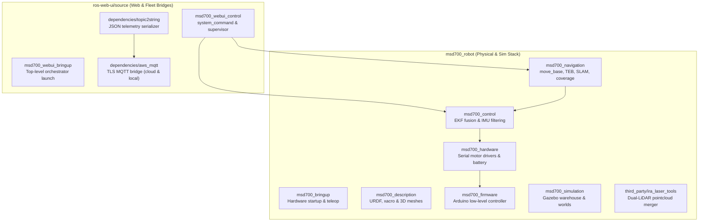

# ROS パッケージレジストリ

<RoleBadge role="developer" />

このドキュメントは、`msd700_robot` および `ros-web-ui/source` にわたる MSD700 ワークスペース内のすべての ROS 1 Noetic パッケージの包括的なレジストリを提供し、パッケージの役割、主要な起動ファイル、アクティブなノード、公開/サブスクライブされたトピック、パラメーターを詳しく説明します。

## ワークスペースパッケージのレイアウト

## パッケージ ディレクトリ: `msd700_robot`

### 1. `msd700_navigation`
コアとなる自律移動、SLAM マッピング、およびエリア カバレッジ パッケージ。

- **プライマリ ノード**:
  - `move_base`: グローバル パス プランニングに `navfn/NavfnROS` を、軌道最適化に `teb_local_planner/TebLocalPlannerROS` を利用する標準 ROS ナビゲーション アクション サーバー。
  - `path_coverage_node.py`: `libs/coverage_geometry.py` を使用して曲がりくねった経路を計算し、リアルタイムの障害物の再計画を処理するブーストロフェドン スイープ プランナー。
  - `slam_gmapping`: 占有グリッドを生成する 2D レーザーベースの SLAM マッピング ノード。
  - `amcl`: 静的マップの位置特定のための適応型モンテカルロ位置特定粒子フィルター。
- **主要な起動ファイル**:
  - `msd700_navigation.launch`: マップ サーバー、AMCL、move_base を使用したフル ナビゲーションの起動。
  - `msd700_boustrophedon.launch`: `path_coverage_node` によるエリア カバレッジ実行スタック。
  - `msd700_slam.launch`: 遠隔操作による Gmapping SLAM の起動。
  - `msd700_explore.launch`: 自律的な SLAM フロンティア探索 (`explore_lite`)。

### 2. `msd700_control`
状態推定、座標変換階層、センサー フュージョンを管理します。

- **プライマリ ノード**:
  - `ekf_localization_node` (`robot_localization`): ホイール エンコーダー オドメトリ (`/wheel/odom`) と IMU センサー データ (`/imu/data`) を安定した `/odometry/filtered` トピックに融合した拡張カルマン フィルター。
  - `imu_filter_node` (`imu_tools`): 生の角速度と加速度を方位四元数に変換する Madgwick AHRS センサー フィルター。
- **主要な起動ファイル**:
  - `robot_localization.launch`: `ekf_localization_config.yaml` からパラメータをロードして EKF fusion を設定および起動します。
  - `imu_filter.launch`: Madgwick 方位推定を開始します。

### 3. `msd700_description`
URDF と Xacro を使用して、物理的な運動学的構造、衝突ジオメトリ、センサーの配置を定義します。

- **主要な URDF モデル**:
  - `urdf/msd700_field.urdf.xacro`: 実物大の生産ロボット モデル (0.90 x 0.70 m、4 つのキャスター、中心駆動軸、ベロダイン マスト)。
  - `urdf/velodyne/VLP_16.urdf.xacro`: 高忠実度の 16 チャンネル 3D LiDAR モデルと Gazebo センサー プラグイン。
  - `urdf/turtlebot3_waffle.urdf.xacro`: レガシーの小型試作モデル。

### 4. `msd700_hardware` および `msd700_firmware`
低レベルのハードウェア インターフェイス、モーターの作動、エンコーダーのパルスカウント、およびバッテリーの状態を処理します。

- **ハードウェア アーキテクチャ**:
  - `serial_launch.launch`: ホストのシリアル ポートを、`/dev/ttyUSB*` を介して 115200 ボーで低レベルの Arduino/Teensy マイクロコントローラーに接続します。
  - Arduino ファームウェアは、閉ループ PID 速度制御を実行し、`/cmd_vel` 速度コマンドをリッスンし、ホイール エンコーダーのティック カウントを発行します。

### 5. `msd700_simulation`
ソフトウェアでナビゲーション アルゴリズムをテストするための Gazebo シミュレーション環境。

- **主要な環境**:
  - `msd700_warehouse_nav.launch`: 実物大の `msd700_field` ロボット モデルを備えた 14 x 21 m の AWS RoboMaker Small Warehouse を発売します。
  - `scripts/fetch_sim_worlds.sh`: GitHub `ros1` ブランチからの 3D シミュレーション メッシュ (12 MB) 用のオンデマンド ダウンローダー。

### 6. `third_party/ira_laser_tools`
複数の 2D LiDAR スキャナを結合するか、3D 点群を仮想平面スキャンに変換します。

- **ノード**:
  - `laserscan_multi_merger`: デュアル プラナー LiDAR を単一の 360 度 `/scan` トピックに結合します。

## パッケージ ディレクトリ: `ros-web-ui/source`

### 1. `msd700_webui_control`
Web コマンドとダッシュボード テレメトリを物理的なロボット ハードウェアにブリッジします。

- **主要ノード**:
  - `system_command.py`: MQTT `/system_command` をサブスクライブし、排他的オペレーティング リースを管理し、アクションをディスパッチし、`/system_feedback` を公開します。
  - `operation_supervisor.py`: オートパイロットのウェイポイントの進行を管理し、`/string/operation_snapshot` をラッチする自律ミッション シーケンサー。
  - `switch_mode.py`: ROS サービス オーケストレーターは、`idle`、`navigation`、および `mapping` モード起動スタックを動的に切り替えます。
  - `hardware_monitor.py`: 重要なセンサー プロセスと USB デバイスが正常に維持されていることを確認するバックグラウンド ウォッチドッグ。

### 2. `dependencies/topic2string`
重い ROS メッセージ タイプを JSON 文字列に変換する高性能シリアル化レイヤー。

- **主要ノード**:
  - `robotpose_from_string.py` / `robotpose_to_string`: 25 Hz ポーズ テレメトリ シリアライザー。
  - `laserscan_to_string.py`: 2 Hz 圧縮レーザー スキャン シリアライザー。
  - `map_compression_node` / `map_decompression_node`: ライブ SLAM 占有グリッド用の Base64 zlib 圧縮。

### 3. `dependencies/aws_mqtt`
ローカル ROS トピックを中央の HiveMQ ブローカーにリンクする暗号化されたトランスポート ブリッジ。

- **ファイルの起動**:
  - `nakayama_msd.launch`: オンボード ROS トピックをポート 8883 (TLS) 上のクラウド HiveMQ に接続するロボット側のブリッジ。
  - `nakayama_cloud.launch`: MQTT トピックをユニットごとのクラウド ROS トピックに変換するサーバー側ブリッジ。
  - `local_msd.launch`: ローカル Mosquitto ブローカー (`127.0.0.1:1883`) に接続するユニット側ブリッジ。

## 関連ドキュメント

- [アーキテクチャ](/ja/development/architecture): 高レベルのシステム構造と継ぎ目。
- [センサー フュージョンとコントロール](/ja/development/sensor-fusion-and-control): EKF とセンサー パイプラインの詳細なセットアップ。
- [状態と動作](/ja/development/state-and-behavior): すべての制御ノードの詳細なステート マシン。