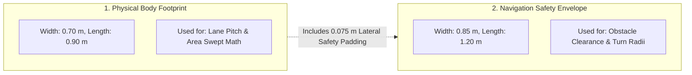
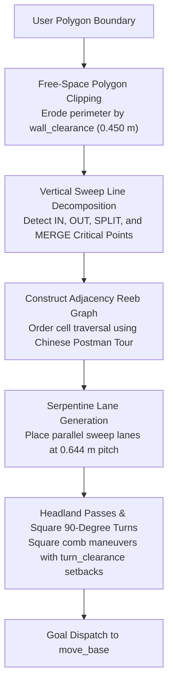
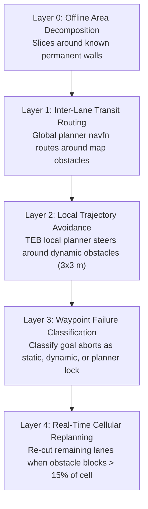
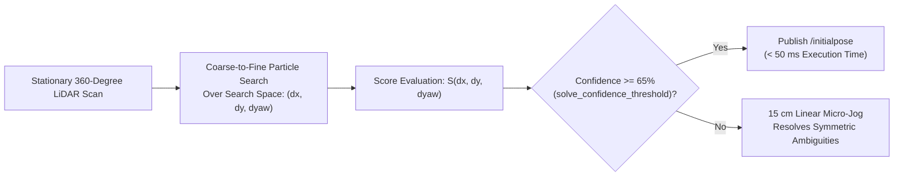

# ブストロフェドン網羅走行 & ゼロスピンアライメントアーキテクチャ

<RoleBadge role="developer" />

本ドキュメントは、ブストロフェドンセル分解による網羅走行計画パイプライン、2種類のジオメトリによるクリアランス計算、5層の障害物管理、およびパーティクルアライン検証によるゼロスピンアライメントについての包括的なアルゴリズム仕様を提供する。

## 2つのロボットジオメトリ

MSD700の網羅走行計画における基本的な設計原則は、**ロボットが異なる計算に使用される2つの異なる幾何学的寸法を持つ**という点である:

| ジオメトリ定義 | サイズ寸法 | アルゴリズム上の用途 |
| --- | --- | --- |
| **Physical Body**(`~body_footprint`) | 長さ0.90 m x 幅0.70 m | レーンピッチと走査済みエリアのattainment計算を決定する。 |
| **Costmap Safety Envelope** | 長さ1.20 m x 幅0.85 m | TEBローカルプランナーのクリアランスと旋回可能性を担保する。 |

エンベロープとボディは`costmap_common_params_field.yaml`と`msd700_coverage/config/robot/field.yaml`に存在する。`path_coverage_node`は`/move_base/global_costmap/footprint`からフットプリント多角形を読み取り、そこから内接/外接半径を導出する(`coverage_geometry.py`)。レーンピッチは常に物理ボディ由来であり、パディング済みエンベロープ由来ではない。

### 派生クリアランス定数(`src/msd700_coverage/coverage_geometry.py`)

TEB起動時(`min_obstacle_dist 0.10`、`safety_margin 0.0`):

| クリアランス定数 | 値 | 数式 |
| --- | --- | --- |
| `wall_clearance` | **0.450 m** | $r_{\text{inscribed}} (0.350\text{ m}) + d_{\min} (0.10\text{ m})$ |
| `turn_clearance` | **0.670 m** | $r_{\text{circumscribed}} (0.570\text{ m}) + d_{\min} (0.10\text{ m})$ |
| `pitch` | **0.644 m** | $w_{\text{body}} (0.70\text{ m}) \times (1 - \text{overlap} (0.08))$ |

TEBなし(フォールバック`min_obstacle_dist 0.15`): `wall_clearance 0.500 m`、`turn_clearance 0.720 m`。

### 物理的なジオメトリ上の限界(TEB起動時):
- **ロボットが進入できる最も狭い通路**: **0.90 m**($2 \times \text{wall\_clearance}$)。
- **ロボットが180度旋回できる最も狭い通路**: **1.34 m**($2 \times \text{turn\_clearance}$)。
- **壁沿いの到達不能な境界ストリップ**: **0.10 m**($\text{wall\_clearance} - \frac{w_{\text{body}}}{2}$)。

::: info Attainmentと生の網羅率
0.10 mの周辺ストリップは衝突なしには通過できないため、長方形の部屋(例: 3 x 6 m)が達成できる理論上の最大網羅率は約**90%**となる。システム性能は、調整前の生の面積割合ではなく、**Attainment Ratio**(実際に走査された到達可能な床面の割合)によって測定される。
:::

---

## ブストロフェドンセル分解アルゴリズム

網羅走行プランナーは、内部に障害物を含む任意の凹多角形境界を、凸かつ障害物のないサブセルへと分解する:

### クリティカルポイントの分類:
$x$軸に沿った垂直スイープラインの進行中、境界頂点は自由空間の局所的な連結性に基づいて分類される:
1. **INクリティカルポイント**: 自由空間が拡大することで新しいセルが開く。
2. **OUTクリティカルポイント**: 境界が収束することでセルが終端する。
3. **SPLITクリティカルポイント**: 内部の障害物がアクティブなセルを2つの異なる平行サブセルに分割する。
4. **MERGEクリティカルポイント**: 障害物の後端を過ぎたところで2つの平行サブセルが再合流する。

---

## 5層の障害物管理

---

## ゼロスピン方位アライメント(パーティクルアライン検証)

ロボットが既知のマップ上の未知の姿勢に置かれた場合、従来のAMCLではパーティクルの分散を収束させるために360度のその場回転が必要となる。

MSD700は、動くことなく方位と位置を瞬時に計算する**粗密パーティクル探索**(`particle_align_validator.py`)を実装している。ダッシュボードは`/align/solve_pose`サービス経由でそれを起動する(Map SyncのAuto Alignボタン、`align_checker`経由):

### 数式による定式化:
$N$個のレーザースキャン点$\mathbf{p}_i = [x_i, y_i]^T$と静的occupancy grid地図$M(x, y)$が与えられたとき、スキャンマッチャーは相関スコアを最大化する剛体変換$(\Delta x, \Delta y, \Delta \theta)$を求める:

$$S(\Delta x, \Delta y, \Delta \theta) = \sum_{i=1}^N M\left( \mathbf{R}(\Delta \theta) \mathbf{p}_i + \begin{bmatrix} \Delta x \\ \Delta y \end{bmatrix} \right)$$

ここで$\mathbf{R}(\Delta \theta)$は2D回転行列である:
$$\mathbf{R}(\Delta \theta) = \begin{bmatrix} \cos(\Delta \theta) & -\sin(\Delta \theta) \\ \sin(\Delta \theta) & \cos(\Delta \theta) \end{bmatrix}$$

マッチスコアの信頼度が$65\%$を超えると、推定された姿勢が`/initialpose`にパブリッシュされ、回転動作ゼロで$50\text{ ms}$未満でロボットの位置推定が完了する。

---

## その場回転: ガードは撤去済み、発生源で修正

ゼロスピンアライメントは回転する*理由*を取り除いた。かつては自律的なその場回転をゼロ化する`rotation_guard`ノードが`twist_mux`とベースの間に存在したが、**削除済み**である(`twist_mux.launch`に撤去の記録がある)。それが捕捉するために存在した各スピンは、今ではそれぞれの発生源で止められており、ガードは旋回失敗の原因ではなかったことが測定されている。

### 発生源で無効化されたもの

| 発生源 | 以前 | 現在 |
| --- | --- | --- |
| `rotate_recovery` | move_baseのリカバリーラダーの最後の段 | ロードされない。`recovery_behaviors`には2つのコストマップリセットのみが記載され、いずれも動作を指示しない |
| TEB終端ピボット | 各ウェイポイントでゴールの方位に向かって回転していた | 厳密化。`yaw_goal_tolerance: 0.15`(網羅走行時: `0.10`) — ウェイポイントがクリックドラッグによる実方位を持つようになったため、ピボットはオペレーターが選んだ方位に着地する |
| TEB初期ピボット | パスがロボットの後方に向かう場合にその場で回転していた | 代わりにバックする。`allow_init_with_backwards_motion: false` |
| `SYNC`コマンド(`nav_controller`) | 障害物チェックなしの10秒間のオープンループ`0.5 rad/s` | 何もしない。先にスキャンマッチングを行うAuto Alignを使用する |

動作の調停は今では`twist_mux`単独にある。ナビゲーションは`/mux/nav_vel`(優先度10)、キーボードは独自の入力(優先度90)、緊急停止は`/mux/emergency_vel`を占有する(優先度255)。`/cmd_vel`へ直接書き込むノードはこのラダーを迂回し、停止させることができない。

## 関連ドキュメント

- [シミュレーション (Gazebo)](/ja/development/ros/simulation): 倉庫テスト環境とスケールモデル。
- [Message Contracts](/ja/development/message-contracts): 網羅走行コマンドのエンベロープとACKプロトコル。
- [State and Behavior](/ja/development/state-and-behavior): ナビゲーションと網羅走行の有限状態機械。
