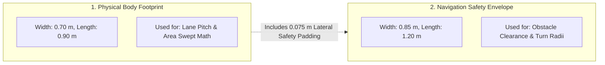
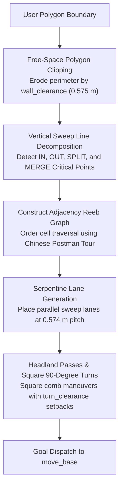
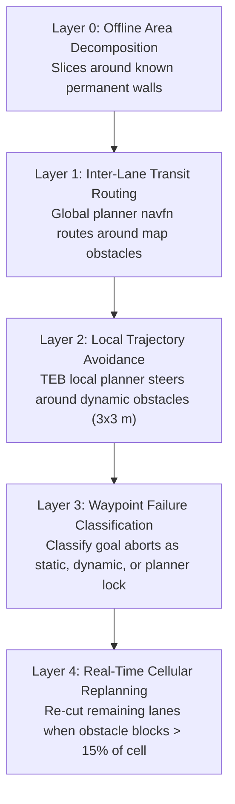
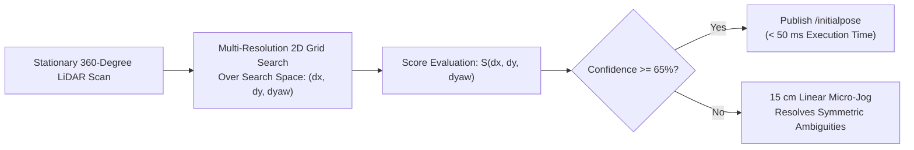
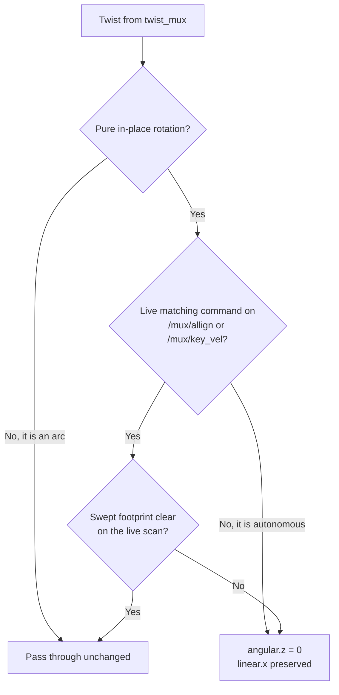

# ブストロフェドン網羅走行 & ゼロスピンアライメントアーキテクチャ

<RoleBadge role="developer" />

本ドキュメントは、ブストロフェドンセル分解による網羅走行計画パイプライン、2種類のジオメトリによるクリアランス計算、5層の障害物管理、およびCorrelative Scan Matcher(CSM)によるゼロスピンアライメントについての包括的なアルゴリズム仕様を提供する。

## 2つのロボットジオメトリ

MSD700の網羅走行計画における基本的な設計原則は、**ロボットが異なる計算に使用される2つの異なる幾何学的寸法を持つ**という点である:

| ジオメトリ定義 | サイズ寸法 | アルゴリズム上の用途 |
| --- | --- | --- |
| **Physical Body**(`~body_footprint`) | 長さ0.90 m x 幅0.70 m | レーンピッチと走査済みエリアのattainment計算を決定する。 |
| **Costmap Safety Envelope** | 長さ1.20 m x 幅0.85 m | TEBローカルプランナーのクリアランスと旋回可能性を担保する。 |

`costmap_common_params.yaml`内のコストマップエンベロープには、意図的な安全パディング(片側あたり横方向0.075 m、縦方向0.150 m)が含まれる。`path_coverage_node`はナビゲーションプランナーとの同期を保つため、`/move_base/global_costmap/footprint`からエンベロープを直接読み取る。

### 派生クリアランス定数(`libs/coverage_geometry.py`)

| クリアランス定数 | 値 | 数式 |
| --- | --- | --- |
| `wall_clearance` | **0.575 m** | $r_{\text{inscribed}} (0.425\text{ m}) + d_{\min} (0.150\text{ m})$ |
| `turn_clearance` | **0.885 m** | $r_{\text{circumscribed}} (0.735\text{ m}) + d_{\min} (0.150\text{ m})$ |
| `pitch` | **0.574 m** | $w_{\text{body}} (0.70\text{ m}) \times (1 - \text{overlap} (0.18))$ |

### 物理的なジオメトリ上の限界:
- **ロボットが進入できる最も狭い通路**: **1.15 m**($2 \times \text{wall\_clearance}$)。
- **ロボットが180度旋回できる最も狭い通路**: **1.77 m**($2 \times \text{turn\_clearance}$)。
- **2レーン走査する価値のある最も狭い通路**: **1.72 m**。
- **壁沿いの到達不能な境界ストリップ**: **0.225 m**($\text{wall\_clearance} - \frac{w_{\text{body}}}{2}$)。

::: info Attainmentと生の網羅率
0.225 mの周辺ストリップは衝突なしには通過できないため、長方形の部屋(例: 3 x 6 m)が達成できる理論上の最大網羅率は**78.6%**となる。システム性能は、調整前の生の面積割合ではなく、**Attainment Ratio**(実際に走査された到達可能な床面の割合)によって測定される。
:::

---

## ブストロフェドンセル分解アルゴリズム

網羅走行プランナーは、内部に障害物を含む任意の凹多角形境界を、凸かつ障害物のないサブセルへと分解する:

### クリティカルポイントの分類:
$x$軸に沿った垂直スイープラインの進行中、境界頂点は自由空間の局所的な連結性に基づいて分類される:
1. **INクリティカルポイント**: 自由空間が拡大することで新しいセルが開く。
2. **OUTクリティカルポイント**: 境界が収束することでセルが終端する。
3. **SPLITクリティカルポイント**: 内部の障害物がアクティブなセルを2つの異なる平行サブセルに分割する。
4. **MERGEクリティカルポイント**: 障害物の後端を過ぎたところで2つの平行サブセルが再合流する。

---

## 5層の障害物管理

---

## ゼロスピン方位アライメント(Correlative Scan Matching)

ロボットが既知のマップ上の未知の姿勢に置かれた場合、従来のAMCLではパーティクルの分散を収束させるために360度のその場回転が必要となる。

MSD700は、動くことなく方位と位置を瞬時に計算する**Correlative Scan Matching(CSM)**を実装している:

### 数式による定式化:
$N$個のレーザースキャン点$\mathbf{p}_i = [x_i, y_i]^T$と静的occupancy grid地図$M(x, y)$が与えられたとき、スキャンマッチャーは相関スコアを最大化する剛体変換$(\Delta x, \Delta y, \Delta \theta)$を求める:

$$S(\Delta x, \Delta y, \Delta \theta) = \sum_{i=1}^N M\left( \mathbf{R}(\Delta \theta) \mathbf{p}_i + \begin{bmatrix} \Delta x \\ \Delta y \end{bmatrix} \right)$$

ここで$\mathbf{R}(\Delta \theta)$は2D回転行列である:
$$\mathbf{R}(\Delta \theta) = \begin{bmatrix} \cos(\Delta \theta) & -\sin(\Delta \theta) \\ \sin(\Delta \theta) & \cos(\Delta \theta) \end{bmatrix}$$

マッチスコアの信頼度が$65\%$を超えると、推定された姿勢が`/initialpose`にパブリッシュされ、回転動作ゼロで$50\text{ ms}$未満でロボットの位置推定が完了する。

---

## その場回転はデフォルトで拒否される

ゼロスピンアライメントは回転する*理由*を取り除いた。Rotation Guardは回転する*能力*を取り除く。なぜなら、スタックの複数の箇所がいまだに独自にスピンしようとしていたためである。

`rotation_guard`(`msd700_control`)は、`twist_mux`とベースの間、共有される`cmd_vel`経路上に配置される。そのため、プラグインごとに1つずつではなく、すべての回転要求元を一度にカバーする。あるコマンドが`|angular.z| > 0.05`かつ`|linear.x| <= 0.05`を満たす場合、その場回転とみなされる。円弧運動や直進運動はフットプリントを平行移動させつつ回転もさせており、その扱いはすでにローカルプランナーの領分であるため、変更されずに通過する。

その場回転が車輪に到達するのは、**両方の**ゲートが合意した場合のみである:

**ゲート1、同意。** 尊重される回転は、人間が要求したものだけである: Map Syncの**Auto Align**(`/mux/allign`、オペレーターがボタンを押した後に`align_checker`がパブリッシュ)と、**手動WASD**(`/mux/key_vel`、ローカルで入力されるか、ダッシュボードからリレーされる)。出力されるツイストは、その要求元が求めたのと同じ方向に、5%の許容誤差の範囲内でそれ以上速くなく回転しなければならず、同意はその要求元がパブリッシュを止めてから1秒後に失効する。`/mux/nav_vel`は意図的に対象外である。自律的なものはすべてそこに到達する。

**ゲート2、ジオメトリ。** 走査されるフットプリントは、コストマップではなくライブスキャンに対して検証される。このゲートは`rotation_guard.py`内で完全に文書化されている。要約すると、走査帯がLiDARの最小レンジの内側にあり、ロボットが近づくにつれてobstacle layerがその跡をレイトレースで消してしまうため、コストマップは回転判定のオラクルとして不適切ということである。

### これによって無効化されたもの

| 発生源 | 以前 | 現在 |
| --- | --- | --- |
| `rotate_recovery` | move_baseのリカバリーラダーの最後の段 | ロードされない。`recovery_behaviors`には2つのコストマップリセットのみが記載され、いずれも動作を指示しない |
| TEB終端ピボット | 各ウェイポイントでゴールの方位に向かって回転していた | 廃止。`yaw_goal_tolerance: 3.15`は任意の最終方位を受け入れる |
| TEB初期ピボット | パスがロボットの後方に向かう場合にその場で回転していた | 代わりにバックする。`allow_init_with_backwards_motion: true` |
| `SYNC`コマンド(`nav_controller`) | 障害物チェックなしの10秒間のオープンループ`0.5 rad/s` | 何もしない。先にスキャンマッチングを行うAuto Alignを使用する |

::: warning ウェイポイントの方位
`yaw_goal_tolerance: 3.15`が正しいのは、このシステム内のどのウェイポイントも誰かが選んだ方位を持たない限りにおいてである。ダッシュボードはすべてのピンを地図上のクリックから構築し、クォータニオンには単位元を入れる。そのため、厳しい許容誤差は、実際には未設定の構造体フィールドを満たすためだけに各ピンでのピボットを引き起こしていた。もしウェイポイントが実際の方位を持つようになれば、これは再検討する必要があり、その際は各ピンでのピボットも復活する。
:::

### 抜け道

- `rotation_guard/allow_in_place: true`は、ジオメトリゲートのみに戻す。これにより、走査帯が空いている限りどの発生源もスピンできるようになる。
- `twist_mux.launch guard_rotation:=false`はノード自体を完全に取り除き、いかなるチェックもないguard導入前の配線に戻す。

どちらもフィールドロボットには適さない。進む前にピボットが必要だと判断するローカルプランナーは、今ではその場に静止し、最終的にゴールを中断する。そしてそのトレードオフは意図的なものである。中断されたゴールは目に見えて回復可能だが、棚への盲目的なスピンはそうではない。

## 関連ドキュメント

- [シミュレーション (Gazebo)](/ja/development/ros/simulation): 倉庫テスト環境とスケールモデル。
- [Message Contracts](/ja/development/message-contracts): 網羅走行コマンドのエンベロープとACKプロトコル。
- [State and Behavior](/ja/development/state-and-behavior): ナビゲーションと網羅走行の有限状態機械。
