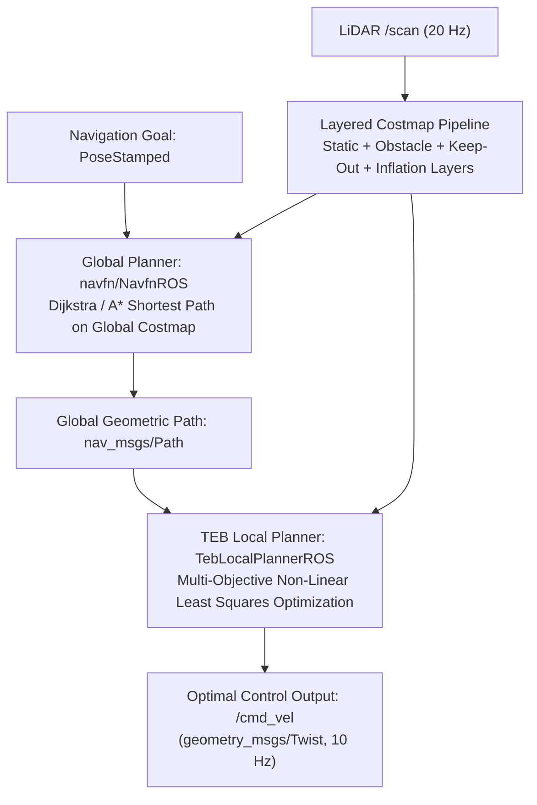

# コストマップとモーションプランナー

<RoleBadge role="developer" />

本ドキュメントは、MSD700ナビゲーションスタックに実装されているレイヤー化コストマップアーキテクチャ、グローバル経路計画アルゴリズム(`navfn`)、およびローカル軌道最適化の仕組み(`teb_local_planner`)を詳述する。

## モーションプランニングパイプライン



---

## レイヤー化コストマップアーキテクチャ

環境は、各セルが$0$(自由空間)から$254$(致死的な障害物)までのコスト値を保持する2D occupancy gridとして表現される。

### コスト計算と指数関数的インフレーション減衰

障害物セルが位置$\mathbf{p}_{obs}$で検出されると、距離$d = \|\mathbf{p} - \mathbf{p}_{obs}\|$にある近傍セルのコストは、インフレーションレイヤーによって以下のように計算される:

$$\text{Cost}(d) = \begin{cases}
254 & \text{if } d \le r_{\text{inscribed}} \quad (\text{Lethal Obstacle Buffer}) \\
\text{round}\left( 253 \cdot \exp\left(-\alpha \cdot (d - r_{\text{inscribed}})\right) \right) & \text{if } r_{\text{inscribed}} < d \le r_{\text{inflation}} \\
0 & \text{if } d > r_{\text{inflation}} \quad (\text{Free Space})
\end{cases}$$

### 設定されているインフレーションパラメータ:
- **内接半径($r_{\text{inscribed}}$)**: $0.35\text{ m}$(プランニングフットプリント`0.90 x 0.70 m`の幅の半分)。
- **インフレーション半径($r_{\text{inflation}}$)**: $0.25\text{ m}$(2026-09-11に$0.70\text{ m}$から引き下げ)。
- **コストスケーリング係数($\alpha$)**: $4.0$。

::: warning 勾配帯は現在空である
$r_{\text{inflation}} < r_{\text{inscribed}}$であるため、上記の区分コスト関数の中間ケースは
決して適用されない。インフレーションされるすべてのセルは内接半径の内側にあり、フラットな$253$を取り、
$0.25\text{ m}$を超えてインフレーションされるセルは存在しない。結果として、減衰の尾を持たない硬い$0.25\text{ m}$の
カラーができあがるが、そのカラーはロボットが実際に占める半幅よりも狭い。そのためnavfnは、
壁が許容できない中心線ルートを生成してしまい、TEBはそこから逸脱せざるを得ない(`inflation_dist` $0.75$、
`weight_inflation` $5.0$、そしてフットプリントチェックが、実際に機体を壁から離しているものである)。
実質的な勾配を取り戻すには、$0.35\text{ m}$を上回る値が必要になる。
:::

```yaml
# config/costmap/costmap_common_params.yaml
footprint: [[-0.45, -0.35], [0.45, -0.35], [0.45, 0.35], [-0.45, 0.35]]
footprint_padding: 0.01

obstacle_layer:
  enabled: true
  max_obstacle_height: 2.0
  min_obstacle_height: 0.0
  obstacle_range: 5.5
  raytrace_range: 6.0
  observation_sources: laser_scan_sensor
  laser_scan_sensor:
    sensor_frame: base_scan
    data_type: LaserScan
    topic: /scan
    marking: true
    clearing: true

inflation_layer:
  enabled: true
  inflation_radius: 0.25
  cost_scaling_factor: 4.0
```

---

## Timed-Elastic-Band (TEB) 軌道最適化

`teb_local_planner`は、ロボット状態のシーケンス$\mathbf{s}_k = [x_k, y_k, \theta_k]^T$と時間差$\Delta T_k$に対する非線形多目的最適化問題として軌道生成を定式化する:

$$\mathcal{B} = \left\{ \mathbf{s}_0, \Delta T_0, \mathbf{s}_1, \Delta T_1, \dots, \mathbf{s}_N \right\}$$

### 目的関数:
プランナーは目的ペナルティ関数の重み付き和を最小化する:

$$V(\mathcal{B}) = \sum_k \left( \gamma_{\text{time}} \cdot \Delta T_k^2 + \gamma_{\text{path}} \cdot \|\mathbf{s}_{k+1} - \mathbf{s}_k\|^2 + \gamma_{\text{obs}} \cdot f_{\text{obs}}(\mathbf{s}_k) + \gamma_{\text{kin}} \cdot f_{\text{kin}}(\mathbf{s}_k, \mathbf{s}_{k+1}) \right)$$

### 主要なペナルティ関数:
1. **時間最適性ペナルティ**:
   $$f_{\text{time}}(\Delta T_k) = \Delta T_k^2$$
   速度制限内($v_{\max} = 0.40\text{ m/s}$、$\omega_{\max} = 1.0\text{ rad/s}$)で最短時間でゴールに到達することを促す。

2. **障害物クリアランスペナルティ**:
   $$f_{\text{obs}}(\mathbf{s}_k) = \begin{cases}
   \left( d_{\min} - \text{dist}(\mathbf{s}_k, \mathcal{O}) \right)^2 & \text{if } \text{dist}(\mathbf{s}_k, \mathcal{O}) < d_{\min} \\
   0 & \text{otherwise}
   \end{cases}$$
   $d_{\min} = 0.150\text{ m}$は最小障害物クリアランス距離である。

3. **非ホロノミック運動学制約**:
   差動駆動のキネマティクスを満たすため、横滑り速度にペナルティを課す:
   $$\dot{y}_k \cdot \cos(\theta_k) - \dot{x}_k \cdot \sin(\theta_k) = 0$$

---

## 進入禁止ゾーンとDynamic Reconfigure

1. **進入禁止グリッドレイヤー(`keepout_layer`)**: `/msd700/keepout_grid`をサブスクライブし、オペレーターが指定したカスタムポリゴンをコスト$254$のセルにラスタライズすることで、グローバル/ローカルプランナーが除外ゾーンを横断する軌道を生成しないようにする。
2. **網羅走行モードへの適応**: ブストロフェドン走行のパスの間、`path_coverage_node`は`dynamic_reconfigure`経由で前進駆動の重み(`weight_kinematics_forward_drive`)を`1000.0`から`5.0`に下げ、失速することなく滑らかな90度のコム状ピボットターンを可能にする。

## 関連ドキュメント

- [ブストロフェドン網羅走行](/ja/development/ros/boustrophedon-and-alignment): 網羅走行のジオメトリとセル分解。
- [センサーフュージョン & 制御](/ja/development/ros/sensor-fusion-and-control): 運動状態推定とEKF。
- [シミュレーション (Gazebo)](/ja/development/ros/simulation): 倉庫テスト環境。
