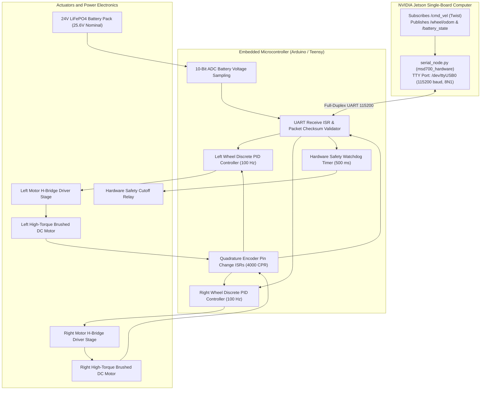

# ファームウェア、マイクロコントローラ、ハードウェアバス

<RoleBadge role="developer" />

本ドキュメントは、MSD700ロボットに実装されている組み込みマイクロコントローラファームウェア、モータードライバーインターフェース、光学エンコーダーのデコード、離散PID速度制御アルゴリズム、アナログテレメトリ回路についての詳細な技術仕様を提供する。

## 組み込み制御トポロジー

---

## ハードウェア電気ピン配置と配線

NVIDIA Jetsonとマイクロコントローラ間の通信は、光絶縁を備えた高速USB UART経由で行われる:

| 信号機能 | マイコンピン | ドライバ / 周辺機器接続 | 電気的特性 |
| --- | --- | --- | --- |
| **Left Motor PWM** | Pin 5 (Timer 3) | Left H-Bridge Speed Gate | 0〜5Vロジック、20 kHz PWM(静音・無音駆動) |
| **Left Motor DIR** | Pin 4 | Left H-Bridge Direction Input | Logic High: 前進、Logic Low: 後退 |
| **Right Motor PWM** | Pin 6 (Timer 4) | Right H-Bridge Speed Gate | 0〜5Vロジック、20 kHz PWM |
| **Right Motor DIR** | Pin 7 | Right H-Bridge Direction Input | Logic High: 前進、Logic Low: 後退 |
| **Left Encoder A** | Pin 2 (INT0) | Left Optical Encoder Channel A | 5V TTL割り込み(立ち上がり/立ち下がりエッジ) |
| **Left Encoder B** | Pin 3 (INT1) | Left Optical Encoder Channel B | 5V TTL割り込み |
| **Right Encoder A** | Pin 18 (INT5) | Right Optical Encoder Channel A | 5V TTL割り込み |
| **Right Encoder B** | Pin 19 (INT4) | Right Optical Encoder Channel B | 5V TTL割り込み |
| **Battery Voltage ADC**| Pin A0 (ADC0) | Precision Resistor Divider Output | 0〜5.0Vアナログ電圧 |
| **E-Stop Safety Line** | Pin 12 | Hardware Relay Gate Driver | Logic High: モーター有効、Low: 遮断 |

---

## 閉ループ離散PID速度制御

ファームウェアは、ホイール速度を制御するため、アンチワインドアップクランプ付きの離散PID制御ループを$100\text{ Hz}$($\Delta t = 0.01\text{ s}$)で2系統実行する:

### 離散誤差の定式化:
$$e_k = v_{\text{target}} - v_{\text{measured}}$$

### クランプ付きPID制御出力:
$$\text{PWM}_k = K_p \cdot e_k + K_i \sum_{j=0}^k e_j \cdot \Delta t + K_d \cdot \frac{e_k - e_{k-1}}{\Delta t}$$

### アンチワインドアップ積分保護:
モーターが一時的に負荷を受けたり、傾斜地で失速している際の積分ワインドアップを防ぐため:

$$\sum e_j \cdot \Delta t = \text{clamp}\left( \sum e_j \cdot \Delta t, -I_{\max}, I_{\max} \right)$$

$$\text{PWM}_k = \text{clamp}(\text{PWM}_k, -\text{PWM}_{\max}, \text{PWM}_{\max})$$

ここで$\text{PWM}_{\max} = 255$($8$ビットタイマー分解能)。

---

## バッテリー電圧検出回路

ロボットは24V LiFePO4バッテリーパック(満充電: $29.2\text{ V}$、公称: $25.6\text{ V}$、カットオフ: $21.0\text{ V}$)により駆動される。

オンボードの電圧分割回路が、バッテリー電圧をマイコンADCの$0\text{ 〜 }5\text{ V}$の範囲にスケールダウンする:

$$V_{adc} = V_{bat} \cdot \frac{R_2}{R_1 + R_2}$$

ここで$R_1 = 30\text{ k}\Omega$、$R_2 = 5.1\text{ k}\Omega$(分圧比$K_{div} = 0.1453$)。

### ファームウェアにおける電圧の再構成:
$$V_{bat} = \frac{\text{ADC\_RAW}}{1024} \cdot V_{ref} \cdot \left( \frac{R_1 + R_2}{R_2} \right)$$

ここで$V_{ref} = 5.00\text{ V}$。

---

## ハードウェアセーフティウォッチドッグ

ホストOSのロックアップやシリアルケーブルの切断によって引き起こされる暴走状態を防ぐため、マイクロコントローラは自律的なハードウェアウォッチドッグを実行する:

1. **タイマー満了**: チェックサム検証済みの速度パケットを受信するたびに、ウォッチドッグタイマーレジスタは$500\text{ ms}$にリセットされる。
2. **セーフティカットオフ**: $500\text{ ms}$以内にパケットが届かない場合、マイクロコントローラは即座にモーターPWM出力をゼロにクランプし、`ESTOP_RELAY`のゲートラインを落とす。

## 関連ドキュメント

- [センサーフュージョン & 制御](/ja/development/ros/sensor-fusion-and-control): オドメトリ積分とEKF。
- [コストマップ & プランナー](/ja/development/ros/costmaps-and-planners): 速度制限パラメータ。
- [State and Behavior](/ja/development/state-and-behavior): 緊急停止のステートマシン。
