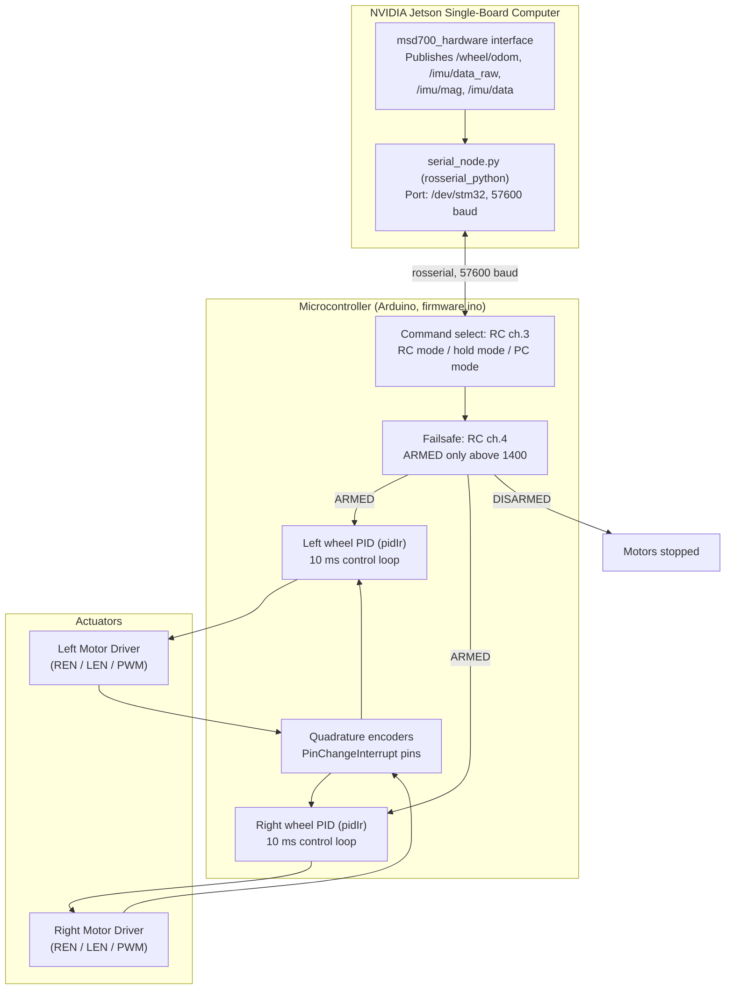

# ファームウェア、マイクロコントローラ、ハードウェアバス

<RoleBadge role="developer" />

組み込みマイクロコントローラファームウェア(`msd700_firmware/firmware/firmware.ino`、Arduino)と、Jetsonがそれとどう通信するかについて説明する。ファームウェアは**2つ**の入力源(RC受信機(Taranis X7)またはROS経由のPC)からコマンドを受け取り、車輪ごとのPIDループで両輪モーターを駆動する。

## 組み込み制御トポロジー

スタック内のどこにも`/battery_state`トピックは存在せず、このファームウェアにADCによるバッテリー分圧回路もない。ファームウェア内の車輪ジオメトリ定数(`WHEEL_RADIUS 2.75 cm`、`WHEEL_DISTANCE 23.0 cm`)は、ホスト側のオドメトリ設定(`odometry_config.yaml`: 半径`2.7 cm`、距離`23 cm`、`encoder_ppr 2400`)と一致する。

---

## ハードウェアピン配置(`firmware.ino`)

| 信号機能 | マイコンピン |
| --- | --- |
| **Right Motor REN / LEN / PWM** | Pins 4 / 5 / 9 |
| **Left Motor REN / LEN / PWM** | Pins 6 / 7 / 8 |
| **Right Encoder A / B** | Pins 52 / 12 |
| **Left Encoder A / B** | Pins 11 / 10 |
| **Status LEDs (red / blue)** | Pins 30 / 31 |
| **Camera servo** | Pin 3 (range 125–175, step 10) |
| **Ultrasonic (UART2 RX / TX)** | Pins 17 / 16 |

Jetsonとのリンクは`Serial.begin(57600)`である。

---

## 閉ループPID速度制御

各車輪は10 ms制御周期(`LOOP_TIME 10`)で離散PIDループ(`pidIr`)を実行する:

$$\text{PWM}_k = K_p \cdot e_k + K_i \sum e_j \cdot \Delta t + K_d \cdot \frac{e_k - e_{k-1}}{\Delta t}$$

出力はフル8ビットの255ではなく`MAX_PWM 250`で飽和(`constrain`)する。速度上限は`MAX_RPM_MOVE 180`(直進)、`MAX_RPM_TURN 70`(回転)である。RC受信機チャンネルは0.25 Hzローパスフィルタ、エンコーダー信号は3 Hzローパスフィルタを通る。

---

## RCフェイルセーフ(アーミング)

この試作機は**ARMED**のときのみ動作コマンドを受け付ける。RCチャンネル4が1400を超えていること(`update_failsafe()`)が必要で、それを下回るとDISARMEDとなり、RC・PCいずれのコマンドが届いてもモーターは停止する。コマンド源はRCチャンネル3に従う。RCモード、ホールドモード、PC(ROS)モードのいずれかである。

## 関連ドキュメント

- [センサーフュージョン & 制御](/ja/development/ros/sensor-fusion-and-control): オドメトリ積分とEKF。
- [コストマップ & プランナー](/ja/development/ros/costmaps-and-planners): 速度制限パラメータ。
- [State and Behavior](/ja/development/state-and-behavior): 緊急停止のステートマシン。
