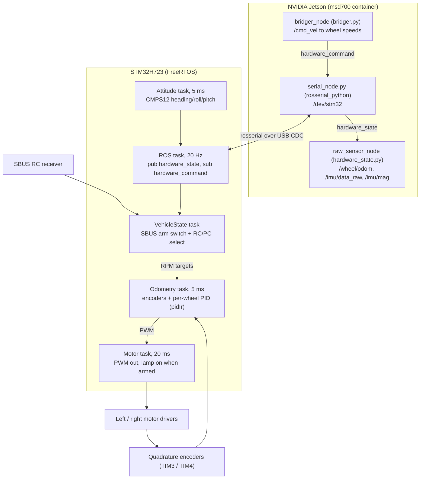

# ファームウェア、マイクロコントローラ、ハードウェアバス

<RoleBadge role="developer" />

ユニットのモーターは、FreeRTOSを実行する**STM32H723**ボード(`0483:5740`、USB仮想COMポート、udevシンボリックリンク`/dev/stm32`)で駆動される。ファームウェアは別リポジトリ`firmware-msd700`のプロジェクト`STM32H7_MSD700_Unified_Firmware`(STM32CubeIDE)にある。SBUSのRC受信機またはROS経由のJetsonという**2つ**の入力源からコマンドを受け取り、各車輪でPID速度ループを回す。

::: info 旧Arduinoファームウェア
`msd700_robot/msd700_firmware/firmware/firmware.ino`(および`firmware-msd700/firmware_msd700`)は旧Arduino Megaスケッチである。参考として残されており、同じ`hardware_state` / `hardware_command`メッセージを使うが、現在のユニットで動作しているものではない。
:::

## 組み込み制御トポロジー

## ROSインターフェース

ファームウェアは、パブリッシャー1つとサブスクライバー1つを持つrosserialノードである。

| 方向 | トピック | メッセージ | 備考 |
| --- | --- | --- | --- |
| MCU → Jetson | `hardware_state` | `msd700_msgs/HardwareState` | ホスト接続中は50 msごとに送信。前回送信以降のエンコーダーパルス差分、CMPS12のheading/roll/pitch、加速度・ジャイロ・磁気、UWBフォロワー目標を含む。8つの超音波フィールドは常に`0.0` |
| Jetson → MCU | `hardware_command` | `msd700_msgs/HardwareCommand` | PCモードでは`right_motor_speed` / `left_motor_speed`が車輪のRPM目標になる |

Jetson側では`serial_launch.launch`が`/dev/stm32`上で`rosserial_python`を起動する(`baud` 57600。リンクはUSB CDCなので実際の通信速度ではない)。既定の`hardware_mode 1`では、`hardware_state.py`(`raw_sensor_node`)が`hardware_state`を`/wheel/odom`、`/imu/data_raw`、`/imu/mag`に変換し、`bridger.py`がmux後の`/cmd_vel`を`hardware_command`に変換する。両者とも車輪形状を`msd700_control/config/pose_config.yaml`から読む(`wheel_radius 2.75` cm、`wheel_distance 26.0` cm、実機で計測)。[センサーフュージョン & 制御](/ja/development/ros/sensor-fusion-and-control)を参照。

スタックのどこにも`/battery_state`トピックは存在しない。

## アーミングとコマンド入力源

アーミングと入力源の選択はSBUS受信機(`USART1`、100 kbaud、反転)で行う。

| SBUSチャンネル | 意味 |
| --- | --- |
| チャンネル3(0始まり) | アームスイッチ。992超で**ARMED**(ランプ点灯)、それ以外はDISARMED |
| チャンネル2 | 1000未満でRCモード: チャンネル0/1が±40 RPMの前進/旋回に対応。それ以外はPCモード: RPM目標は`hardware_command`から来る |

SBUSフレームが**400 ms**届かない場合(受信機の抜けや圏外)、車両はDISARMEDになる。DISARMED中は両PIDループがリセットされ、ROS側が何を送ってもPWM出力はすべて0に保たれる。独立したハードウェアウォッチドッグ(IWDG)は50 msごとにリフレッシュされ、スケジューラが停止するとMCUをリセットする。

## 閉ループ車輪速度制御

オドメトリタスクは5 msごとに実行され、両エンコーダー(右`TIM3`、左`TIM4`)を読み、車輪RPMを計算し、車輪ごとに`pidIr`ループを1つ回す。

$$u_k = K_p e_k + K_i T_s \sum e_j + \frac{K_d}{T_s} (e_k - e_{k-1}), \quad |u_k| \le 100$$

ゲインは`Core/Inc/configuration.h`にあり、出荷時のチューニングは積分のみ(両輪とも`KP 0.00`、`KI 0.02`、`KD 0.00`)。モータータスクは20 msごとに、クランプ後の出力を`TIM23`(右)と`TIM2`(左)のPWMコンペア値`95 × u`として適用し、どちらのチャンネルを駆動するかで回転方向を決める。ファームウェア独自の推測航法は`WHEEL_RADIUS 0.0275` mを使うが、ROSでは使われない。

## その他のタスク

- **Attitude**: CMPS12(傾斜補正コンパス)を5 msごとに読む。そのヨーがROSへ送るheadingにもなる。
- **UWB**: `USART2`上のフォロワータグ測位。フィルタ後に`uwb_*`フィールドで報告する。
- **LIDAR**: 試作機から残っているRPLIDAR読み取りタスク。ユニットはEthernet接続のVelodyne VLP-16を使う。

## 関連ドキュメント

- [センサーフュージョン & 制御](/ja/development/ros/sensor-fusion-and-control): オドメトリ積分とEKF。
- [コストマップ & プランナー](/ja/development/ros/costmaps-and-planners): 速度制限パラメータ。
- [State and Behavior](/ja/development/state-and-behavior): 緊急停止のステートマシン。
