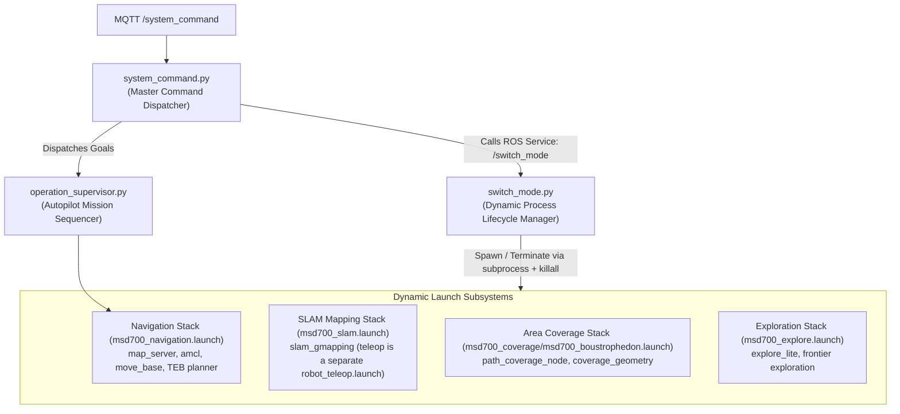
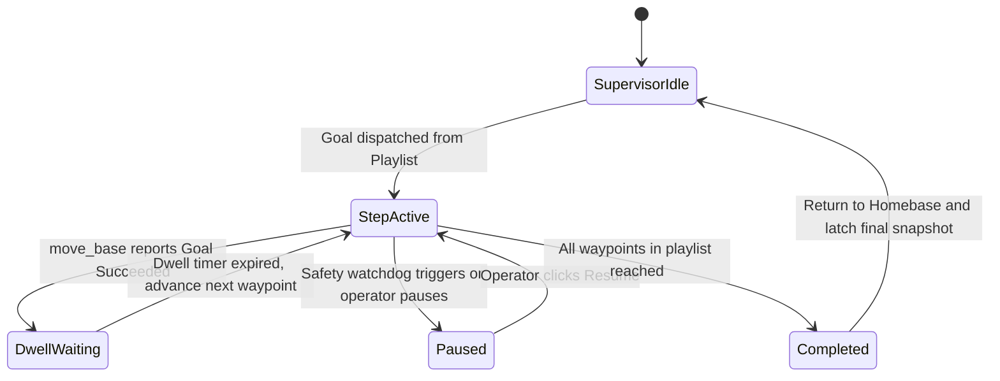

# 動的ノード & モード切り替えアーキテクチャ

<RoleBadge role="developer" />

本ドキュメントは、MSD700ロボットが`switch_mode.py`、`system_command.py`、`operation_supervisor.py`を用いて、メインのROS coreを再起動することなく実行時に運用モード(`navigation`、`slam`、`explore`、`boustrophedon`：idleは単に「launchスタックなし」)を動的に切り替える仕組みを詳述する。モード名は`switch_mode.yaml`由来であり、`/switch_mode`サービス経由で送られる文字列と一致しなければならない。

## モードオーケストレーションのトポロジー



---

## 運用モードと稼働ノードスタック

| モード(`switch_mode.yaml`) | Launchファイル | 備考 |
| --- | --- | --- |
| (idle、スタックなし) | - | ベースノードは動き続ける(`serial_node`、`imu_filter`、`robot_state_publisher`、`aws_mqtt`、`camera_client`)。 |
| **`navigation`** | `msd700_navigation.launch` | `map_server`、`amcl`、`move_base`、コストマップ。 |
| **`slam`** | `msd700_slam.launch` | ライブマッピング。テレオペはスタックの一部ではなく別のlaunch。 |
| **`explore`** | `msd700_explore.launch` | `explore_lite`によるフロンティア探索。 |
| **`boustrophedon`** | `msd700_coverage/msd700_boustrophedon.launch` | `path_coverage_node`。`use_autocover`はデフォルトでオフ。 |

---

## `subprocess`による動的プロセスライフサイクル

`switch_mode.py`は各スタックを`subprocess.Popen(cmd_list, ...)`で起動し、`switch_mode.yaml`のタイムアウトで終了させる:

```yaml
timeouts:
  graceful_shutdown: 3   # seconds before escalation
  force_kill: 1          # seconds before SIGKILL
```

### 安全な終了処理とゾンビプロセスの防止:
1. **Terminate**: アクティブなスタックのプロセスグループに正常終了を要求する。
2. **3秒間の猶予ウィンドウ**: 各ノードには状態をフラッシュするための最大3秒の猶予が与えられる(例: `map_saver`が`.pgm`/`.yaml`を書き込む場合)。
3. **エスカレーション**: 猶予を過ぎるとスイッチャーは強制終了(`1 s`)へエスカレートし、シミュレーターの残骸は`killall`で回収するため、ROSマスターのグラフ上にゾンビノードが一切残らない。

---

## Autopilotミッションシーケンシング(`operation_supervisor.py`)

`operation_supervisor.py`は、複数ステップのウェイポイントルートとエリア網羅走行プレイリストの自律実行を管理する:



### スーパーバイザーの主要機能:
- **ラッチされたOperation Snapshot**: `/string/operation_snapshot`をlatched QoSでパブリッシュする。オペレーターがブラウザタブを開くと、アクティブなミッションの全状態(現在のウェイポイントインデックス、残りのルートピン、滞留タイマー)が数ミリ秒で復元される。
- **Autopilotの安全性に関する例外扱い**: Autopilotが有効(ON)になると、ウォッチドッグは切断時の3階層すべて(2秒の一時停止、10分のidle、30分のシャットダウン)を抑制し、長時間の網羅走行ミッションが無人のまま継続できるようにする。

## 関連ドキュメント

- [ROSパッケージ一覧](/ja/development/ros/ros-packages): パッケージ構造とLaunchファイルの定義。
- [State and Behavior](/ja/development/state-and-behavior): 詳細な有限状態機械とウォッチドッグの段階。
- [Message Contracts](/ja/development/message-contracts): MQTTとoperation syncのメッセージペイロード。
