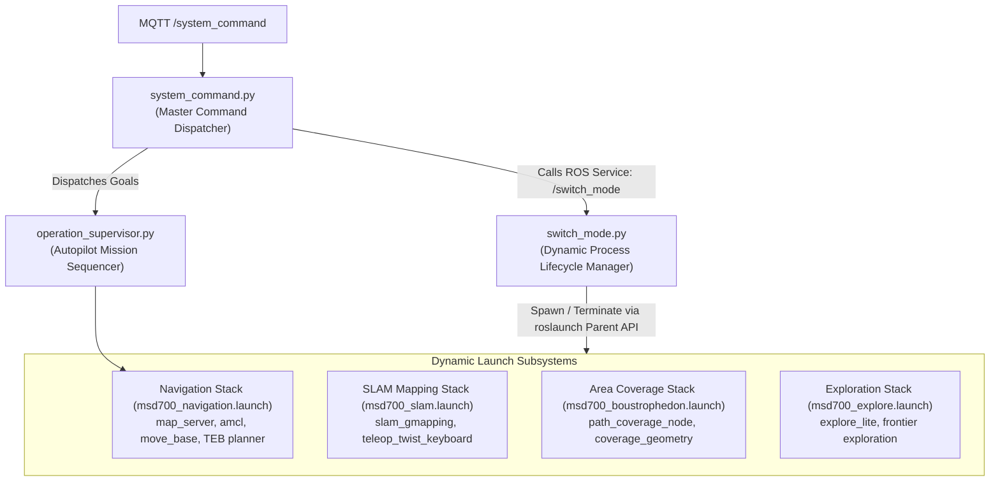
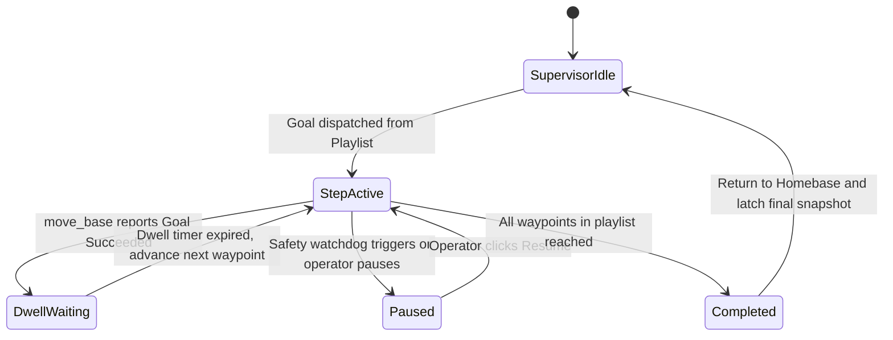

# 動的ノード & モード切り替えアーキテクチャ

<RoleBadge role="developer" />

本ドキュメントは、MSD700ロボットが`switch_mode.py`、`system_command.py`、`operation_supervisor.py`を用いて、メインのROS coreを再起動することなく実行時に運用モード(`idle`、`navigation`、`mapping`、`coverage`、`exploration`)を動的に切り替える仕組みを詳述する。

## モードオーケストレーションのトポロジー



---

## 運用モードと稼働ノードスタック

| 運用モード | 稼働中のROSノード | 非稼働 / 回収されたノード | メモリ & CPUフットプリント |
| --- | --- | --- | --- |
| **`idle`** | `roscore`、`serial_node`、`imu_filter`、`robot_state_publisher`、`aws_mqtt`、`camera_client`。 | `move_base`、`amcl`、`slam_gmapping`、`path_coverage_node`。 | 最小(約5% CPU、200 MB RAM)。 |
| **`navigation`** | すべての`idle`ノード + `map_server`、`amcl`、`move_base`、`costmap_2d`。 | `slam_gmapping`、`explore_lite`。 | 標準的なナビゲーション(約25% CPU)。 |
| **`mapping`** | すべての`idle`ノード + `slam_gmapping`、`teleop`。 | `amcl`、`map_server`(代わりにライブマップを読み込む)。 | 中程度(約35% CPU)。 |
| **`coverage`** | すべての`navigation`ノード + `path_coverage_node`。 | `explore_lite`。 | フルミッション負荷(約40% CPU)。 |
| **`exploration`** | すべての`mapping`ノード + `explore_lite`のフロンティア探索。 | `amcl`。 | 高いアルゴリズム負荷(約45% CPU)。 |

---

## `roslaunch` Parent APIによる動的プロセスライフサイクル

`system("roslaunch ...")`のようなシェルコマンドの実行はデタッチされたゾンビプロセスを残してしまうため、`switch_mode.py`はネイティブのPython API `roslaunch.parent.ROSLaunchParent`を利用する:

```python
import roslaunch
import rospy

class ModeSwitcher:
    def __init__(self):
        self.current_mode = "idle"
        self.active_launch_parent = None

    def transition_to(self, target_mode, launch_file_path):
        # 1. Gracefully terminate active launch stack
        if self.active_launch_parent is not None:
            rospy.loginfo(f"Stopping active stack for mode: {self.current_mode}")
            self.active_launch_parent.shutdown()
            self.active_launch_parent = None

        # 2. Instantiate and start new launch parent
        if target_mode != "idle":
            uuid = roslaunch.rlutil.get_or_generate_uuid(None, False)
            roslaunch.configure_logging(uuid)
            self.active_launch_parent = roslaunch.parent.ROSLaunchParent(
                uuid, [launch_file_path]
            )
            self.active_launch_parent.start()

        self.current_mode = target_mode
        rospy.loginfo(f"Successfully transitioned to mode: {target_mode}")
```

### 安全な終了処理とゾンビプロセスの防止:
1. **SIGINTのディスパッチ**: `launch_parent.shutdown()`は、管理下の全子プロセスに対して依存関係の逆順で`SIGINT`を送信する。
2. **5秒間の猶予ウィンドウ**: 各ノードにはディスクバッファをフラッシュするための最大5秒の猶予が与えられる(例: `map_saver`が`.pgm`と`.yaml`の画像を書き込む場合)。
3. **エスカレーション**: 猶予期間内にノードが正常終了しない場合、親プロセスは`SIGTERM`、続いて`SIGKILL`へとエスカレートし、ROSマスターのグラフ上にゾンビノードが一切残らないことを保証する。

---

## Autopilotミッションシーケンシング(`operation_supervisor.py`)

`operation_supervisor.py`は、複数ステップのウェイポイントルートとエリア網羅走行プレイリストの自律実行を管理する:



### スーパーバイザーの主要機能:
- **ラッチされたOperation Snapshot**: `/string/operation_snapshot`をlatched QoSでパブリッシュする。オペレーターがブラウザタブを開くと、アクティブなミッションの全状態(現在のウェイポイントインデックス、残りのルートピン、滞留タイマー)が数ミリ秒で復元される。
- **Autopilotの安全性に関する例外扱い**: Autopilotが有効(ON)になると、スーパーバイザーは10秒のオペレーター切断一時停止を抑制し、長時間の網羅走行ミッションが無人のまま継続できるようにする。

## 関連ドキュメント

- [ROSパッケージ一覧](/ja/development/ros/ros-packages): パッケージ構造とLaunchファイルの定義。
- [State and Behavior](/ja/development/state-and-behavior): 詳細な有限状態機械とウォッチドッグの段階。
- [Message Contracts](/ja/development/message-contracts): MQTTとoperation syncのメッセージペイロード。
