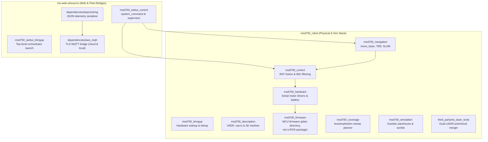

# ROSパッケージ一覧

<RoleBadge role="developer" />

本ドキュメントは、`msd700_robot`と`ros-web-ui/source`にまたがるMSD700ワークスペース内の全ROS 1 Noeticパッケージの包括的な一覧を提供し、各パッケージの役割、主要なLaunchファイル、稼働ノード、パブリッシュ/サブスクライブされるTopic、パラメータを詳述する。

## ワークスペースパッケージ構成

## パッケージディレクトリ: `msd700_robot`

### 0. `msd700_bringup`
ハード・sim・ナビゲーションを実行可能スタックに組み立てるlaunch層。

| Launchファイル | 用途 | 実行先 |
| --- | --- | --- |
| `robot_navigation.launch` | フルスタック:ハード**または**sim + 制御 + ナビゲーションコア、任意RViz/テレオペ | 実機対sim (`use_sim`) |
| `robot_slam.launch` | マッピング用の同層構成(gmapping/hector) | 実機対sim (`use_sim`) |
| `robot_teleop.launch` | 手動運転:ハード/sim + 制御 + `teleop_twist_keyboard` → `mux/key_vel` | 実機対sim + テレオペ/デバッグ |
| `lidar_scanner.launch` | 実機LiDAR入口(Velodyne既定、RPLIDAR/レガシー)。simでは決して起動しない | 実機のみ |
| `serial_launch.launch` | `/dev/stm32` @57600上の `rosserial_python` | 実機 |
| `map_server.launch` | パッケージ相対または絶対yaml上の `map_server` | 両方 |
| `multiple_point.launch` | `nav_controller.py` + `nav_gui.py` の多点モード | 中立 |
| `rviz_launch.launch` | デバッグ/vizヘルパー(description + state publisher + rviz) | デバッグ |
| `teleop.launch` | `teleop_node_cmd_vel.py` | テレオペ |
| `custom_model/` | レガシーの単体/二体RPLIDAR launch | 実機(レガシー) |
| `testing/speed_test.launch` | シリアル + テレオペ + bridger + `calculate.py` リグ | デバッグ/テスト |

`bridger.launch`(駆動ジオメトリ + `bridger.py`)は冷間アイドル含め全モードで常時オン。

### 1. `msd700_navigation`
自律移動、SLAMマッピング、エリア網羅走行を担うコアパッケージ。

- **主要ノード**:
  - `move_base`: グローバル経路計画に`navfn/NavfnROS`、軌道最適化に`teb_local_planner/TebLocalPlannerROS`を利用する標準ROSナビゲーションアクションサーバー。
  - `slam_gmapping`: occupancy gridを生成する2Dレーザーベースのマッピングノード。
  - `amcl`: 静的地図上での位置推定を行うAdaptive Monte Carlo Localizationパーティクルフィルタ。
- **主要Launchファイル**:
  - `msd700_navigation.launch`: map server、AMCL、move_baseを含む完全なナビゲーション起動。
  - `msd700_slam.launch`: Gmapping SLAM起動(テレオペは別の`robot_teleop.launch`)。
  - `msd700_explore.launch`: 自律SLAMフロンティア探索(`explore_lite`)。
- **カバレッジは隣にある**: `msd700_coverage/launch/msd700_boustrophedon.launch`が`path_coverage_node.py`を実行し、`src/msd700_coverage/coverage_geometry.py`を用いて蛇行経路を計画し、障害物周辺を再計画する。

### 2. `msd700_control`
状態推定、座標変換階層、センサーフュージョンを管理する。

- **主要ノード**:
  - `ekf_localization_node` (`robot_localization`): ホイールエンコーダーオドメトリ(`/wheel/odom`)とフィルタ済みIMUデータ(`/imu/from_filter`)を融合し、安定した`/odometry/filtered`トピックを30 Hzで生成する拡張カルマンフィルタ。
  - `imu_filter_node` (`imu_filter_madgwick`、`imu_filter.launch`により`gain 0.01`、磁力計オン、固定フレーム`odom`で起動): 生の角速度と加速度をオリエンテーションクォータニオンに変換するMadgwick AHRSフィルタ。その出力トピックは`/imu/from_filter`(`/imu/data`からのリマップ)であり、これがEKFが実際に消費するもの。`/imu/data`自体は`hardware_state.py`がパブリッシュする。
- **主要Launchファイル**:
  - `robot_localization.launch`: `ekf_localization_config.yaml`からパラメータを読み込み、EKFフュージョンを構成・起動する。
  - `imu_filter.launch`: Madgwickオリエンテーション推定を起動する。

### 3. `msd700_description`
URDFとXacroを用いて物理的な運動構造、衝突ジオメトリ、センサー配置を定義する。

- **主要URDFモデル**:
  - `urdf/msd700_field.urdf.xacro`: 実寸スケールの量産ロボットモデル(0.90 x 0.70 mボディ、x = ±0.30 m / y = ±0.30 mに4つの駆動輪、footprintから0.50 m上のVelodyneマスト)。キャスターなし、`camera_link`なし。
  - `urdf/velodyne/VLP_16.urdf.xacro`: 高精度16チャンネル3D LiDARモデルとGazeboセンサープラグイン。
  - `urdf/turtlebot3_waffle.urdf.xacro`: レガシーな小型プロトタイプモデル。

### 4. `msd700_hardware` & `msd700_firmware`
低レベルハードウェアインターフェース、モーター駆動、エンコーダーパルスカウント、バッテリー状態を扱う。

- **ハードウェア構成**:
  - `serial_launch.launch` (`msd700_bringup`): ホストを低レベルマイコンに`/dev/stm32`経由(57600ボー、`rosserial_python`の`serial_node.py`経由)で接続する。
  - ファームウェアは`msd700_hardware`インターフェースに対してrosserialプロトコルを話し、同インターフェースが`/wheel/odom`と生IMUトピックをパブリッシュする。スタック内のどこにも`/battery_state`トピックは存在しない。ファームウェアの実装内容については[ファームウェア & ハードウェア](/ja/development/ros/firmware-and-hardware)を参照。

### 5. `msd700_simulation`
ナビゲーションアルゴリズムをソフトウェア上でテストするGazeboシミュレーション環境。

- **主要環境**:
  - `msd700_warehouse_nav.launch`: 実寸スケールの`msd700_field`ロボットモデルで13.98 x 20.91 mのAWS RoboMaker Small Warehouseを起動する。
  - `scripts/fetch_sim_worlds.sh`: GitHubの`ros1`ブランチから3Dシミュレーションメッシュ(12 MB)をオンデマンドでダウンロードするスクリプト。

### 6. `third_party/ira_laser_tools`
複数の2D LiDARスキャナーの統合に利用可能だが、デフォルトのスタックはデュアルマージャーを使用しない。`pointcloud_to_laserscan`がVelodyneのクラウドを`/scan`に変換し、ハザードパイプラインが`/scan_hazard`を追加する。[知覚とハザードスキャン](/ja/development/ros/perception-and-hazard-scan)参照。

### 7. `msd700_msgs`
ロボット内部のメッセージ契約(`msd700_robot/msd700_msgs/msg/`):

- `HardwareCommand.msg`: `uint8 movement_command`、`uint8 cam_angle_command`、`float32 right_motor_speed`、`float32 left_motor_speed`。
- `HardwareState.msg`: 8× `float32 ch_ultrasonic_distance_1…_8`、`int32 right/left_motor_pulse_delta`、`float32 heading/pitch/roll`、`float32 acc/gyr/mag_x/y/z`、`float32 uwb_dist/deviation/rho/theta`。
- `WebNavCommand.msg`: `string command`、`geometry_msgs/PoseStamped pose`、`string file_path`。

## パッケージディレクトリ: `ros-web-ui/source`

### 1. `msd700_webui_control`
Webコマンドとダッシュボードテレメトリを物理ロボットハードウェアに橋渡しする。

- **主要ノード**:
  - `system_command.py`: MQTTの`/system_command`をサブスクライブし、排他的な操作リースを管理し、アクションをディスパッチし、`/system_feedback`をパブリッシュする。
  - `operation_supervisor.py`: Autopilotのウェイポイント進行を管理し、`/string/operation_snapshot`をラッチする自律ミッションシーケンサー。
  - `switch_mode.py`: `navigation`、`slam`、`explore`、`boustrophedon`の各モードのLaunchスタックを動的に切り替えるROSサービスオーケストレーター(idle = スタックなし)。
  - `hardware_monitor.py`: 重要なセンサープロセスとUSBデバイスの健全性を検証するバックグラウンドウォッチドッグ。

### 2. `dependencies/topic2string`
重いROSメッセージ型をJSON文字列に変換する高性能シリアライゼーション層。

- **主要ノード**:
  - `robotpose_to_string.py`: ポーズテレメトリシリアライザ。デフォルト2 Hz(`topic2string/launch/msd.launch`により25 Hzに上げられ、手動走行中のダッシュボードマーカーが滑らかに保たれる)。
  - `laserscan_to_string.py`: イベント駆動の圧縮レーザースキャンシリアライザ(固定レートなし)。
  - `map_compression_pipeline.py`(ノード名`map_compression_node`): ライブSLAM occupancy grid用のBase64 zlib圧縮。

### 3. `dependencies/aws_mqtt`
ローカルのROSトピックを中央HiveMQブローカーに接続する暗号化トランスポートブリッジ。

- **Launchファイル**:
  - `nakayama_msd.launch`: ロボット側ブリッジ。オンボードのROSトピックをポート8883(TLS)でクラウドHiveMQに接続する。
  - `nakayama_cloud.launch`: サーバー側ブリッジ。MQTTトピックをユニットごとのクラウドROSトピックに変換する。
  - `local_msd.launch`: ユニット側ブリッジ。ローカルMosquittoブローカー(`127.0.0.1:1883`)に接続する。

## 関連ドキュメント

- [アーキテクチャ](/ja/development/architecture): システム全体の高レベルな構造と継ぎ目。
- [センサーフュージョン & 制御](/ja/development/ros/sensor-fusion-and-control): EKFとセンサーパイプラインの詳細な設定。
- [State and Behavior](/ja/development/state-and-behavior): 全制御ノードの詳細なステートマシン。
