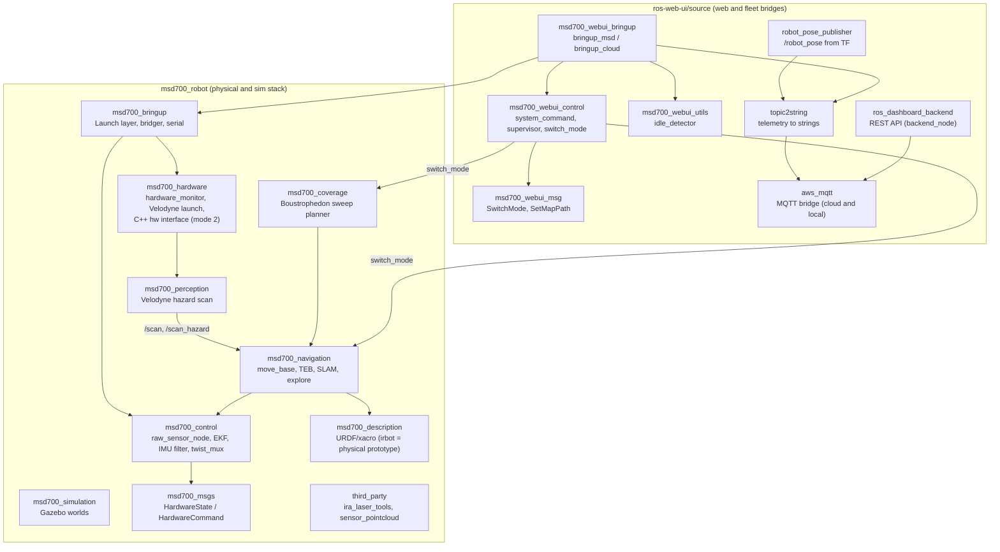

# ROSパッケージ一覧

<RoleBadge role="developer" />

本ドキュメントは、`msd700_robot`と`ros-web-ui/source`にまたがるMSD700ワークスペース内の全ROS 1 Noeticパッケージの包括的な一覧を提供し、各パッケージの役割、主要なLaunchファイル、稼働ノード、パブリッシュ/サブスクライブされるTopic、パラメータを詳述する。

## ワークスペースパッケージ構成

## パッケージディレクトリ: `msd700_robot`

### 0. `msd700_bringup`
ハード・sim・ナビゲーションを実行可能スタックに組み立てるlaunch層。

| Launchファイル | 用途 | 実行先 |
| --- | --- | --- |
| `robot_navigation.launch` | フルスタック:ハード**または**sim + 制御 + ナビゲーションコア、任意RViz/テレオペ | 実機対sim (`use_sim`) |
| `robot_slam.launch` | マッピング用の同層構成(gmapping/hector) | 実機対sim (`use_sim`) |
| `robot_teleop.launch` | 手動運転:ハード/sim + 制御 + `teleop_twist_keyboard` → `mux/key_vel` | 実機対sim + テレオペ/デバッグ |
| `lidar_scanner.launch` | 実機LiDAR入口(Velodyne既定、RPLIDAR/レガシー)。simでは決して起動しない | 実機のみ |
| `serial_launch.launch` | `/dev/stm32` @57600上の `rosserial_python` | 実機 |
| `map_server.launch` | パッケージ相対または絶対yaml上の `map_server` | 両方 |
| `multiple_point.launch` | `nav_controller.py` + `nav_gui.py` の多点モード | 中立 |
| `rviz_launch.launch` | デバッグ/vizヘルパー(description + state publisher + rviz) | デバッグ |
| `teleop.launch` | `teleop_node_cmd_vel.py` | テレオペ |
| `custom_model/` | レガシーの単体/二体RPLIDAR launch | 実機(レガシー) |
| `testing/speed_test.launch` | シリアル + テレオペ + bridger + `calculate.py` リグ | デバッグ/テスト |

`bridger.launch`(駆動ジオメトリ + `bridger.py`)は冷間アイドル含め全モードで常時オン。

### 1. `msd700_navigation`
自律移動、SLAMマッピング、エリア網羅走行を担うコアパッケージ。

- **主要ノード**:
  - `move_base`: グローバル経路計画に`navfn/NavfnROS`、軌道最適化に`teb_local_planner/TebLocalPlannerROS`を利用する標準ROSナビゲーションアクションサーバー。
  - `slam_gmapping`: occupancy gridを生成する2Dレーザーベースのマッピングノード。
  - `amcl`: 静的地図上での位置推定を行うAdaptive Monte Carlo Localizationパーティクルフィルタ。
- **主要Launchファイル**:
  - `msd700_navigation.launch`: map server、AMCL、move_baseを含む完全なナビゲーション起動。
  - `msd700_slam.launch`: Gmapping SLAM起動(テレオペは別の`robot_teleop.launch`)。
  - `msd700_explore.launch`: 自律SLAMフロンティア探索(`explore_lite`)。
- **カバレッジは隣にある**: `msd700_coverage/launch/msd700_boustrophedon.launch`が`path_coverage_node.py`を実行し、`src/msd700_coverage/coverage_geometry.py`を用いて蛇行経路を計画し、障害物周辺を再計画する。

### 2. `msd700_control`
状態推定、座標変換階層、センサーフュージョンを管理する。

- **主要ノード**:
  - `ekf_localization_node` (`robot_localization`): ホイールオドメトリ(`/wheel/odom`)とIMU(`/imu/data`)を融合して30 Hzの`/odometry/filtered`を生成し、`odom -> base_footprint`をブロードキャストする拡張カルマンフィルタ。
  - `imu_filter_node` (`imu_filter_madgwick`、`imu_filter.launch`により`gain 0.01`、磁力計オン、固定フレーム`odom`で起動): `/imu/data_raw` + `/imu/mag`に対するMadgwick AHRSフィルタ。出力は`/imu/from_filter`にリマップされ、`hardware_state.py`(`raw_sensor_node`)がそれを読んで姿勢を`/imu/data`として再パブリッシュし、これをEKFが消費する。
  - `raw_sensor_node`(`hardware_state.py`、`hardware_mode 1`で`hardware_state_sub.launch`が起動): STM32の`hardware_state`を`config/pose_config.yaml`の形状を使って`/wheel/odom`、`/imu/data_raw`、`/imu/mag`、`/imu/data`に変換する。
- **主要Launchファイル**:
  - `robot_localization.launch`: `ekf_localization_config.yaml`からパラメータを読み込み、EKFフュージョンを構成・起動する。
  - `imu_filter.launch`: Madgwickオリエンテーション推定を起動する。

### 3. `msd700_description`
URDFとXacroを用いて物理的な運動構造、衝突ジオメトリ、センサー配置を定義する。

- **主要URDFモデル**:
  - `urdf/irbot.urdf.xacro`: **実機**がパブリッシュするモデル(`launch/robot_description.launch.xml`経由、`bringup_msd.launch`で常時起動)。固定チェーン`base_footprint -> base_link -> laser`と`base_link -> imu`。LiDARの高さは`config/msd700_xacro_irbot.yaml`による。
  - `urdf/msd700_field.urdf.xacro`: 実寸スケールの**シミュレーション**モデル(0.90 x 0.70 mボディ、x = ±0.30 m / y = ±0.30 mに4つの駆動輪、footprintから0.50 m上のVelodyneマスト)。キャスターなし、`camera_link`なし。
  - `urdf/velodyne/VLP_16.urdf.xacro`: 高精度16チャンネル3D LiDARモデルとGazeboセンサープラグイン。
  - `urdf/turtlebot3_waffle.urdf.xacro`: レガシーな小型プロトタイプモデル。

### 4. `msd700_hardware` & `msd700_firmware`
低レベルハードウェアインターフェース、モーター駆動、エンコーダーパルスカウントを扱う。

- **ハードウェア構成**:
  - `serial_launch.launch` (`msd700_bringup`): ホストを低レベルマイコンに`/dev/stm32`経由(57600ボー、`rosserial_python`の`serial_node.py`経由)で接続する。
  - STM32ファームウェアはrosserial(`hardware_state` / `hardware_command`)で通信する。既定の`hardware_mode 1`では`raw_sensor_node`と`bridger.py`が双方向を処理し、C++の`msd700_hardware`インターフェース(`msd700_hardware.launch`、`config/odometry_config.yaml`)は`hardware_mode 2`でのみ使われる。スタック内のどこにも`/battery_state`トピックは存在しない。ファームウェアの実装内容については[ファームウェア & ハードウェア](/ja/development/ros/firmware-and-hardware)を参照。

### 5. `msd700_simulation`
ナビゲーションアルゴリズムをソフトウェア上でテストするGazeboシミュレーション環境。

- **主要環境**:
  - `msd700_warehouse_nav.launch`: 実寸スケールの`msd700_field`ロボットモデルで13.98 x 20.91 mのAWS RoboMaker Small Warehouseを起動する。
  - `scripts/fetch_sim_worlds.sh`: GitHubの`ros1`ブランチから3Dシミュレーションメッシュ(12 MB)をオンデマンドでダウンロードするスクリプト。

### 6. `third_party/ira_laser_tools`
複数の2D LiDARスキャナーの統合に利用可能だが、デフォルトのスタックはデュアルマージャーを使用しない。`pointcloud_to_laserscan`がVelodyneのクラウドを`/scan`に変換し、ハザードパイプラインが`/scan_hazard`を追加する。[知覚とハザードスキャン](/ja/development/ros/perception-and-hazard-scan)参照。

### 7. `msd700_msgs`
ロボット内部のメッセージ契約(`msd700_robot/msd700_msgs/msg/`):

- `HardwareCommand.msg`: `uint8 movement_command`、`uint8 cam_angle_command`、`float32 right_motor_speed`、`float32 left_motor_speed`。
- `HardwareState.msg`: 8× `float32 ch_ultrasonic_distance_1…_8`、`int32 right/left_motor_pulse_delta`、`float32 heading/pitch/roll`、`float32 acc/gyr/mag_x/y/z`、`float32 uwb_dist/deviation/rho/theta`。
- `WebNavCommand.msg`: `string command`、`geometry_msgs/PoseStamped pose`、`string file_path`。

### 8. `msd700_perception`
Velodyneの点群を、スタックの他の部分が使う2Dスキャンに変換する: SLAM/AMCL用の`/scan`、コストマップ用の`/scan_hazard`(障害物と穴)、ダッシュボードのオーバーレイ用の`/scan_holes`。[知覚とハザードスキャン](/ja/development/ros/perception-and-hazard-scan)を参照。

- **ノード**: `hazard_scan_node.py`(パイプライン本体。ライブラリコードは`src/msd700_perception/`、Cの高速パスは`src_cpp/fastops.cpp`)、段階ごとのデバッグ用`hazard_inspector.py`。
- **launchファイル**: `velodyne_hazard.launch`(`msd700_hardware/velodyne_scanner.launch`の置き換え。`MSD700_HAZARD_SCAN=true`で選択)、`cloud_hazard.launch`、`hazard_scan.launch`。
- **設定**: `config/hazard_scan.yaml`。

### 9. `msd700_coverage`
エリア掃引とオペレーションプレイリストを支えるブストロフェドン網羅走行プランナー。[ブストロフェドン網羅走行](/ja/development/ros/boustrophedon-and-alignment)を参照。

- **ノード**: `path_coverage_node.py`(分割、レーン計画、ゴール送信、一時停止/再開の所有権)、`autocover_node.py`(任意の自動開始。既定はオフ)。
- **launchファイル**: `msd700_boustrophedon.launch`(`switch_mode.yaml`の`boustrophedon`モード)、`coverage.launch`。
- **設定**: `config/boustrophedon_params.yaml`、`config/robot/field.yaml` / `prototype.yaml`。

### 10. `third_party/sensor_pointcloud`
レンジメッセージを`PointCloud2`に集約する。リポジトリに同梱されているが、現在のスタックでは起動されない。

`msd700_movement/`は`package.xml`のない残存ディレクトリ(旧ナビゲーションスクリプト、`rplidar_ros`、`robot_pose_publisher`の2つ目のコピー)で、catkinはビルドしない。

## パッケージディレクトリ: `ros-web-ui/source`

### 1. `msd700_webui_control`
Webコマンドとダッシュボードテレメトリを物理ロボットハードウェアに橋渡しする。

- **主要ノード**:
  - `system_command.py`: MQTTの`/system_command`をサブスクライブし、排他的な操作リースを管理し、アクションをディスパッチし、`/system_feedback`をパブリッシュする。
  - `operation_supervisor.py`: Autopilotのウェイポイント進行を管理し、`/string/operation_snapshot`をラッチする自律ミッションシーケンサー。
  - `switch_mode.py`: `navigation`、`slam`、`explore`、`boustrophedon`の各モードのLaunchスタックを動的に切り替えるROSサービスオーケストレーター(idle = スタックなし)。
  - `hardware_monitor.py`: 重要なセンサープロセスとUSBデバイスの健全性を検証するバックグラウンドウォッチドッグ。

### 2. `dependencies/topic2string`
重いROSメッセージ型をMQTT向けのコンパクトな文字列に変換するシリアライゼーション層。2026-09-18以降、ユニットは**C++ノード**を実行する(`bringup_msd.launch` → `topic2string_impl:=cpp_nodes` → `launch/msd_cpp_nodes.launch`、ソースは`src/nodelets/`)。`scripts/`のPythonスクリプトと`launch/msd.launch`はロールバック用に残されている(`topic2string_impl:=python`)。ノード名とトピックはどちらも同じ。

- **主要ノード**:
  - `robotpose_msd`(`robotpose_to_string_node`): 25 Hzのポーズテレメトリシリアライザ。ロボットが動いていないときは送信をスキップする。
  - `laserscan_to_string`(`laserscan_to_string_node`): 2 Hz(`publish_frequency 2.0`)の圧縮レーザースキャンシリアライザ。センチメートル単位に量子化する。
  - `map_compression_node`(`map_compression_node`、`src/nodelets/map_compression.cpp`): ライブのoccupancy gridを圧縮し(`base64(zlib(...))`、セルはint8でパック)、変化時とハートビートで送信し、マップリセット後はバースト送信する。

### 3. `dependencies/aws_mqtt`
ローカルのROSトピックを中央HiveMQブローカーに接続する暗号化トランスポートブリッジ。

- **Launchファイル**:
  - `nakayama_msd.launch`: ロボット側ブリッジ。オンボードのROSトピックをポート8883(TLS)でクラウドHiveMQに接続する。
  - `nakayama_cloud.launch`: サーバー側ブリッジ。MQTTトピックをユニットごとのクラウドROSトピックに変換する。
  - `local_msd.launch`: ユニット側ブリッジ。ローカルMosquittoブローカー(`127.0.0.1:1883`)に接続する。

### 4. `msd700_webui_bringup`
システムの片側全体を起動する最上位のlaunchファイル。

- `bringup_msd.launch`: ユニット側。常時起動のベース(`twist_mux`、`bridger`、ロボット記述、ハードウェアモニター)、`topic2string`(既定はC++)、MQTTブリッジ、`system_command`、`switch_mode`、idle detector。
- `bringup_cloud.launch`: クラウドサーバー側。ユニット単位またはフリートのリレー(`use_unit_relays`、`use_multi_unit_bridge`)、バックエンド、rosbridge。
- `bringup_local_server.launch`: ユニットのローカルサーバー側(バックエンド、rosbridge、`topic2string/local.launch`)。同じroscoreを共有する別コンテナで動く。
- `debug_local.launch`: デバッグ用にクラウドとユニットを1台で起動する。

### 5. `msd700_webui_msg`
モード切替用のメッセージとサービス型: `SwitchModeMsg.msg`、`SwitchMode.srv`、`SetMapPath.srv`。

### 6. `msd700_webui_utils`
- `idle_detector.py`(`idle_detector.launch`、`bringup_msd.launch`が起動): TF上のロボット姿勢を監視し、ロボットが実際に動いているかを報告する。`system_command.py`がスタック/idle判定に使う。
- `string_monitor.py`: トピック上の`std_msgs/String`ペイロードサイズを報告するデバッグツール。

### 7. `dependencies/robot_pose_publisher`
TFから`map`フレームのロボット姿勢を`/robot_pose`としてパブリッシュするC++ノード。`topic2string`がダッシュボード向けにシリアライズする。

### 8. `dependencies/ROS-dashboard-backend`(パッケージ`ros_dashboard_backend`)
Node.jsのREST API(`scripts/backend_node`、`admin_api.js`、`enroll_api.js`、`sync_*.js`)。`launch/ros_dashboard_backend.launch`で起動する。[APIリファレンス](/ja/development/api-reference)を参照。

## 関連ドキュメント

- [アーキテクチャ](/ja/development/architecture): システム全体の高レベルな構造と継ぎ目。
- [センサーフュージョン & 制御](/ja/development/ros/sensor-fusion-and-control): EKFとセンサーパイプラインの詳細な設定。
- [State and Behavior](/ja/development/state-and-behavior): 全制御ノードの詳細なステートマシン。
