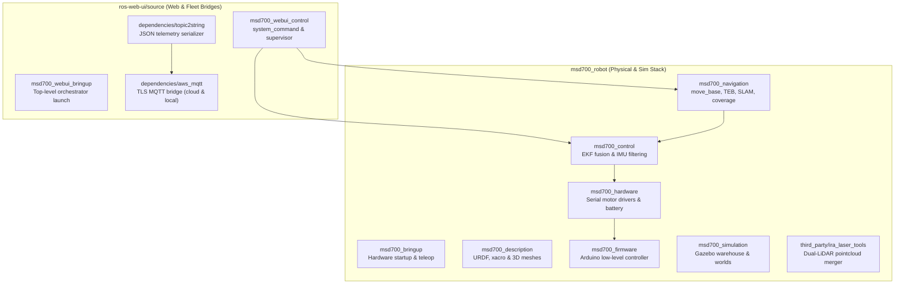

# ROSパッケージ一覧

<RoleBadge role="developer" />

本ドキュメントは、`msd700_robot`と`ros-web-ui/source`にまたがるMSD700ワークスペース内の全ROS 1 Noeticパッケージの包括的な一覧を提供し、各パッケージの役割、主要なLaunchファイル、稼働ノード、パブリッシュ/サブスクライブされるTopic、パラメータを詳述する。

## ワークスペースパッケージ構成

## パッケージディレクトリ: `msd700_robot`

### 1. `msd700_navigation`
自律移動、SLAMマッピング、エリア網羅走行を担うコアパッケージ。

- **主要ノード**:
  - `move_base`: グローバル経路計画に`navfn/NavfnROS`、軌道最適化に`teb_local_planner/TebLocalPlannerROS`を利用する標準ROSナビゲーションアクションサーバー。
  - `path_coverage_node.py`: `libs/coverage_geometry.py`を用いて蛇行経路を計算し、リアルタイムの障害物再計画を処理するブストロフェドン網羅走行プランナー。
  - `slam_gmapping`: occupancy gridを生成する2Dレーザーベースのマッピングノード。
  - `amcl`: 静的地図上での位置推定を行うAdaptive Monte Carlo Localizationパーティクルフィルタ。
- **主要Launchファイル**:
  - `msd700_navigation.launch`: map server、AMCL、move_baseを含む完全なナビゲーション起動。
  - `msd700_boustrophedon.launch`: `path_coverage_node`によるエリア網羅走行実行スタック。
  - `msd700_slam.launch`: テレオペレーション付きGmapping SLAM起動。
  - `msd700_explore.launch`: 自律SLAMフロンティア探索(`explore_lite`)。

### 2. `msd700_control`
状態推定、座標変換階層、センサーフュージョンを管理する。

- **主要ノード**:
  - `ekf_localization_node` (`robot_localization`): ホイールエンコーダーオドメトリ(`/wheel/odom`)とIMUセンサーデータ(`/imu/data`)を融合し、安定した`/odometry/filtered`トピックを生成する拡張カルマンフィルタ。
  - `imu_filter_node` (`imu_tools`): 生の角速度と加速度をオリエンテーションクォータニオンに変換するMadgwick AHRSセンサーフィルタ。
- **主要Launchファイル**:
  - `robot_localization.launch`: `ekf_localization_config.yaml`からパラメータを読み込み、EKFフュージョンを構成・起動する。
  - `imu_filter.launch`: Madgwickオリエンテーション推定を起動する。

### 3. `msd700_description`
URDFとXacroを用いて物理的な運動構造、衝突ジオメトリ、センサー配置を定義する。

- **主要URDFモデル**:
  - `urdf/msd700_field.urdf.xacro`: 実寸スケールの量産ロボットモデル(0.90 x 0.70 m、キャスター4輪、中央駆動軸、Velodyneマスト)。
  - `urdf/velodyne/VLP_16.urdf.xacro`: 高精度16チャンネル3D LiDARモデルとGazeboセンサープラグイン。
  - `urdf/turtlebot3_waffle.urdf.xacro`: レガシーな小型プロトタイプモデル。

### 4. `msd700_hardware` & `msd700_firmware`
低レベルハードウェアインターフェース、モーター駆動、エンコーダーパルスカウント、バッテリー状態を扱う。

- **ハードウェア構成**:
  - `serial_launch.launch`: ホストのシリアルポートを`/dev/ttyUSB*`経由(115200ボー)で低レベルのArduino/Teensyマイコンに接続する。
  - Arduinoファームウェアは閉ループPID速度制御を実行し、`/cmd_vel`速度コマンドを受信し、ホイールエンコーダーのティックカウントをパブリッシュする。

### 5. `msd700_simulation`
ナビゲーションアルゴリズムをソフトウェア上でテストするGazeboシミュレーション環境。

- **主要環境**:
  - `msd700_warehouse_nav.launch`: 実寸スケールの`msd700_field`ロボットモデルで14 x 21 mのAWS RoboMaker Small Warehouseを起動する。
  - `scripts/fetch_sim_worlds.sh`: GitHubの`ros1`ブランチから3Dシミュレーションメッシュ(12 MB)をオンデマンドでダウンロードするスクリプト。

### 6. `third_party/ira_laser_tools`
複数の2D LiDARスキャナーを統合、または3Dポイントクラウドを仮想の平面スキャンに変換する。

- **ノード**:
  - `laserscan_multi_merger`: 2台の平面LiDARを1つの360度`/scan`トピックに統合する。

## パッケージディレクトリ: `ros-web-ui/source`

### 1. `msd700_webui_control`
Webコマンドとダッシュボードテレメトリを物理ロボットハードウェアに橋渡しする。

- **主要ノード**:
  - `system_command.py`: MQTTの`/system_command`をサブスクライブし、排他的な操作リースを管理し、アクションをディスパッチし、`/system_feedback`をパブリッシュする。
  - `operation_supervisor.py`: Autopilotのウェイポイント進行を管理し、`/string/operation_snapshot`をラッチする自律ミッションシーケンサー。
  - `switch_mode.py`: `idle`、`navigation`、`mapping`の各モードのLaunchスタックを動的に切り替えるROSサービスオーケストレーター。
  - `hardware_monitor.py`: 重要なセンサープロセスとUSBデバイスの健全性を検証するバックグラウンドウォッチドッグ。

### 2. `dependencies/topic2string`
重いROSメッセージ型をJSON文字列に変換する高性能シリアライゼーション層。

- **主要ノード**:
  - `robotpose_from_string.py` / `robotpose_to_string`: 25 Hzのポーズテレメトリシリアライザ。
  - `laserscan_to_string.py`: 2 Hzの圧縮レーザースキャンシリアライザ。
  - `map_compression_node` / `map_decompression_node`: ライブSLAM occupancy grid用のBase64 zlib圧縮。

### 3. `dependencies/aws_mqtt`
ローカルのROSトピックを中央HiveMQブローカーに接続する暗号化トランスポートブリッジ。

- **Launchファイル**:
  - `nakayama_msd.launch`: ロボット側ブリッジ。オンボードのROSトピックをポート8883(TLS)でクラウドHiveMQに接続する。
  - `nakayama_cloud.launch`: サーバー側ブリッジ。MQTTトピックをユニットごとのクラウドROSトピックに変換する。
  - `local_msd.launch`: ユニット側ブリッジ。ローカルMosquittoブローカー(`127.0.0.1:1883`)に接続する。

## 関連ドキュメント

- [アーキテクチャ](/ja/development/architecture): システム全体の高レベルな構造と継ぎ目。
- [センサーフュージョン & 制御](/ja/development/ros/sensor-fusion-and-control): EKFとセンサーパイプラインの詳細な設定。
- [State and Behavior](/ja/development/state-and-behavior): 全制御ノードの詳細なステートマシン。
