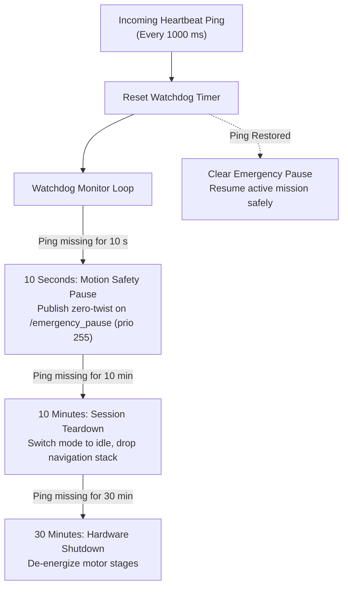

# セーフティウォッチドッグとハートビート監視

<RoleBadge role="developer" />

オンボードソフトウェアは、`system_command.py`内で動作する連続的なスライディングウィンドウウォッチドッグを通じて通信の健全性を監視する。これはロボット内部の安全機構であり、それ自体にはダッシュボードUIを持たない。オペレーターからその効果(`in_use`/リースフィールド、強制されうるアクティビティ状態)がどう見えるかについては、[アーキテクチャ § State Ownership and Persistence Matrix](/ja/development/architecture#状態の所有権と永続化のマトリクス)と[ナビゲーション: 手動オーバーライド & Autopilot](/ja/development/webui/navigation/manual-and-autopilot)を参照。

## ハートビートウォッチドッグの時間階層

1. **10秒(モーション一時停止)**: 10秒間有効なハートビートが届かない場合、`system_command.py`は優先度255でラッチされた`/emergency_pause`ツイストコマンドをアサートする。ロボットはアクティブな`move_base`ゴールをキャンセルすることなく完全停止まで減速する。通信が復旧すると一時停止は解除され、動作は自動的に再開される。
2. **10分(セッション終了)**: オペレーターが10分間切断されたままの場合、モーターの過熱を防ぐため、アクティブなナビゲーションまたはマッピングセッションは安全にアンロードされる。
3. **30分(ハードウェアシャットダウン)**: 30分間継続して不在の場合、ハードウェアドライバは低電力スタンバイモードに移行して電源を落とす。

::: warning Autopilotモードの例外扱い
Autopilotモードが有効な間、10秒の通信一時停止は抑制される。オペレーターがノートPCを閉じても、Wi-Fiの不感地帯を通過しても、ロボットは自律ルートを継続する。各画面からこの例外がどうトリガーされるかについては、[ナビゲーション: 手動オーバーライド & Autopilot](/ja/development/webui/navigation/manual-and-autopilot)と[マッピング: 手動オーバーライド & 自律探索](/ja/development/webui/mapping/manual-and-autonomous)を参照。
:::

## 関連

- [アーキテクチャ § State Ownership and Persistence Matrix](/ja/development/architecture#状態の所有権と永続化のマトリクス)
- [ナビゲーション: 手動オーバーライド & Autopilot](/ja/development/webui/navigation/manual-and-autopilot)
- [マッピング: 手動オーバーライド & 自律探索](/ja/development/webui/mapping/manual-and-autonomous)
- [ROSパッケージ一覧](/ja/development/ros/ros-packages)
