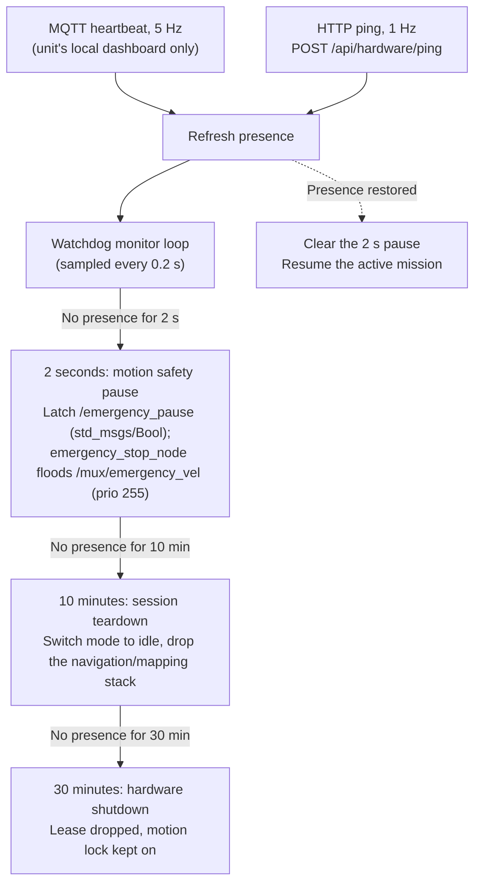

# セーフティウォッチドッグとハートビート監視

<RoleBadge role="developer" />

オンボードソフトウェアは、`system_command.py`内で動作するウォッチドッグでオペレーターの在席を監視する。これはロボット内部の安全機構であり、それ自体にはダッシュボードUIを持たない。オペレーターからその効果(`in_use`/リースフィールド、強制されうるアクティビティ状態)がどう見えるかについては、[アーキテクチャ § State Ownership and Persistence Matrix](/ja/development/architecture#状態の所有権と永続化のマトリクス)と[ナビゲーション: 手動オーバーライド & Autopilot](/ja/development/webui/navigation/manual-and-autopilot)を参照。

## 2つの在席シグナル

ウォッチドッグは、次のどちらかをオペレーター画面が監視している証拠として受け付ける。

| シグナル | 経路 | レート | 内容 |
| --- | --- | --- | --- |
| `ping` | ブラウザ → `POST /api/hardware/ping` → バックエンド → MQTT → `/system_command` | 1 Hz、リクエストタイムアウト1.5秒 | 在席**と**権限: 操作リース、claim/release/takeover、バックエンドが付与する`origin`、ステータスフィードバック |
| `heartbeat` | ブラウザ → MQTT over WebSocketでユニットのMosquittoへ直接(`NEXT_PUBLIC_MQTT_WS_URL`、ポート`9001`)→ `/system_command` | 5 Hz、QoS 0、retainなし | 在席のみ(`data.page`)。何の権限も与えない: claim、release、origin、フィードバックなし |

heartbeatが存在するのは、HTTP pingがクラウド経由の往復通信だからである。損失の多い回線では、pingが2回連続で失われるだけで2秒階層が発動する。heartbeatなら10回連続で失われる必要がある。heartbeatは`NEXT_PUBLIC_MQTT_WS_URL`付きでビルドされたダッシュボードでのみ動作し、ユニットのローカルダッシュボードはこれに該当する(`ws://<LOCAL_IP>:9001`)。クラウドダッシュボードは設定していないため、クラウドのセッションはHTTP pingのみで監視される。送信側は`heartbeatService.ts`、受信側は`system_command.py`の`_operator_heartbeat`。

## ハートビートウォッチドッグの時間階層

値は`msd700_webui_control/config/system_command.yaml`による。

1. **2秒(モーション一時停止)**: 2秒間在席がない場合(`ping_pause_timeout: 2.0`、`ping_monitor_interval: 0.2`ごとに確認)、`system_command.py`は`/emergency_pause`(`std_msgs/Bool`)をラッチし、`emergency_stop_node`が優先度255で`/mux/emergency_vel`にゼロツイストを流し込む。アクティブな`move_base`ゴールはキャンセルされない。次に受理されたpingまたはheartbeatで一時停止は解除され、動作が再開する。
2. **10分(セッション終了)**: 10分間在席がない場合(`ping_timeout: 600.0`)、アクティブなナビゲーションまたはマッピングセッションはアンロードされ、ロボットはidleになる。
3. **30分(ハードウェアシャットダウン)**: 30分後(`ping_shutdown_timeout: 1800.0`)、操作リースが解放され、operation supervisorと手動オーバーライドの状態がクリアされ、モーションロックを保持したまま全ハードウェアがシャットダウンされる。この階層は再接続しても**復旧しない**。ハードウェアを明示的に再初期化する必要がある。

これらの階層を抑えられるのは、実行中の操作を所有する画面だけである。ユニット一覧とログイン画面は読み取り専用で、監視とはみなされない。

::: warning Autopilotモードの例外扱い
Autopilotが有効な間は、**3つすべて**の階層が抑制される: 2秒の一時停止、10分のidle切替、30分のシャットダウン。オペレーターがノートPCを閉じても、Wi-Fiの不感地帯を通過しても、ロボットは自律ルートを最後まで実行する。各画面からこの例外がどうトリガーされるかについては、[ナビゲーション: 手動オーバーライド & Autopilot](/ja/development/webui/navigation/manual-and-autopilot)と[マッピング: 手動オーバーライド & 自律探索](/ja/development/webui/mapping/manual-and-autonomous)を参照。
:::

## 関連

- [アーキテクチャ § State Ownership and Persistence Matrix](/ja/development/architecture#状態の所有権と永続化のマトリクス)
- [ナビゲーション: 手動オーバーライド & Autopilot](/ja/development/webui/navigation/manual-and-autopilot)
- [マッピング: 手動オーバーライド & 自律探索](/ja/development/webui/mapping/manual-and-autonomous)
- [ROSパッケージ一覧](/ja/development/ros/ros-packages)
