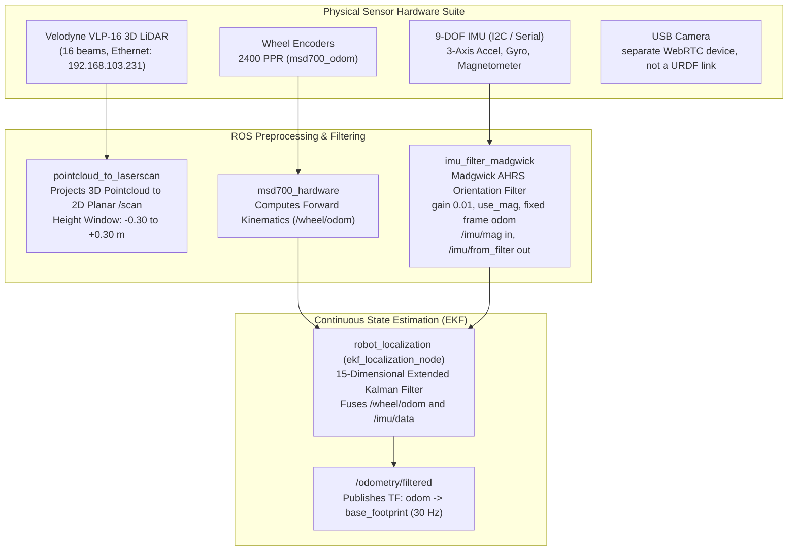
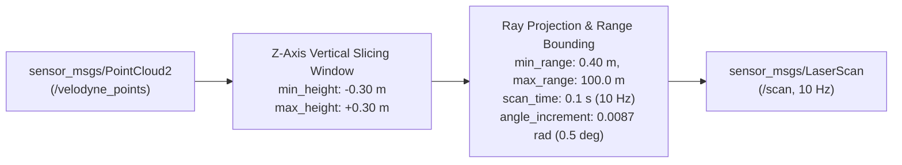

# センサーフュージョン、キネマティクス、状態推定

<RoleBadge role="developer" />

本ドキュメントは、MSD700ロボットに実装されている状態推定パイプライン、拡張カルマンフィルタ(EKF)構成、IMUオリエンテーションフィルタリング、差動二輪駆動キネマティクスについての網羅的な数学的・アーキテクチャ的仕様を提供する。

## 知覚とフュージョンのアーキテクチャ

---

## 差動二輪駆動の順運動学

フィールドロボットは4つの駆動輪(前後左右、$x = \pm 0.30\text{ m}$、$y = \pm 0.30\text{ m}$)を持ち、オドメトリはそれらを差動ペアとして融合する。

### キネマティクスパラメータ(`msd700_hardware/config/odometry_config.yaml`):
- ホイール半径: $r = 0.027\text{ m}$($2.7\text{ cm}$)。
- トラックゲージ(車輪センターライン間の距離): $L = 0.23\text{ m}$($23\text{ cm}$)。
- エンコーダー分解能: $PPR = 2400\text{ pulses/revolution}$。

### 制御周期$\Delta t$ごとの変位計算:
左エンコーダー差分$\Delta \text{ticks}_L$と右エンコーダー差分$\Delta \text{ticks}_R$が与えられたとき:

$$\Delta s_L = \frac{2 \pi r \cdot \Delta \text{ticks}_L}{PPR}, \quad \Delta s_R = \frac{2 \pi r \cdot \Delta \text{ticks}_R}{PPR}$$

並進変位$\Delta s$と方位変化$\Delta \theta$:

$$\Delta s = \frac{\Delta s_R + \Delta s_L}{2}, \quad \Delta \theta = \frac{\Delta s_R - \Delta s_L}{L}$$

### 離散オドメトリ積分:
ロボットローカルフレームにおいて、ルンゲ・クッタ2次(中点法)積分を用いる:

$$x_{k+1} = x_k + \Delta s \cdot \cos\left(\theta_k + \frac{\Delta \theta}{2}\right)$$

$$y_{k+1} = y_k + \Delta s \cdot \sin\left(\theta_k + \frac{\Delta \theta}{2}\right)$$

$$\theta_{k+1} = \theta_k + \Delta \theta$$

---

## Madgwick AHRS IMUオリエンテーションフィルタ

`/imu/data_raw`上の生IMUデータは、`imu_filter_madgwick`によって処理され、ドリフトフリーなクォータニオンオリエンテーション$\mathbf{q} = [q_w, q_x, q_y, q_z]^T$が導出される。フィルタは`gain 0.01`、`use_mag true`、固定フレーム`odom`で動作し、`/imu/mag`を読み取り、融合結果を`/imu/from_filter`にパブリッシュする(これがEKFの`imu0`として消費される):

### 勾配降下法による最適化:
$$\mathbf{q}_{k+1} = \mathbf{q}_k + \left( \frac{1}{2} \mathbf{q}_k \otimes \mathbf{\omega}_{gyro} - \beta \frac{\nabla \mathbf{f}}{\|\nabla \mathbf{f}\|} \right) \Delta t$$

- $\mathbf{\omega}_{gyro} = [0, \omega_x, \omega_y, \omega_z]^T$: ジャイロスコープからの角速度ベクトル。
- $\nabla \mathbf{f}$: 実測された加速度計の重力ベクトルを、基準地球座標系の重力$[0, 0, 1]^T$に整合させる目的関数の勾配。
- $\beta$(`gain`)$= 0.01$: ジャイロスコープの応答性と加速度計の振動ノイズのバランスを取るフィルタ発散率パラメータ。

---

## 15次元拡張カルマンフィルタ(EKF)

状態推定ノード(`robot_localization`の`ekf_localization_node`)は、15状態のガウス確率変数ベクトルを保持する:

$$\mathbf{x} = \begin{bmatrix} x & y & z & \phi & \theta & \psi & \dot{x} & \dot{y} & \dot{z} & \dot{\phi} & \dot{\theta} & \dot{\psi} & \ddot{x} & \ddot{y} & \ddot{z} \end{bmatrix}^T$$

ここで:
- $x, y, z$: オドメトリフレームにおける3D位置($2$Dモードでは$z$は$0$に固定)。
- $\phi, \theta, \psi$: ロール、ピッチ、ヨー(オイラー角)。
- $\dot{x}, \dot{y}, \dot{z}$: 機体座標系の並進速度。
- $\dot{\phi}, \dot{\theta}, \dot{\psi}$: 角速度。
- $\ddot{x}, \ddot{y}, \ddot{z}$: 並進加速度。

### プロセス更新(予測ステップ):
$$\hat{\mathbf{x}}_{k|k-1} = \mathbf{f}(\hat{\mathbf{x}}_{k-1|k-1}, \mathbf{u}_k)$$

$$\mathbf{P}_{k|k-1} = \mathbf{F}_k \mathbf{P}_{k-1|k-1} \mathbf{F}_k^T + \mathbf{Q}$$

- $\mathbf{F}_k = \left. \frac{\partial \mathbf{f}}{\partial \mathbf{x}} \right|_{\hat{\mathbf{x}}_{k-1|k-1}}$: 状態遷移ヤコビ行列。
- $\mathbf{Q}$: プロセスノイズ共分散対角行列(未モデル化のダイナミクスとホイールスリップを反映)。

### 観測更新(修正ステップ):
$$\mathbf{K}_k = \mathbf{P}_{k|k-1} \mathbf{H}_k^T \left( \mathbf{H}_k \mathbf{P}_{k|k-1} \mathbf{H}_k^T + \mathbf{R}_k \right)^{-1}$$

$$\hat{\mathbf{x}}_{k|k} = \hat{\mathbf{x}}_{k|k-1} + \mathbf{K}_k \left( \mathbf{z}_k - \mathbf{h}(\hat{\mathbf{x}}_{k|k-1}) \right)$$

$$\mathbf{P}_{k|k} = (\mathbf{I} - \mathbf{K}_k \mathbf{H}_k) \mathbf{P}_{k|k-1}$$

- $\mathbf{z}_k$: ホイールオドメトリ(`odom0: /wheel/odom`)からの速度$\dot{x}$と、フィルタ済みIMU(`imu0`、フレーム`odom`)からのロール/ピッチおよびヨーレートを融合した観測ベクトル。ロールとピッチはIMU由来であり、フィルタは`odom`フレームで$30\text{ Hz}$動作する。
- $\mathbf{R}_k$: `ekf_localization_config.yaml`由来の観測ノイズ共分散行列(プロセス共分散と初期共分散はファイル内。チューニング値はyamlを参照)。

---

## LiDARポイントクラウド投影パイプライン

Velodyne VLP-16センサーは16本のレーザーリングにわたって毎秒30万点を生成する。空間的な障害物認識を維持しつつCPU使用率を最小化するため、`pointcloud_to_laserscan`は3Dポイントクラウドを高頻度の2D平面スキャンにスライスする:

センサー周辺の$\pm 0.30\text{ m}$バンドはナビゲーションコストマップに残し、それ以外(床面反射、天井)は落とす。第2のパイプライン(`cloud_hazard.launch`)は地面をフィットさせ、その上$0.08$–$0.65\text{ m}$バンドで穴や段差を監視し、`/scan_hazard`をパブリッシュする。

## 関連ドキュメント

- [コストマップ & プランナー](/ja/development/ros/costmaps-and-planners): ナビゲーションレイヤーと障害物インフレーション。
- [ファームウェア & ハードウェア](/ja/development/ros/firmware-and-hardware): マイコンのパルスカウントとPIDループ。
- [シミュレーション (Gazebo)](/ja/development/ros/simulation): 実寸スケールのGazeboセンサー検証。
