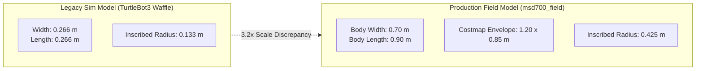
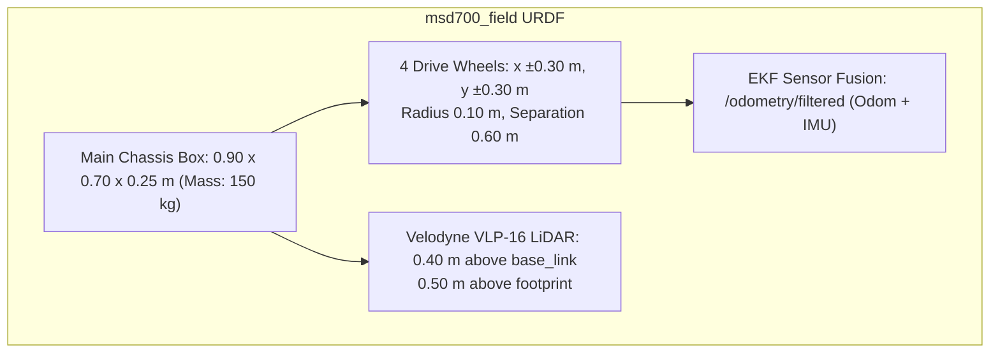

# シミュレーション (Gazebo)

<RoleBadge role="developer" />

本ドキュメントは、MSD700ロボットが実寸スケールでGazebo上にどのようにシミュレートされるか、AWS RoboMaker Small Warehouse環境、センサー構成、そしてシミュレータが検証できること・できないことについて説明する。

実機ロボットの寸法から導出された網羅走行計画のジオメトリについては、[ブストロフェドン網羅走行](/ja/development/ros/boustrophedon-and-alignment)を参照。

## 背景: 実寸スケール寸法モデル

リポジトリ内の従来のシミュレータ構成では、TurtleBot3 Waffleモデル(トラック幅0.287 mに対し**0.266 x 0.266 m**のフットプリント)が使用されていた。これに対し、実際の量産MSD700ロボットは**0.90 x 0.70 m**であり、ナビゲーションコストマップ上ではパディングを加えた**1.20 x 0.85 m**のフットプリントとして表現される。



### スケール差による影響:
1. **再現不能な狭小通路の問題**: 倉庫の狭い通路での経路計画失敗という実世界の報告は、半径0.133 mのTurtleBotでは再現できなかった。
2. **設定の漏れ残り**: 実寸スケールモデリングに置き換えられるまで、レガシーなパラメータ(`robot_width: 0.32`)が網羅走行設定内に残っていた。
3. **環境スケールの不整合**: 標準のTurtleBotマップには、0.9 x 0.7 mのロボットに対する十分なクリアランスがなかった:
   - `turtlebot_world`: 最大クリアランス0.39 m(0.425 mの内接ハーフ幅をどこにも収容できない)。
   - `AWS RoboMaker Small Warehouse`: 衝突ジオメトリからは最大クリアランス**3.83 m**(立つために十分な幅の床が65%、旋回に十分な幅が46%)、AWS同梱の占有地図からは**3.68 m**(58% / 38%) — 許容誤差内で一致する2通りの独立した測定方法。

## シミュレーションワールド: AWS Small Warehouse

シミュレータは[AWS RoboMaker Small Warehouse](https://github.com/aws-robotics/aws-robomaker-small-warehouse-world)環境を標準として採用している。234 m²の開放床面、保管ラック、パレットジャッキ、障害物を備えた13.98 x 20.91 mの工業用ホールである。

gitリポジトリを軽量に保つため、3Dメッシュアセット(12 MB)はオンデマンドで取得される:

```bash
rosrun msd700_simulation fetch_sim_worlds.sh
```

::: warning 上流ブランチの選択
AWS RoboMakerは2025-09-10にアーカイブされた。そのGitHubのデフォルトブランチには非推奨を示すREADMEしか含まれていない。シミュレーションアセットは**`ros1`**ブランチに置かれており、`fetch_sim_worlds.sh`はこれを明示的にクローンする。
:::

### スポーン座標とクリアランス

検証済みのデフォルトスポーン姿勢は**`x: 0.50, y: -2.40, yaw: 1.5708(北向き)`**であり、**3.79 m**の開けたクリアランスを提供する。

| 地点名 | 座標 (x, y) | クリアランス半径 | ステータス |
| --- | --- | --- | --- |
| **Default Warehouse Spawn** | `(0.50, -2.40)` | **3.79 m** | 安全性検証済み(デフォルト) |
| Alternate Bay 1 | `(1.81, -7.25)` | 2.47 m | 安全 |
| Alternate Bay 2 | `(0.81, 2.75)` | 1.49 m | 安全 |
| Shelving Clutter (無効) | `(4.00, 1.00)` | **0.29 m** | **危険**: 棚の衝突ゾーン内 |

## ロボットURDFモデル: `msd700_field`

実機ロボットは`msd700_description/urdf/msd700_field.urdf.xacro`でモデル化され、Gazeboプラグインは`msd700_field.gazebo.xacro`に定義されている。



### 物理仕様:
- **寸法**: 長さ0.90 m、幅0.70 m、高さ0.25 m、質量150 kg。
- **駆動ジオメトリ**: 4つの駆動輪(前後左右)。オドメトリはそれらを差動ペアとして融合する。
- **Velodyne VLP-16 LiDAR**: 実機と一致するよう、footprintから0.50 m上のマウントマストに設置。
- **標準化されたROSフレーム**: 標準的なフレーム規約(`base_footprint`、`base_link`、`base_scan`、`imu_link`、`odom`、`map`)を使用する。

## シミュレーションスタックの起動

### 1. Web UI統合を含む完全なシミュレーション
```bash
roslaunch msd700_simulation msd700_warehouse_nav.launch
```

### 2. 倉庫内でのSLAMマッピング
```bash
roslaunch msd700_simulation msd700_warehouse_slam.launch
```

### 3. Move Baseのパラメータ化(`robot_profile`)
Launchファイルは`robot_profile:=field`(倉庫Launchのデフォルト)を受け付け、フィールドロボット用のコストマップを構成する。`prototype`やレガシーな小型スケールテスト用の`waffle`も指定できる。`sim_body:=`も引き続き動作するが、`robot_profile`の非推奨エイリアスである。

## 関連ドキュメント

- [ブストロフェドン網羅走行](/ja/development/ros/boustrophedon-and-alignment): 幾何学的な経路計算とクリアランス許容値。
- [Repository Structure](/ja/development/repository-structure): シミュレーションパッケージのディレクトリレイアウト。
- [アーキテクチャ](/ja/development/architecture): システム全体の通信トポロジー。
