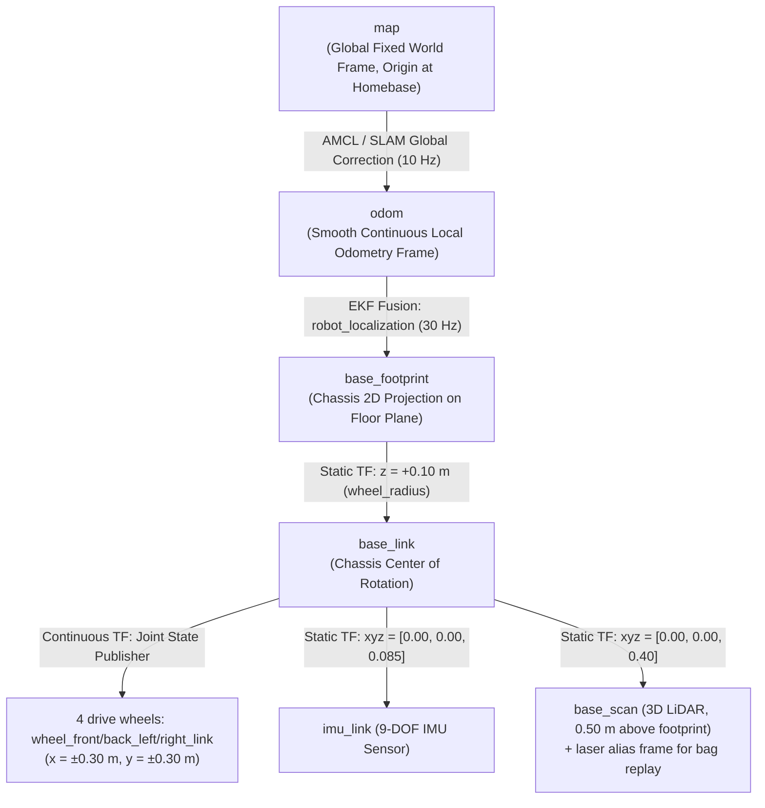
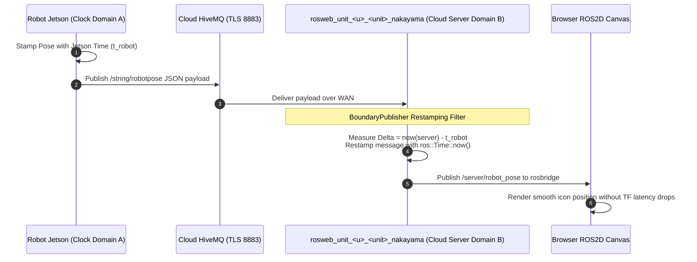

# 座標系、変換、TFアーキテクチャ

<RoleBadge role="developer" />

本ドキュメントは、MSD700ロボットシステムに実装されている座標変換ツリー(`tf` / `tf2`)、空間参照フレーム、動的トランスフォームブロードキャスタ、センサーオフセット、マシン間のクロック再スタンプについての包括的な仕様を提供する。

## 座標フレーム階層(TFツリー)

座標変換ツリーは、ROS REP-103(Standard Units of Measure & Coordinate Conventions)とREP-105(Coordinate Frames for Mobile Platforms)に準拠する:



フィールドロボットには`camera_link`は存在しない。カメラはURDFリンクではなく、別のUSB/WebRTCデバイスである。

---

## トランスフォームパブリッシャーと更新レート

| 変換エッジ | ブロードキャストノード | レート | 数学的な源 | 通信断絶時の挙動 |
| --- | --- | --- | --- | --- |
| `map -> odom` | `amcl` / `slam_gmapping` | 10 Hz | 静的なレーザーoccupancy gridに対してオドメトリドリフトを補正する。 | 位置推定が確定すると離散的にジャンプする。レーザースキャンが途絶えた場合は最後のトランスフォームを維持する。 |
| `odom -> base_footprint` | `robot_localization` (`ekf_localization_node`) | 30 Hz | ホイールエンコーダー速度とIMUのヨー/角速度を連続的に融合する。 | 連続的、滑らか、かつドリフトのない短期軌道。 |
| `base_footprint -> base_link` | `robot_state_publisher` | 静的 | 固定の高さオフセット($z = 0.10\text{ m}$ = ホイール半径)。 | URDFからの固定トランスフォーム。 |
| `base_link -> base_scan` | `robot_state_publisher` | 静的 | LiDARマスト($x = 0$、`base_link`から$z = 0.40\text{ m}$、footprintから$0.50\text{ m}$)。bag再生用の`laser`エイリアスフレーム付き。 | URDFからの固定トランスフォーム。 |
| `base_link -> imu_link` | `robot_state_publisher` | 静的 | 物理シャーシへの取り付け位置($z \approx 0.085\text{ m}$ = `body_center_z`)。 | URDFからの固定トランスフォーム。 |

---

## 空間座標規約(REP-103)

MSD700は右手系デカルト座標系を厳格に適用する:

```
        +X (Forward / Roll Axis)
           ▲
           │
           │
           │
 ◄─────────┼─────────► +Y (Left / Pitch Axis)
           │
           ▼
        +Z (Upward / Yaw Axis)
```

- **$+X$**: ロボットの主な進行方向に沿って真正面を指す。
- **$+Y$**: ロボットの横幅方向、真左を指す。
- **$+Z$**: 床面に垂直に、真上を指す。
- **回転角**: 右手系の法則に従う($+Z$まわりの反時計回りの回転が正のヨーレート$+\dot{\theta}$に対応する)。

---

## マシン間クロックドメインの再スタンプ(`BoundaryPublisher`)

テレメトリ(ロボットの姿勢やレーザースキャンなど)が実機ロボットからインターネット経由でクラウドサーバーへ橋渡しされる際、タイムスタンプをそのまま評価すると**物理マシン間のクロックドリフトにより`TF_OLD_DATA`外挿警告が発生する**。



### 再スタンプが不可欠である理由:
1. **JetsonのRTCの制約**: NTPアクセスのないフィールド環境の実機SBCは、数秒から数か月単位でずれたクロックのまま起動することがある。
2. **バッファ破棄**: 受信したポーズメッセージのタイムスタンプがサーバーのROSマスターより過去の時刻を示している場合、`tf2_ros::Buffer`は即座にそれを破棄し、Webキャンバス上でのロボットの動き描画を妨げる。
3. **`BoundaryPublisher`による解決**: `patch_time.py`はロボットハードウェアのタイムスタンプを取り除き、サーバーのROSマスターに到達した時点で幾何学的ペイロードに`ros::Time::now()`を用いて再スタンプする。

## 関連ドキュメント

- [センサーフュージョン & 制御](/ja/development/ros/sensor-fusion-and-control): 運動状態推定とEKF。
- [コストマップ & プランナー](/ja/development/ros/costmaps-and-planners): ナビゲーションコストマップの座標フレーム。
- [rosbridgeプロトコル](/ja/development/rosbridge-protocol): WebSocketトピックのシリアライゼーション。
