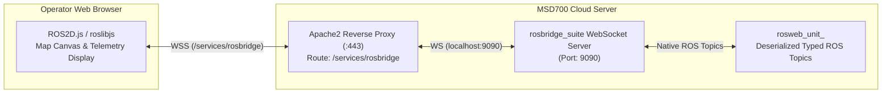

# WebSocket and rosbridge Protocol

<RoleBadge role="developer" />

This document details the WebSocket interface provided by `rosbridge_suite`, explaining the JSON protocol specification, message subscription formats, service invocation schemas, compression techniques, and web canvas rendering integration.

## rosbridge Architecture Overview

The web dashboard interacts with live ROS topics and services through `rosbridge_server` over a persistent WebSocket connection.



## Connection Endpoints

| Environment | Protocol & Path | Destination Port |
| --- | --- | --- |
| **Production Server** | `wss://msd.nglobal.jp/services/rosbridge` | Proxied to internal `localhost:9090` |
| **Development Server** | `ws://<server-ip>:9091` | Direct WebSocket to dev rosbridge container |
| **Unit Local Server** | `ws://<unit-ip>:9090` | Direct WebSocket to onboard `rosbridge_suite` |

## rosbridge Protocol Operations

The rosbridge v2 protocol uses standardized JSON operations (`op`):

### 1. Topic Subscription (`op: "subscribe"`)
Initiates streaming of a ROS topic to the browser:

```json
{
  "op": "subscribe",
  "id": "sub_robot_pose_1",
  "topic": "/unit_01JZ8P9WZ0UNIT00000000000/server/robot_pose",
  "type": "geometry_msgs/PoseStamped",
  "throttle_rate": 40,
  "queue_length": 1,
  "compression": "none"
}
```

- `topic`: Fully qualified ROS topic name including unit ULID namespace.
- `throttle_rate`: Minimum time in milliseconds between messages (e.g. 40 ms = 25 Hz).
- `compression`: Supports `none` or `png` (for high-bandwidth occupancy grids).

### 2. Topic Publishing (`op: "publish"`)
Publishes a typed ROS message from browser to ROS master:

```json
{
  "op": "publish",
  "id": "pub_cmd_vel_1",
  "topic": "/unit_01JZ8P9WZ0UNIT00000000000/server/key_vel",
  "type": "geometry_msgs/Twist",
  "msg": {
    "linear": { "x": 0.35, "y": 0.0, "z": 0.0 },
    "angular": { "x": 0.0, "y": 0.0, "z": 0.50 }
  }
}
```

### 3. Service Invocation (`op: "call_service"`)
Calls a ROS service synchronously:

```json
{
  "op": "call_service",
  "id": "srv_call_102",
  "service": "/unit_01JZ8P9WZ0UNIT00000000000/server/global_localization",
  "args": {}
}
```

- **Service Response Envelope**:
```json
{
  "op": "service_response",
  "id": "srv_call_102",
  "service": "/unit_01JZ8P9WZ0UNIT00000000000/server/global_localization",
  "values": {},
  "result": true
}
```

## Primary Web Canvas Subscriptions

The web dashboard (`ROS-dashboard-next-ts`) subscribes to the following primary visual topics:

| Topic Identifier | ROS Message Type | Purpose on Canvas |
| --- | --- | --- |
| `/server/robot_pose` | `geometry_msgs/PoseStamped` | Updates 2D robot icon position and heading arrow (25 Hz). |
| `/server/slam/map` | `nav_msgs/OccupancyGrid` | Renders the live SLAM floorplan bitmap on EaselJS canvas. |
| `/server/scan` | `sensor_msgs/LaserScan` | Renders red laser beam points around the robot. |
| `/server/move_base/NavfnROS/plan` | `nav_msgs/Path` | Renders global blue planned navigation trajectory. |
| `/server/move_base/TebLocalPlannerROS/local_plan` | `nav_msgs/Path` | Renders dynamic local trajectory line. |
| `/server/boustrophedon_path` | `nav_msgs/Path` | Renders orange boustrophedon area coverage sweep path. |

## Frontend Resilience and Self-Healing

1. **`ROS2D.js` Stage Prototype Patch**: To prevent crashes where EaselJS stage objects lose ROS coordinate transform functions during rapid component remounting, the frontend dynamically injects `globalToRos` and `rosToGlobal` methods into `createjs.Stage.prototype` prior to viewer instantiation.
2. **Reconnection Debounce**: If the WebSocket drops, the client waits for three consecutive reconnection attempts before surfacing a disconnect warning, preventing UI flickering during temporary network blips.

## Related Documentation

- [Message Contracts](/ja/development/message-contracts): MQTT and serialized topic contracts.
- [Architecture](/ja/development/architecture): Two-machine model and rosbridge routing.
- [API Reference](/ja/development/api-reference): HTTP REST API endpoints.
