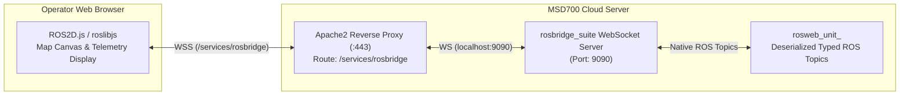

# WebSocket と rosbridge プロトコル

<RoleBadge role="developer" />

このドキュメントでは、`rosbridge_suite` によって提供される WebSocket インターフェイスについて詳しく説明し、JSON プロトコル仕様、メッセージ サブスクリプション形式、サービス呼び出しスキーマ、圧縮技術、および Web キャンバス レンダリングの統合について説明します。

## rosbridge アーキテクチャの概要

Web ダッシュボードは、永続的な WebSocket 接続を介して `rosbridge_server` を通じてライブ ROS トピックおよびサービスと対話します。



## 接続エンドポイント

|環境 |プロトコルとパス |宛先ポート |
| --- | --- | --- |
| **実稼働サーバー** | `wss://msd.nglobal.jp/services/rosbridge` |内部 `localhost:9090` にプロキシされます |
| **開発サーバー** | `ws://<server-ip>:9091` | WebSocket を dev rosbridge コンテナにダイレクトする |
| **ユニット ローカル サーバー** | `ws://<unit-ip>:9090` | WebSocket をオンボード `rosbridge_suite` に指示する |

## rosbridge プロトコルの操作

rosbridge v2 プロトコルは、標準化された JSON 操作 (`op`) を使用します。

### 1. トピックの購読 (`op: "subscribe"`)
ブラウザへの ROS トピックのストリーミングを開始します。

```json
{
  "op": "subscribe",
  "id": "sub_robot_pose_1",
  "topic": "/unit_01JZ8P9WZ0UNIT00000000000/server/robot_pose",
  "type": "geometry_msgs/PoseStamped",
  "throttle_rate": 40,
  "queue_length": 1,
  "compression": "none"
}
```

- `topic`: ユニットの ULID 名前空間を含む完全修飾 ROS トピック名。
- `throttle_rate`: メッセージ間の最小時間 (ミリ秒単位) (例: 40 ms = 25 Hz)。
- `compression`: `none` または `png` (高帯域幅占有グリッド用) をサポートします。

### 2. トピックの公開 (`op: "publish"`)
型指定された ROS メッセージをブラウザから ROS マスターにパブリッシュします。

```json
{
  "op": "publish",
  "id": "pub_cmd_vel_1",
  "topic": "/unit_01JZ8P9WZ0UNIT00000000000/server/key_vel",
  "type": "geometry_msgs/Twist",
  "msg": {
    "linear": { "x": 0.35, "y": 0.0, "z": 0.0 },
    "angular": { "x": 0.0, "y": 0.0, "z": 0.50 }
  }
}
```

### 3. サービス呼び出し (`op: "call_service"`)
ROS サービスを同期的に呼び出します。

```json
{
  "op": "call_service",
  "id": "srv_call_102",
  "service": "/unit_01JZ8P9WZ0UNIT00000000000/server/global_localization",
  "args": {}
}
```

- **サービス応答エンベロープ**:
```json
{
  "op": "service_response",
  "id": "srv_call_102",
  "service": "/unit_01JZ8P9WZ0UNIT00000000000/server/global_localization",
  "values": {},
  "result": true
}
```

## プライマリ Web キャンバスのサブスクリプション

Web ダッシュボード (`ROS-dashboard-next-ts`) は、次の主要なビジュアル トピックをサブスクライブします。

|トピック識別子 | ROS メッセージ タイプ |キャンバス上の目的 |
| --- | --- | --- |
| `/server/robot_pose` | `geometry_msgs/PoseStamped` | 2D ロボット アイコンの位置と方向矢印を更新します (25 Hz)。 |
| `/server/slam/map` | `nav_msgs/OccupancyGrid` | EaselJS キャンバス上にライブ SLAM フロアプラン ビットマップをレンダリングします。 |
| `/server/scan` | `sensor_msgs/LaserScan` |ロボットの周囲に赤いレーザー ビーム ポイントをレンダリングします。 |
| `/server/move_base/NavfnROS/plan` | `nav_msgs/Path` |グローバルな青色の計画ナビゲーション軌道をレンダリングします。 |
| `/server/move_base/TebLocalPlannerROS/local_plan` | `nav_msgs/Path` |ダイナミックなローカル軌道ラインをレンダリングします。 |
| `/server/boustrophedon_path` | `nav_msgs/Path` |オレンジ色のボストロフェドン エリア カバレッジ スイープ パスをレンダリングします。 |

## フロントエンドの復元力と自己修復

1. **`ROS2D.js` ステージ プロトタイプ パッチ**: コンポーネントの高速再マウント中に EaselJS ステージ オブジェクトが ROS 座標変換機能を失うクラッシュを防ぐため、フロントエンドはビューアのインスタンス化前に `globalToRos` メソッドと `rosToGlobal` メソッドを `createjs.Stage.prototype` に動的に挿入します。
2. **再接続デバウンス**: WebSocket が切断された場合、クライアントは切断警告が表示される前に 3 回連続して再接続が試行されるまで待機し、一時的なネットワーク ブリップ中の UI のちらつきを防ぎます。

## 関連ドキュメント

- [メッセージ コントラクト](/ja/development/message-contracts): MQTT およびシリアル化されたトピック コントラクト。
- [アーキテクチャ](/ja/development/architecture): 2 マシン モデルとロスブリッジ ルーティング。
- [API リファレンス](/ja/development/api-reference): HTTP REST API エンドポイント。