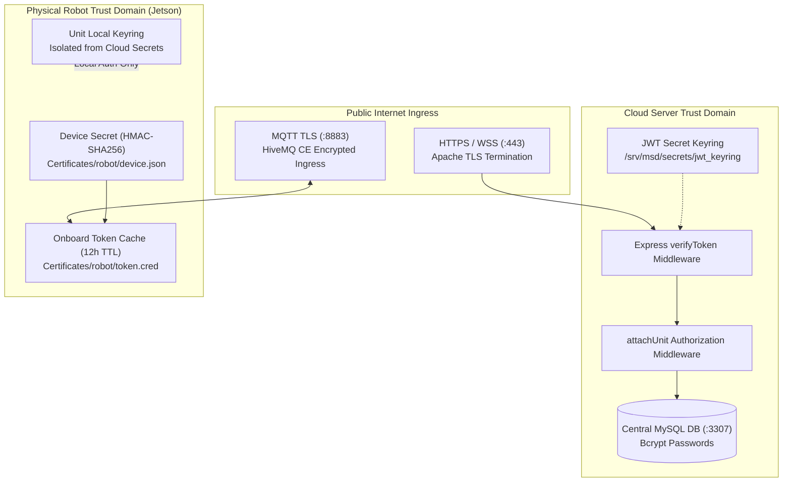
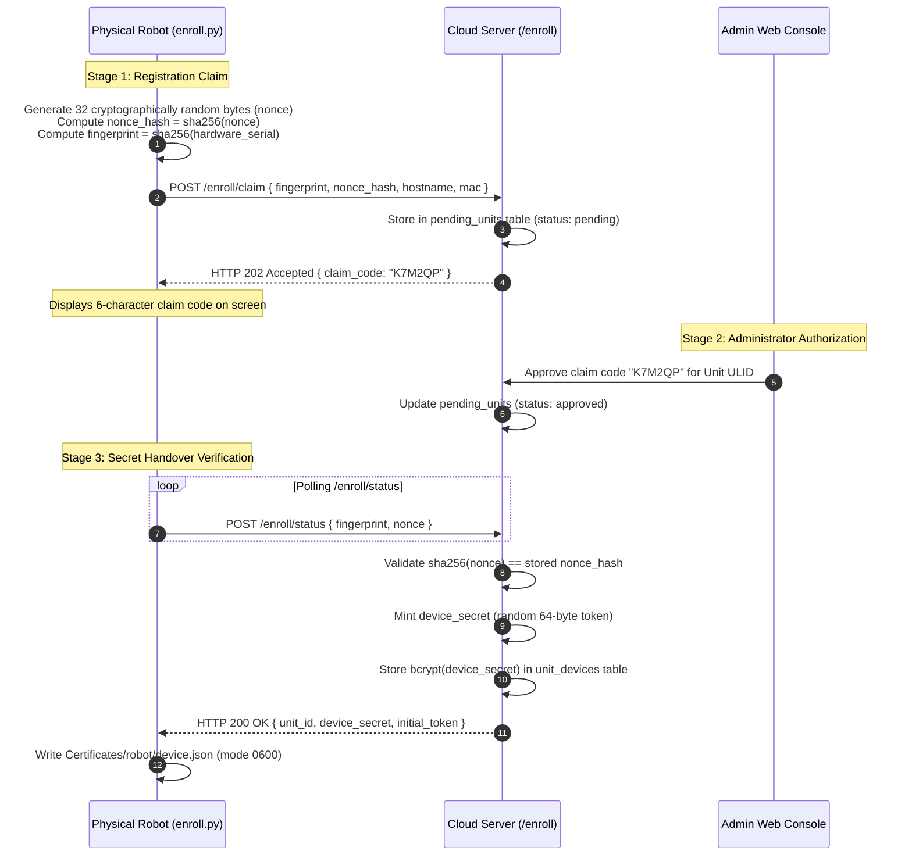
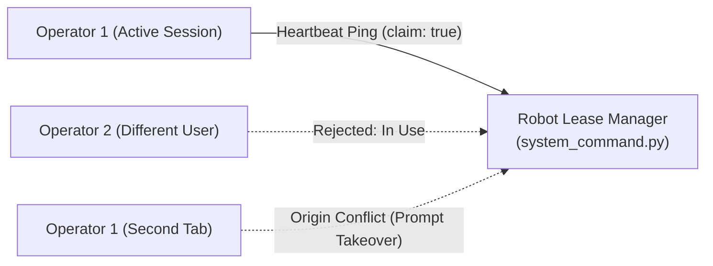

# セキュリティと認証

<RoleBadge role="developer" />

このドキュメントでは、MSD700 ロボット プラットフォーム全体に実装されるセキュリティ モデル、暗号化認証メカニズム、信頼ドメインの分離、およびアクセス制御ポリシーについて詳しく説明します。

## セキュリティ アーキテクチャの概要

MSD700 は、Web フロントエンド、クラウド バックエンド、メッセージ ブローカー、および物理的な Jetson シングルボード コンピューター (SBC) 全体に多層防御を適用します。



## 3 つの独立した信頼ドメイン

セキュリティ境界は、交換不可能な 3 つの信頼ドメインに分割されます。

|信頼ドメイン |発行者当局 |トークンの目的 |検証エンドポイント |分離ルール |
| --- | --- | --- | --- | --- |
| **オペレーター ドメイン** |クラウド サーバー バックエンド (`backend_node`) | Web ダッシュボードにアクセスする人間のオペレーターを認証します。 | `verifyToken` すべての `/api/*` ルート |ロボットが直接使用することはできません。 `/local/*` ルートで拒否されました。 |
| **ロボット クラウド ドメイン** |クラウド登録サービス (`/enroll/token`) | HiveMQ およびクラウド メディア サーバーに接続する物理ロボットを認証します。 | HiveMQ TLS + クラウド `media-server` |ロボットに割り当てられた ULID を厳密にスコープします。 12時間有効です。 |
| **ユニットローカルドメイン** |オンボード ローカル バックエンド (`backend_local`) |ローカル LAN オペレーターとオンボード ビデオ ストリーミング クライアントを認証します。 | `/local/*` エンドポイント |ローカルのオフライン主権を確保するために、クラウド トークンは厳密に拒否されます。 |

## 暗号化ハードウェア登録 (Nonce プロトコル)

未登録のロボットは、3 段階の暗号化ハンドシェイクを通じてクラウド サーバーに自身を登録します。



### 32 バイトの Nonce プロトコルが重要な理由:
- **MAC / 指紋スプーフィング保護**: ハードウェアの MAC アドレスとシリアル番号がローカル ネットワーク上にブロードキャストされ、管理コンソールに表示されます。秘密のノンスがないと、物理ロボットの電源がオフのときに、攻撃者が MAC アドレスをスプーフィングして資格情報を要求する可能性があります。
- **シングルユース検証**: 平文の nonce は、最終的な資格情報のハンドオーバー中に TLS 経由で 1 回だけ送信されます。検証されると、サーバーは保留中の nonce をクリアします。
- **生の秘密ストレージがゼロ**: クラウド データベースには、`device_secret` の `bcrypt` ハッシュのみが保存されます。データベースが完全に漏洩しても、アクティブなロボット デバイスの秘密は侵害されません。

## JWT キーリングとダウンタイムゼロのシークレットローテーション

認証トークンは、単一の静的環境変数ではなく、`/srv/msd/secrets/jwt_keyring` に保存されている **JWT キーリング** に対して検証されます。

```json
{
  "active_kid": "key_2026_08_a",
  "keys": {
    "key_2026_08_a": {
      "secret": "9a8b7c6d5e4f3a2b1c0d...",
      "created_at": "2026-08-01T00:00:00Z"
    },
    "key_2026_07_b": {
      "secret": "1f2e3d4c5b6a7f8e9d0c...",
      "created_at": "2026-07-01T00:00:00Z"
    }
  }
}
```

### キーリングのローテーション ルール:
1. **アクティブな署名キー**: 新しく作成されたすべてのアクセス トークンとリフレッシュ トークンは、`active_kid` で識別されるキーで署名されます。
2. **猶予期間の検証**: 受信トークンが到着すると、`verifyToken` はその署名を `active_kid` と照合してチェックします。検証が失敗した場合は、HTTP 401 で拒否する前に、キーリング内の以前のキーをテストします。
3. **セッション中断ゼロ**: 運用環境でシークレットをローテーションしても、すべてのアクティブなオペレーターが同時に再ログインする必要はありません。

## オペレーティング リースのセキュリティ: 複数のオペレーターによる乗っ取りの防止

同時ユーザーまたはブラウザ タブからのコマンドの競合を防ぐために、モーターの作動へのアクセスは、物理ロボットのメモリに保持されている**排他的オペレーティング リース**によって管理されます。



- **ハートビートの有効期限**: リースは 15 秒間有効であり、定期的な ping によって更新する必要があります。
- **アカウントとセッションの分離**:
  - `in_use`: 別のユーザー アカウントがリースを保持している場合、コマンドの実行はブロックされます。
  - `origin_conflict`: 同じユーザー アカウントが 2 番目のタブを開いたり、クラウドからローカル ネットワークに切り替えたりすると、UI はアクティブなタブをサイレントに中断するのではなく、明示的な引き継ぎを要求します。

## ネットワーク セキュリティと TLS 終端

1. **Apache リバース プロキシ**: すべての外部 HTTP、SSE、および WebSocket トラフィックは、Let's Encrypt (`/etc/letsencrypt/live/`) からの証明書を使用して、Apache ポート 443 で TLS を終了します。
2. **HiveMQ 相互トランスポート セキュリティ**: ロボットは TLS 経由でポート 8883 の HiveMQ に接続します。キーストア PKCS#12 証明書は `/srv/msd/secrets/hivemq/keystore.p12` にあります。
3. **コンテナの分離**: バックエンド コンテナは内部 Docker ブリッジ ネットワーク (`ros_backend_net`) を介して通信し、内部データベースやロスブリッジ ポートをパブリック インターネットに直接公開しません。

## 関連ドキュメント

- [アーキテクチャ](/ja/development/architecture): 完全なプラットフォーム トポロジと信頼ドメイン。
- [メッセージ コントラクト](/ja/development/message-contracts): ハードウェア登録ペイロード定義。
- [API リファレンス](/ja/development/api-reference): ユーザー認証とセッション更新のエンドポイント。