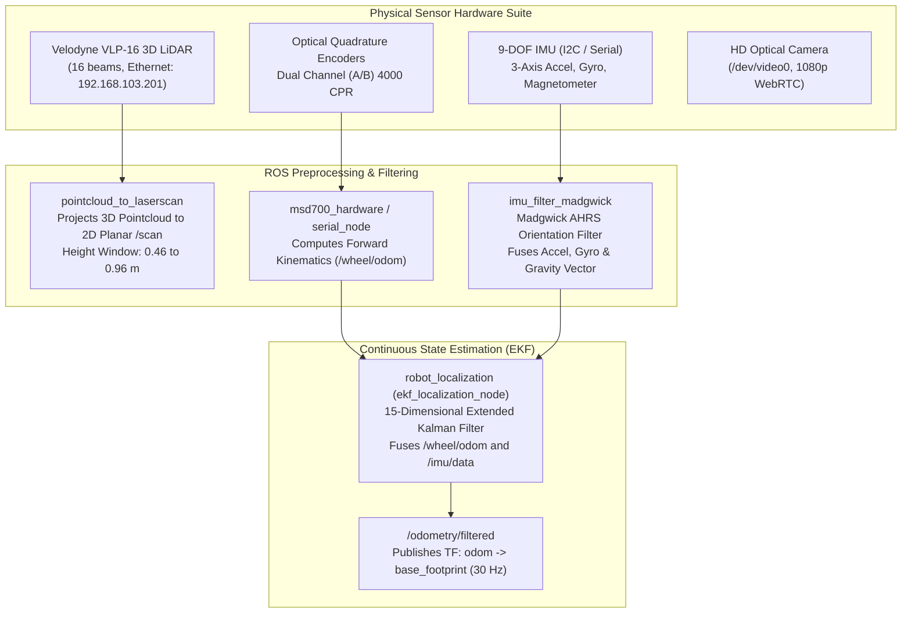
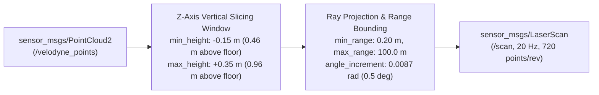

# センサーフュージョン、運動学、および状態推定

<RoleBadge role="developer" />

このドキュメントでは、MSD700 ロボットに実装された状態推定パイプライン、拡張カルマン フィルター (EKF) 構成、IMU 方向フィルタリング、および差動駆動運動学の数学的および構造的な仕様を徹底的に説明します。

## 知覚と融合のアーキテクチャ

---

## 差動駆動の順運動学

物理ロボットは、4 つのパッシブ キャスター ホイールでサポートされた 2 輪差動駆動プラットフォームとして動作します。

### 運動学パラメータ:
- ホイール半径: $r = 0.075\text{ m}$ (ホイール直径: $0.150\text{ m}$)。
- トラック ゲージ (駆動輪の中心線間の距離): $L = 0.580\text{ m}$。
- エンコーダ解像度: $CPR = 4000\text{ counts/revolution}$ ($4\times$ 直交デコード後)。
- ギアボックス減速比: $N = 30:1$。

### 制御期間ごとの変位計算 $\Delta t$:
左エンコーダ デルタ $\Delta \text{ticks}_L$ と右エンコーダ デルタ $\Delta \text{ticks}_R$ を指定すると、次のようになります。

$$\Delta s_L = \frac{2 \pi r \cdot \Delta \text{ticks}_L}{CPR \cdot N}, \quad \Delta s_R = \frac{2 \pi r \cdot \Delta \text{ticks}_R}{CPR \cdot N}$$

線形変位 $\Delta s$ と方位変化 $\Delta \theta$:

$$\Delta s = \frac{\Delta s_R + \Delta s_L}{2}、\quad \Delta \theta = \frac{\Delta s_R - \Delta s_L}{L}$$

### 離散オドメトリの統合:
ルンゲ・クッタの 2 次 (中間点) 積分を使用したロボットのローカル フレームでは、次のようになります。

$$x_{k+1} = x_k + \Delta s \cdot \cos\left(\theta_k + \frac{\Delta \theta}{2}\right)$$

$$y_{k+1} = y_k + \Delta s \cdot \sin\left(\theta_k + \frac{\Delta \theta}{2}\right)$$

$$\theta_{k+1} = \theta_k + \Delta \theta$$

---

## Madgwick AHRS IMU 方向フィルター

`/imu/data_raw` の生の IMU データ ($50\text{ Hz}$) は `imu_filter_madgwick` によって処理され、ドリフトのない四元数の方向 $\mathbf{q} = [q_w, q_x, q_y, q_z]^T$ が導出されます。

### 勾配降下の最適化:
$$\mathbf{q}_{k+1} = \mathbf{q}_k + \left( \frac{1}{2} \mathbf{q}_k \otimes \mathbf{\omega}_{gyro} - \beta \frac{\nabla \mathbf{f}}{\|\nabla \mathbf{f}\|} \right) \Delta t$$

- $\mathbf{\omega}_{gyro} = [0, \omega_x, \omega_y, \omega_z]^T$: ジャイロスコープからの角速度ベクトル。
- $\nabla \mathbf{f}$: 測定された加速度計の重力ベクトルを基準地球系重力 $[0, 0, 1]^T$ に合わせる目的関数勾配。
- $\beta = 0.05$: 加速度センサーの振動ノイズに対するジャイロスコープの応答性のバランスを取るフィルター発散率パラメーター。

---

## 15 次元拡張カルマン フィルター (EKF)

状態推定ノード (`robot_localization` からの `ekf_localization_node`) は、15 状態のガウス確率変数ベクトルを維持します。

$$\mathbf{x} = \begin{bmatrix} x & y & z & \phi & \theta & \psi & \dot{x} & \dot{y} & \dot{z} & \dot{\phi} & \dot{\theta} & \dot{\psi} & \ddot{x} & \ddot{y} & \ddot{z} \end{bmatrix}^T$$

場所:
- $x、y、z$: オドメトリ フレームの 3D 位置 (2D モードでは $z$ が $0$ にクランプされます)。
- $\phi、\theta、\psi$: ロール、ピッチ、ヨー (オイラー角)。
- $\dot{x}、\dot{y}、\dot{z}$: 車体フレームの線速度。
- $\dot{\phi}、\dot{\theta}、\dot{\psi}$: 角速度。
- $\ddot{x}、\ddot{y}、\ddot{z}$: 線形加速度。

### プロセス更新 (予測ステップ):
$$\hat{\mathbf{x}}_{k|k-1} = \mathbf{f}(\hat{\mathbf{x}}_{k-1|k-1}, \mathbf{u}_k)$$

$$\mathbf{P}_{k|k-1} = \mathbf{F}_k \mathbf{P}_{k-1|k-1} \mathbf{F}_k^T + \mathbf{Q}$$

- $\mathbf{F}_k = \left。 \frac{\partial \mathbf{f}}{\partial \mathbf{x}} \right|_{\hat{\mathbf{x}}_{k-1|k-1}}$: 状態遷移ヤコビ行列。
- $\mathbf{Q}$: 対角プロセス ノイズ共分散行列 (モデル化されていないダイナミクスとホイール スリップを反映)。

### 測定値の更新 (修正ステップ):
$$\mathbf{K}_k = \mathbf{P}_{k|k-1} \mathbf{H}_k^T \left( \mathbf{H}_k \mathbf{P}_{k|k-1} \mathbf{H}_k^T + \mathbf{R}_k \right)^{-1}$$

$$\hat{\mathbf{x}}_{k|k} = \hat{\mathbf{x}}_{k|k-1} + \mathbf{K}_k \left( \mathbf{z}_k - \mathbf{h}(\hat{\mathbf{x}}_{k|k-1}) \right)$$

$$\mathbf{P}_{k|k} = (\mathbf{I} - \mathbf{K}_k \mathbf{H}_k) \mathbf{P}_{k|k-1}$$

- $\mathbf{z}_k$: ホイールオドメトリからの速度 $\dot{x}$ と、IMU からの絶対ヨー $\psi$ と角速度 $\dot{\psi}$ を融合した測定ベクトル。
- $\mathbf{R}_k$: センサーの分散に合わせて調整された測定ノイズ共分散行列 ($R_{\dot{x}, \text{wheel}} = 10^{-3}$, $R_{\psi, \text{imu}} = 10^{-4}$)。

---

## LiDAR PointCloud 投影パイプライン

Velodyne VLP-16 センサーは、16 個のレーザー リングにわたって 300,000 ポイント/秒を生成します。空間障害物認識を維持しながら CPU 使用率を最小限に抑えるために、`pointcloud_to_laserscan` は 3D 点群を高速 2D 平面スキャンにスライスします。

これにより、$0.46\text{ m}$ から $0.96\text{ m}$ の標高ゾーン内の障害物 (テーブルの脚、低いパレット、立っている人など) が、床の反射が乱雑になることなくナビゲーション コストマップに取り込まれるようになります。

## 関連ドキュメント

- [コストマップとプランナー](/ja/development/costmaps-and-planners): ナビゲーション レイヤーと障害物のインフレ。
- [ファームウェアとハ​​ードウェア](/ja/development/firmware-and-hardware): マイクロコントローラーのパルスカウントと PID ループ。
- [シミュレーション](/ja/development/simulation): 実物大のGazeboセンサー検証。