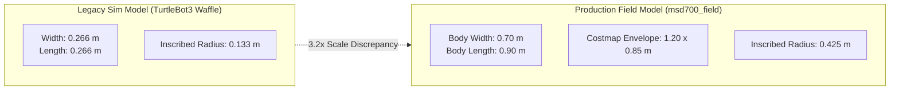
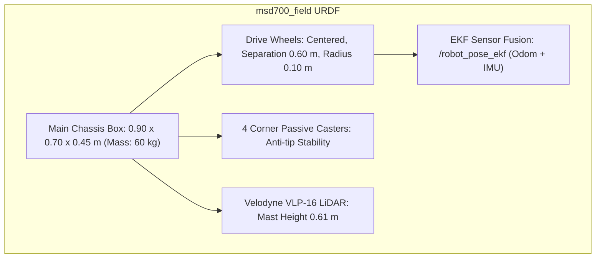

# シミュレーション

<RoleBadge role="developer" />

このドキュメントでは、MSD700 ロボットが実際の物理スケールで Gazebo でシミュレートされる方法、AWS RoboMaker Small Warehouse 環境、センサー構成、シミュレーターで検証できることとできないことについて説明します。

ロボットの物理的な寸法から派生したカバレッジ計画ジオメトリについては、[Boustrophedon Coverage](/ja/development/boustrophedon-and-alignment) を参照してください。

## 背景: 真のスケールのディメンション モデル

リポジトリ内の古いシミュレータ セットアップでは、TurtleBot3 Waffle モデルを使用しました: **0.287 m のホイール トラック上の **0.266 x 0.266 m** のフットプリント。対照的に、実際の製品版 MSD700 ロボットのサイズは **0.90 x 0.70 m** で、ナビゲーション コストマップではパッド入りの **1.20 x 0.85 m** のフットプリントとして表されます。



### スケールギャップの結果:
1. **再現不可能な狭い通路の問題**: 倉庫の狭い廊下での経路計画の失敗に関する実際のレポートは、半径 0.133 m の TurtleBot では再現できませんでした。
2. **構成リーク**: レガシー パラメーター (`robot_width: 0.32`) は、真スケール モデリングに置き換えられるまで、カバレッジ構成に残存していました。
3. **環境スケールの不一致**: 標準的な TurtleBot マップには、0.9 x 0.7 m のロボットに適切なクリアランスがありませんでした。
   - `turtlebot_world`: 最大クリアランス 0.39 m (内接半径 0.425 m には適合しません)。
   - `AWS RoboMaker Small Warehouse`: 最大クリアランス **3.68 m** (58% 移動可能な床、38% がその場で回転可能)。

## シミュレーションの世界: AWS Small Warehouse

このシミュレーターは、[AWS RoboMaker Small Warehouse](https://github.com/aws-robotics/aws-robomaker-small-warehouse-world) 環境、つまり 234 平方メートルのオープン フロア スペース、保管ラック、パレット ジャッキ、および障害物を備えた 13.98 x 20.91 m の産業ホールで標準化されています。

3D メッシュ アセット (12 MB) は、Git リポジトリを軽量に保つためにオンデマンドでフェッチされます。

```bash
rosrun msd700_simulation fetch_sim_worlds.sh
```

::: warning Upstream Branch Selection
AWS RoboMaker は 2025 年 9 月 10 日にアーカイブされました。デフォルトの GitHub ブランチには、非推奨の README のみが含まれています。シミュレーション アセットは **`ros1`** ブランチに存在し、`fetch_sim_worlds.sh` によって明示的にクローンが作成されます。
:::

### スポーン座標とクリアランス

検証済みのデフォルトのスポーン ポーズは **`x: 0.50, y: -2.40, yaw: 1.5708 (facing North)`** で、**3.79 m** のオープン クリアランスを提供します。

|場所の名前 |座標 (x, y) |クリアランス半径 |ステータス |
| --- | --- | --- | --- |
| **デフォルトのウェアハウススポーン** | `(0.50, -2.40)` | **3.79メートル** |安全であることが確認済み (デフォルト) |
|代替ベイ 1 | `(1.81, -7.25)` | 2.47メートル |安全 |
|代替ベイ 2 | `(0.81, 2.75)` | 1.49メートル |安全 |
|棚の乱雑さ (無効) | `(4.00, 1.00)` | **0.29 メートル** | **危険**: 棚衝突ゾーン内 |

## ロボット URDF モデル: `msd700_field`

物理ロボットは、`msd700_field.gazebo.xacro` の Gazebo プラグインを使用して `msd700_description/urdf/msd700_field.urdf.xacro` でモデル化されています。



### 物理仕様:
- **寸法**: 長さ 0.90 m、幅 0.70 m、高さ 0.45 m、質量 60 kg。
- **ドライブジオメトリ**: 対称的な回転エンベロープを確保するために、中間点を中心としたスキッドステア/ディファレンシャルドライブ。
- **4 コーナーキャスター**: 平面 LiDAR が仮想床障害物を作成する原因となるピッチングとロール振動を排除します。
- **Velodyne VLP-16 LiDAR**: 物理ユニットと一致する、取り付けマストで地上 0.61 m に持ち上げられます。
- **標準化された ROS フレーム**: 標準フレーム規則 (`base_footprint`、`base_link`、`base_scan`、`imu_link`、`odom`、`map`) を使用します。

## シミュレーション スタックの起動

### 1. Web UI 統合による完全なシミュレーション
```bash
roslaunch msd700_simulation msd700_warehouse_nav.launch
```

### 2. ウェアハウスでの SLAM マッピング
```bash
roslaunch msd700_simulation msd700_warehouse_slam.launch
```

### 3. 移動ベースのパラメータ化 (`sim_body`)
起動ファイルは、1.20 x 0.85 m のフットプリントのコストマップを構成する `sim_body:=field` (倉庫起動のデフォルト)、または従来の小規模テスト用の `sim_body:=waffle` を受け入れます。

## 関連ドキュメント

- [Boustrophedon Coverage](/ja/development/boustrophedon-and-alignment): 幾何学的パスの計算とクリアランス許容差。
- [リポジトリ構造](/ja/development/repository-structure): シミュレーション パッケージのディレクトリ レイアウト。
- [アーキテクチャ](/ja/development/architecture): 完全なシステム通信トポロジ。