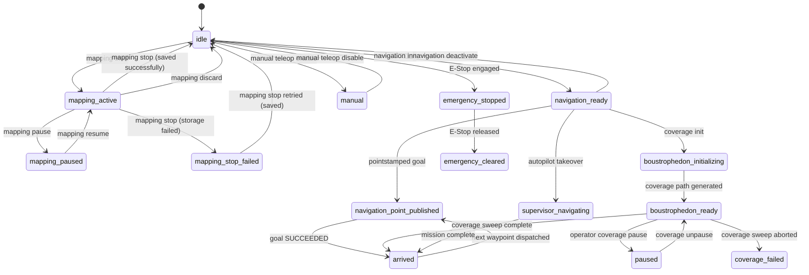
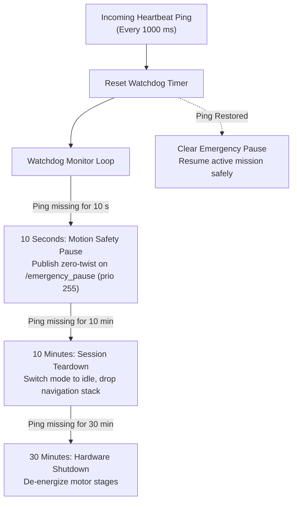
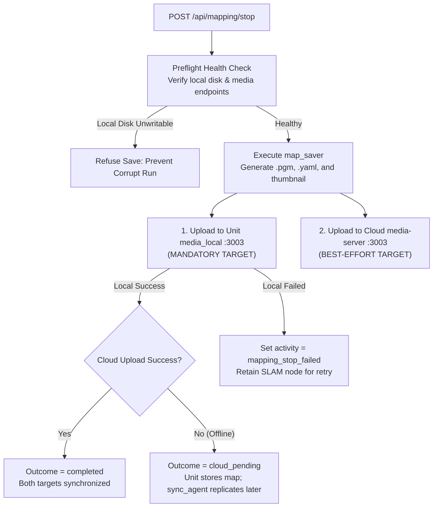
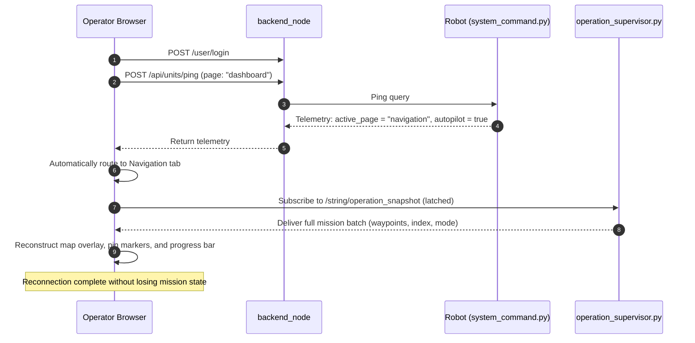

# 状態と動作

<RoleBadge role="developer" />

このドキュメントでは、ナビゲーション状態の遷移、SLAM マッピング フェーズ、自動操縦の自律性、安全ウォッチドッグ、障害回復メカニズムなど、MSD700 ロボットのライフサイクルを管理する有限状態マシンについて詳しく説明します。

MSD700 の核となるアーキテクチャ原則: **物理ロボットは究極の真実の情報源**。トグル、リース、および操作の進行状況はロボット コンピューター (`system_command.py` および `operation_supervisor.py`) に常駐し、ブラウザーのタブが閉じられたり、サーバーが再起動されたり、ネットワークが切断されたりしても残ります。

## 国家の所有権と永続性のマトリックス

|状態ドメイン |主要所有者 |永続性のスコープ |読者消費者 |
| --- | --- | --- | --- |
| **ロボットのアクティビティ** | `system_command.py` (`RobotStateTracker`) |ブラウザを閉じてもバックエンドを再起動しても持続します。 |テレメトリ ping 応答 |
| **オペレーティング リース** | `system_command.py` |サーバーを再起動しても持続します。更新されない場合は 15 秒で期限切れになります。 | Ping フィードバック (`in_use`、`origin_conflict`) |
| **オートパイロット/マニュアルモード** | `system_command.py` |ブラウザーのタブを閉じても持続します。 |テレメトリ ping 応答 |
| **アクティブなミッション バッチ** | `operation_supervisor.py` |ブラウザを閉じても持続します。 RAMに保存されます。 |ラッチ付き `/string/operation_snapshot` |
| **コンテナのライフサイクル** | `unit_manager.js` (サーバー RAM) |サーバーランタイムのみ。ブート時に `adoptExisting()` によって再構築されます。 |管理者 Web コンソールとリーパー |
| **UI のドラフトと選択** |ブラウザ `sessionStorage` |セッションの有効期間。タブを閉じるとクリアされます。 |ダッシュボード React コンポーネント |
| **艦隊の記録と地図** |セントラル MySQL (`db`) |永久保存。 |バックエンド REST API |

::: warning Browser Storage Limitation
ブラウザのタブを閉じると、`sessionStorage` がクリアされます。シームレスなミッション再開を保証するために、アクティブなウェイポイントとカバレッジ境界は `/string/operation_snapshot` にラッチされます。オペレーターが新しいタブでダッシュボードを再度開くと、UI はこのラッチされたトピックをサブスクライブし、アクティブな実行を完全に再構築します。
:::

## ロボットアクティビティステートマシン

ロボットのアクティビティ文字列は `RobotStateTracker` によって継続的に追跡され、ハートビート ping ごとに報告されます。

### 完全なアクティビティ状態

|アクティビティキー |ターゲット UI タブ |説明 |
| --- | --- | --- |
| `idle` |アイドル |システムが初期化されました。モーターコントローラーは有効になっていますが、アクティブな目標がありません。 |
| `manual` |アイドル | WASD キーボード コントロール経由で手動テロップがアクティブになります。 |
| `mapping_active` |マッピング | `explore_lite` フロンティア探索によるアクティブな SLAM マッピング。 |
| `mapping_paused` |マッピング | SLAM 探査はオペレーターによって一時停止されました。 |
| `mapping_stop_failed` |マッピング |マップの保存に失敗しました。 SLAM 状態はアクティブのままであるため、オペレータは再試行できます。 |
| `navigation_ready` |ナビゲーション |マップがロードされ、`move_base` が操作可能になり、ゴールのディスパッチを待っています。 |
| `navigation_point_published` |ナビゲーション |ナビゲーション目標に向かって積極的に移動するロボット。 |
| `boustrophedon_initializing` |ナビゲーション |カバレッジ スイープ ラインの生成 (アイドル/スタック タイムアウトを免除)。 |
| `boustrophedon_ready` |ナビゲーション |バストロフェドン カバレッジ スイープ ラインを実行します。 |
| `supervisor_navigating` |ナビゲーション | `operation_supervisor` によって管理される自律ウェイポイントのディスパッチ。 |
| `arrived` |ナビゲーション |目的地のウェイポイントに正常に到着したか、カバーエリアを完了しました。 |
| `coverage_failed` |ナビゲーション |カバレッジ計画またはパスの実行が中止されました。 |
| `auto_aligning` |ナビゲーション | Auto Align 粒子フィルターの方向のキャリブレーションを実行しています。 |
| `paused` |ナビゲーション |明示的なオペレーターコマンドによりミッションが一時停止されました。 |
| `paused_due_to_ping_loss` | (内部) |安全ウォッチドッグは、ハートビート ping の低下によりロボットの動作を一時停止しました。 |
| `emergency_stopped` |アイドル |ハードウェア緊急停止が作動しています (優先度 255 でゼロ速度がクランプされています)。 |
| `emergency_cleared` |アイドル |非常停止が解除されました。モーターを再初期化する準備ができています。 |

## 安全監視とハートビートの監視

オンボード ソフトウェアは、連続スライディング ウィンドウ ウォッチドッグを介して通信の健全性を監視します。

### ハートビート ウォッチドッグのタイミング層:
1. **10 秒 (モーション一時停止)**: 有効なハートビートが 10 秒間到着しない場合、`system_command.py` はラッチされた `/emergency_pause` ツイスト コマンドを優先度 255 でアサートします。ロボットはアクティブな `move_base` 目標をキャンセルせずに完全に停止するまで減速します。通信が戻ると一時停止が解除され、動作が自動的に再開されます。
2. **10 分 (セッション ティアダウン)**: オペレーターが 10 分間切断されたままの場合、アクティブなナビゲーション セッションまたはマッピング セッションはモーターの過熱を防ぐために正常にアンロードされます。
3. **30 分 (ハードウェア シャットダウン)**: 30 分間連続して操作が行われないと、ハードウェア ドライバーの電源がオフになり、低電力スタンバイ モードになります。

::: warning Autopilot Mode Exemption
**オートパイロット モード**がアクティブな場合、10 秒間の通信一時停止は一時停止されます。オペレーターがノートパソコンを閉じたり、Wi-Fi のデッドゾーンを走行したりしても、ロボットは自律的な検査ルートを続行します。
:::

## マップストレージと 2 層レプリケーション

`POST /api/mapping/stop` 経由で SLAM マップを保存すると、ロボットはマップ アセットを 2 つの独立したターゲットに書き込みます。

|ストレージターゲット |要件レベル |失敗の影響 |
| --- | --- | --- |
| **ユニットローカルメディアサーバー** | **必須** |ローカル保存が失敗すると、ロボットはこのマップを移動できなくなります。 SLAM セッションは `mapping_stop_failed` でアクティブなままであるため、オペレータは保存を再試行できます。 |
| **Cloud Central メディアサーバー** | **ベストエフォート** |クラウドのアップロードが失敗した場合 (ロボットが倉庫でオフラインになっている場合など)、マップには `cloud_pending` のマークが付けられます。インターネット接続が回復すると、バックグラウンドの `sync_agent` によってマップ ファイルが自動的に複製されます。 |

## セッションの再接続と回復

オペレータが閉じたブラウザ タブを再度開くか、新しいワークステーションからログインすると、次のようになります。

### 回復の原則:
1. **`active_page`** によるルーティング: フロントエンドは、ライブ ロボット テレメトリに基づいて、オペレーターをアクティブな操作タブ (ナビゲーションまたはマッピング) に直接リダイレクトします。
2. **ラッチされたスナップショットの再構築**: ミッション状態全体 (アクティブなウェイポイント、現在のインデックス、移動方向、およびカバレッジ ポリゴン) が、ラッチされた `/string/operation_snapshot` ROS トピックから復元されます。
3. **ゴースト状態の検証**: ブラウザー キャッシュがミッション進行中であることを示しているが、ロボットが 8 つの連続テレメトリ サンプルにわたって `idle` を報告する場合、フロントエンドは自動的に `idle` にリセットして、ファントム実行の表示を防ぎます。

## 関連ドキュメント

- [メッセージ コントラクト](/ja/development/message-contracts): シリアル化されたトピック スキーマとハートビート ping エンベロープ。
- [アーキテクチャ](/ja/development/architecture): ハードウェアとサーバー トポロジの概要。
- [API リファレンス](/ja/development/api-reference): HTTP エンドポイントとエラー コードのリファレンス。