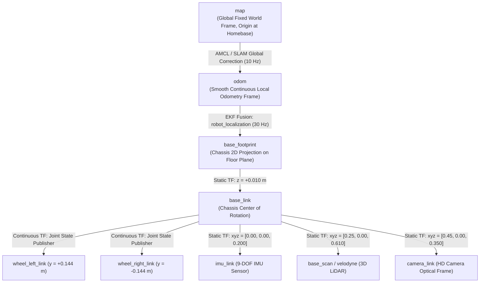
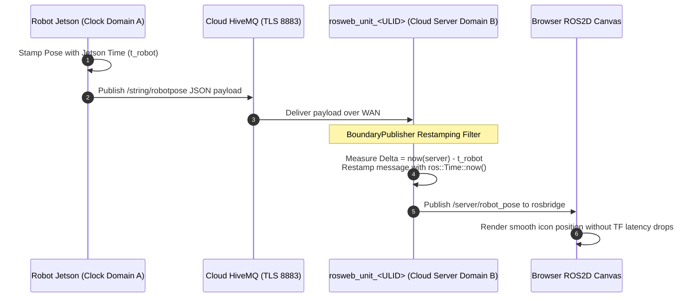

# 座標フレーム、変換、TF アーキテクチャ

<RoleBadge role="developer" />

この文書は、MSD700 ロボット システムに実装される座標変換ツリー (`tf` / `tf2`)、空間参照フレーム、動的変換ブロードキャスター、センサー オフセット、およびクロスマシン クロック リスタンプの包括的な仕様を提供します。

## 座標フレーム階層 (TF ツリー)

座標変換ツリーは、ROS REP-103 (標準測定単位および座標規則) および REP-105 (モバイル プラットフォーム用の座標フレーム) に準拠しています。



---

## パブリッシャーの変換とレートの更新

|エッジの変換 |ブロードキャスターノード |レート |数学的ソース |停止中の動作 |
| --- | --- | --- | --- | --- |
| `map -> odom` | `amcl` / `slam_gmapping` | 10Hz |静的なレーザー占有グリッドに対する走行距離のドリフトを修正します。 |ローカライズされた場合は離散ジャンプ。レーザー スキャンが中断された場合でも、最後の変換を保持します。 |
| `odom -> base_footprint` | `robot_localization` (`ekf_localization_node`) | 30Hz |ホイールエンコーダー速度と IMU ヨー/角速度の継続的な融合。 |継続的でスムーズな、ドリフトのない短期軌道。 |
| `base_footprint -> base_link` | `robot_state_publisher` |静的 |標高オフセットを修正しました ($z = 0.010\text{ m}$)。 | URDF からの変換を修正しました。 |
| `base_link -> base_scan` | `robot_state_publisher` |静的 |物理的なマストの取り付け座標 ($x = 0.250\text{ m}, z = 0.610\text{ m}$)。 | URDF からの変換を修正しました。 |
| `base_link -> imu_link` | `robot_state_publisher` |静的 |物理シャーシ マウント ($z = 0.200\text{ m}$)。 | URDF からの変換を修正しました。 |
| `base_link -> camera_link` | `robot_state_publisher` |静的 |フロントシャーシマウント ($x = 0.450\text{ m}、z = 0.350\text{ m}$)。 | URDF からの変換を修正しました。 |

---

## 空間座標の規則 (REP-103)

MSD700 は、右手のデカルト座標系を厳密に適用します。

```
        +X (Forward / Roll Axis)
           ▲
           │
           │
           │
 ◄─────────┼─────────► +Y (Left / Pitch Axis)
           │
           ▼
        +Z (Upward / Yaw Axis)
```

- **$+X$**: ロボットの主な移動方向に沿って真前を指します。
- **$+Y$**: ロボットの横幅の真左方向を指します。
- **$+Z$**: 床面に対して垂直に垂直上向きを指します。
- **回転角度**: 右手の法則に従います ($+Z$ を中心とした反時計回りの回転は、正のヨー レート $+\dot{\theta}$ に対応します)。

---

## クロスマシン クロック ドメイン リスタンピング (`BoundaryPublisher`)

テレメトリ (ロボットのポーズやレーザー スキャンなど) が物理ロボットからインターネットを介してクラウド サーバーにブリッジされるとき、タイムスタンプが直接評価される場合、**物理マシン間のクロック ドリフトによって `TF_OLD_DATA` 外挿警告が生成されます**。



### 再スタンプに負荷がかかる理由:
1. **Jetson RTC の制限**: NTP アクセスのないフィールド環境の物理 SBC は、数秒または数か月ずれたクロックで起動できます。
2. **バッファ削除**: 受信ポーズ メッセージにサーバーの ROS マスターを基準にして過去のタイムスタンプが含まれている場合、`tf2_ros::Buffer` はそれらを直ちに破棄し、Web キャンバスがロボットの動きをレンダリングするのを防ぎます。
3. **`BoundaryPublisher` 解決策**: `patch_time.py` は、サーバー ROS マスターに入るときに、ロボット ハードウェアのタイムスタンプを削除し、`ros::Time::now()` で幾何学的ペイロードを再スタンプします。

## 関連ドキュメント

- [センサー フュージョンと制御](/ja/development/sensor-fusion-and-control): 運動学的状態推定と EKF。
- [コストマップとプランナー](/ja/development/costmaps-and-planners): ナビゲーション コストマップの座標フレーム。
- [rosbridge プロトコル](/ja/development/rosbridge-protocol): WebSocket トピックのシリアル化。