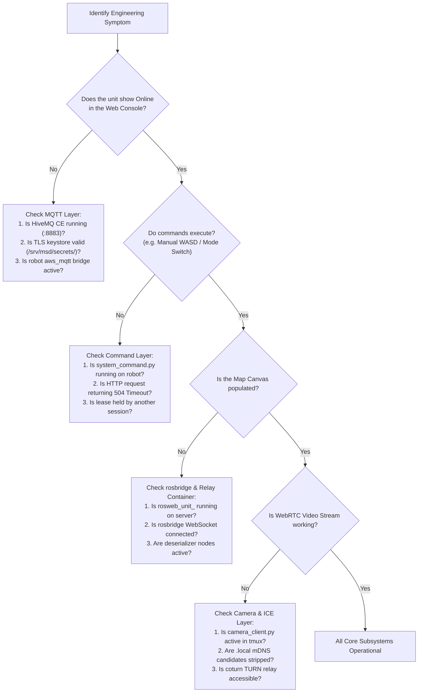

# 開発者の診断とトラブルシューティング

<RoleBadge role="developer" />

このドキュメントでは、MSD700 スタック全体にわたる一般的なエンジニアリング問題を解決するための、構造化された診断ワークフロー、症状と原因のマッピング、および回復手順を説明します。

## 体系的な診断フローチャート



## 一般的な障害モードと解決策

### 1. ユニットがオフラインであるように見える (MQTT ブローカー層)
- **症状**: ダッシュボードのユニット ステータス バッジに `offline` が表示されます。
- **根本原因**: 物理ロボットは、HiveMQ ポート 8883 への暗号化された TLS 接続を確立できません。
- **診断手順**:
  1. サーバー上の HiveMQ コンテナーのステータスを確認します: `docker ps | grep hivemq`。
  2. TLS 証明書キーストア (`/srv/msd/secrets/hivemq/keystore.p12`) が有効であり、UID 1001 で読み取り可能であることを確認します。
  3. ロボット上で、MQTT ブリッジ ログを検査します: `tmux attach -t robot_services` と、`aws_mqtt` ウィンドウを確認します。

### 2. ユニットはオンラインですが、マップ キャンバスは空白のままです (rosbridge / リレー コンテナー)
- **症状**: コマンドは成功しますが、マップ、ロボット アイコン、またはレーザー スキャンが Web キャンバスに表示されません。
- **根本原因**: オンデマンド リレー コンテナ `rosweb_unit_<ULID>` がアイドル リーパーによって停止されたか、Apache WebSocket プロキシがブロックされました。
- **診断手順**:
  1. ユニットごとのコンテナがサーバー上で実行されているかどうかを確認します: `docker ps | grep rosweb_unit`。
  2. 存在しない場合は、ブラウザでユニット ページをリロードして、`unit_manager.js` の `touch` イベントをトリガーします。
  3. ブラウザ開発者ツールを使用して、`/services/rosbridge` への WebSocket 接続をテストします。

### 3. TF エラーによりナビゲーションがフリーズする (`use_sim_time` の古さ)
- **症状**: ロボットが移動を拒否し、コンソール ログに「シミュレートされた時間」または `TF_OLD_DATA` に関する TF 警告が繰り返し表示されます。
- **根本原因**: `/use_sim_time` はシミュレーション実行によって ROS マスター上で `true` に設定されましたが、実際のロボット動作中に `/clock` パブリッシャーは存在しません。
- **解決策**:
  ```bash
  rosparam set /use_sim_time false
  ```
  ロボット起動スタックを再起動します。パラメータは `roscore` に直接存在するため、ノードだけを再起動してもパラメータはクリアされないことに注意してください。

### 4. ビデオ ストリームがローカル Wi-Fi で停止または失敗する (mDNS 候補エラー)
- **症状**: WebRTC ビデオが `Errno 19: No such device` を使用してローカル ネットワークに接続できません。
- **根本原因**: Chrome はプライバシーを保護する `.local` mDNS 候補名を発行します。ロボットにインターネット ゲートウェイがない場合、`aioice` はマルチキャスト DNS に参加しようとして失敗します。
- **解決策**: `camera_client.py` に `_strip_mdns_candidates()` フィルタが含まれていること、およびローカル ICE 構成変数 (`LOCAL_STUN_URLS`、`LOCAL_TURN_URL`) が `none` に設定されていることを確認します。

### 5. キープアウトコストマップのデッドロック
- **症状**: 目標は `move_base` によって受け入れられますが、ロボットは前に進みません。
- **根本原因**: `keepout_layer` は `costmap_common_params.yaml` で有効になっていますが、`/msd700/keepout_grid` を待機しています。キープアウト グリッドが公開されていない場合、コストマップは「現在」とマークされることはありません。
- **解決策**: `path_coverage_node` または `system_command.py` が初期化時に空のキープアウト グリッドを発行していることを確認します。

## 関連ドキュメント

- [アーキテクチャ](/ja/development/architecture): 2 チャネル通信モデル。
- [メッセージ コントラクト](/ja/development/message-contracts): 予期されるトピックの形式とペイロード。
- [セットアップ: トラブルシューティング](/ja/setup/troubleshooting): 技術者と展開のトラブルシューティング手順。