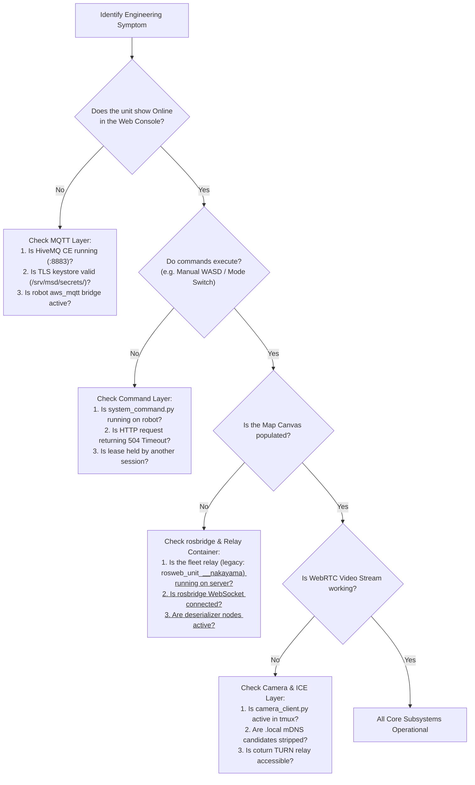

# 開発者向け診断とトラブルシューティング

<RoleBadge role="developer" />

このドキュメントは、MSD700 スタック全体でよくあるエンジニアリング上の問題を解決するための、体系的な診断ワークフロー、症状から原因へのマッピング、および復旧手順を提供します。

## 体系的診断フローチャート



## よくある障害モードと解決策

### 1. ユニットがオフラインに見える(MQTT ブローカー層)
- **症状**: ダッシュボードのユニットステータスバッジに `offline` と表示される。
- **根本原因**: 物理ロボットが HiveMQ の port 8883 への暗号化 TLS 接続を確立できない。
- **診断手順**:
  1. サーバー上で HiveMQ コンテナの状態を確認する: `docker ps | grep hivemq`。
  2. TLS 証明書のキーストア(`/srv/msd/secrets/hivemq/keystore.p12`)が有効で、UID 1001 から読み取り可能であることを確認する。
  3. ロボット側で MQTT ブリッジのログを確認する: `tmux attach -t robot_services` を実行し、`aws_mqtt` ウィンドウを確認する。

### 2. ユニットはオンラインだが、マップキャンバスが空のまま(rosbridge / リレーコンテナ)
- **症状**: コマンドは成功するが、Web キャンバス上にマップ、ロボットアイコン、レーザースキャンのいずれも表示されない。
- **根本原因**: フリートリレーコンテナ(`ros_web_ui_v2_unit_relays`)がダウンしている — あるいはレガシーなユニット単位の経路では、オンデマンドコンテナ `rosweb_unit_<u>_<unit>_nakayama` がアイドルリーパーによって停止された — または Apache の WebSocket プロキシがブロックされている。
- **診断手順**:
  1. まずフリートリレーを確認する: `docker ps | grep unit_relays`。レガシー経路では代わりにユニット単位のコンテナを確認する: `docker ps | grep rosweb_unit`。
  2. レガシー経路でのみ: ブラウザでユニットページをリロードし、`unit_manager.js` の `touch` イベントを発生させる。フリートモードではロスターは`units`テーブルから得られるため、touchイベントは不要であり、登録済みロボットは到達可能である。
  3. ブラウザの開発者ツールを使って `/services/rosbridge` への WebSocket 接続をテストする。

### 3. TF エラーでナビゲーションがフリーズする(`use_sim_time` の陳腐化)
- **症状**: ロボットが動くことを拒否し、コンソールログに "simulated time" または `TF_OLD_DATA` に言及する TF 警告が繰り返し表示される。
- **根本原因**: シミュレーション実行により ROS master 上で `/use_sim_time` が `true` に設定されたが、実ロボット動作中には `/clock` パブリッシャーが存在しない。
- **解決策**:
  ```bash
  rosparam set /use_sim_time false
  ```
  ロボットの bringup スタックを再起動する。このパラメータは `roscore` に直接存在するため、ノードだけを再起動してもクリアされない点に注意。

### 4. ローカル Wi-Fi でビデオストリームが停止または失敗する(mDNS 候補エラー)
- **症状**: ローカルネットワーク上で WebRTC 映像が `Errno 19: No such device` で接続に失敗する。
- **根本原因**: Chrome はプライバシー保護のための `.local` mDNS 候補名を発行する。ロボットにインターネットゲートウェイがない場合、`aioice` がマルチキャスト DNS への参加を試みて失敗する。
- **解決策**: `camera_client.py` に `_strip_mdns_candidates()` フィルターが含まれていること、およびローカル ICE 設定変数(`LOCAL_STUN_URLS`、`LOCAL_TURN_URL`)が `none` に設定されていることを確認する。

### 5. Keep-Out コストマップのデッドロック
- **症状**: `move_base` にゴールは受理されるが、ロボットが前進しない。
- **根本原因**: `keepout_layer` が `costmap_common_params_field.yaml` で有効になっているが、`/msd700/keepout_grid` を待ち続けている。keep-out グリッドが発行されない場合、コストマップは決して "current" とマークされない。
- **解決策**: `path_coverage_node` または `system_command.py` が初期化時に空の keepout グリッドを発行するようにする。

### 6. ローカル同期が "Access Denied" を報告する(ローカルデータベース資格情報のドリフト)
- **症状**: Local Mode の同期ログに `Access denied for user '<MYSQL_USER>'@'127.0.0.1' (using password: YES)` と表示される。これは歴史的に、クラウドに到達可能であるにもかかわらず `handshake` フェーズで失敗していると誤ってラベル付けされてきた。
- **根本原因**: ユニット上の `docker/.env` は git 管理下にあり、ホストごとに異なる。ユニットの `mysql_data_local` ボリュームが既に初期化された後に、そこで `MYSQL_USER`/`MYSQL_PASSWORD` が変更されると(`git pull`、または手動編集)、MySQL はデータディレクトリに焼き込まれた古いパスワードを保持し続け、遡って新しいパスワードを採用することはない。その結果 `sync_agent.js` は自身の最初のローカル `sync_state` 読み取りで、クラウド接続エラーではなく `ER_ACCESS_DENIED_ERROR` で失敗する。これが現在、実際のクラウド障害とどう区別されているかについては [データ同期: 障害分類](/ja/development/data-sync#障害の分類) を参照。
- **診断手順**:
  1. ユニット上で: `cat docker/.env | grep MYSQL_` を実行し、値が最近変更されたように見えるか確認する(`git pull` 直後など)。
  2. 不一致を直接確認する: `docker exec -it <local_db_container> mysql -u "$MYSQL_USER" -p"$MYSQL_PASSWORD"` — 手動での `Access denied` は、一時的な不具合ではなくドリフトを裏付ける。
- **解決策**: `docker/.env` を、そのボリュームが初期化された時点のパスワードに戻すか、ローテーションが意図的なものであった場合は、ローカル MySQL に対して root で `ALTER USER '<user>'@'%' IDENTIFIED BY '<new_password>';` を実行し、データベースを新しい `.env` の値に合わせる。これを「直す」ために `mysql_data_local` を消去してはならない。それはまだクラウドに同期されていないマップ/ルートのユニット側唯一のローカルコピーであり、この障害モードは同期そのものが現在機能していないことを意味する。

### 7. クラウドダッシュボードにライブトピックがない(転送されたポートによって ROS Master が乗っ取られる)
- **症状**: クラウドダッシュボードはステータス、アクティビティ、保存済みマップを正常に表示するが、ライブなものは何も表示されない: マッピング中のマップなし、lidar なし、ロボットポーズなし。ユニット自身のローカルダッシュボードは完全に正常に動作する。バックエンドコンテナは依然として `Up` と報告している。
- **根本原因**: あるユニットのスタックが自身のものではなく**クラウド**の ROS master に登録され、ROS は名前が二重に主張されるたびに古い方のノードをシャットダウンするため、サーバーは自身の `/rosbridge_websocket`(および `/backend_node`)を失った。よくある侵入経路は、VS Code Remote や `ssh -L` セッションがサーバーの master ポートをラップトップに転送し、リモートの master が `localhost` で応答するようになるケースである。ユニットは現在 `11321`/`11322` を使用し、`run_msd.sh` は自身が所有していない master を拒否するが、オーバーライドや修正前のチェックアウトではまだそこに到達し得る。
- **診断手順**:
  1. バックエンドコンテナで `scripts/ros_doctor.sh` を実行する。master の所有者を名指しし、このマシンが到達できないホストから登録されているノードを列挙し、rosbridge ポートで何かが listen しているかどうかを示す。
  2. 特徴的な兆候は、登録**されている**が見知らぬホスト名から来ている rosbridge ノードの隣に、9090/9091 で listen しているものがほとんどないことである。
  3. `docker ps` は、rosbridge のヘルスチェックが失敗するのに十分な時間が経過すると、バックエンドコンテナを `unhealthy` と表示する。
- **解決策**: 迷い込んだマシン上で `ROS_MASTER_URI` を修正し(ポートフォワードを閉じる)、サーバー上で `rosnode cleanup` を実行してからバックエンドコンテナを再起動する。先に再起動するだけでは、名前の奪い合いが始まるだけである。

## 関連ドキュメント

- [アーキテクチャ](/ja/development/architecture): 2チャネル通信モデル。
- [メッセージ仕様](/ja/development/message-contracts): 想定されるトピック形式とペイロード。
- [セットアップ: トラブルシューティング](/ja/setup/troubleshooting): 技術者およびデプロイ担当者向けのトラブルシューティング手順。
