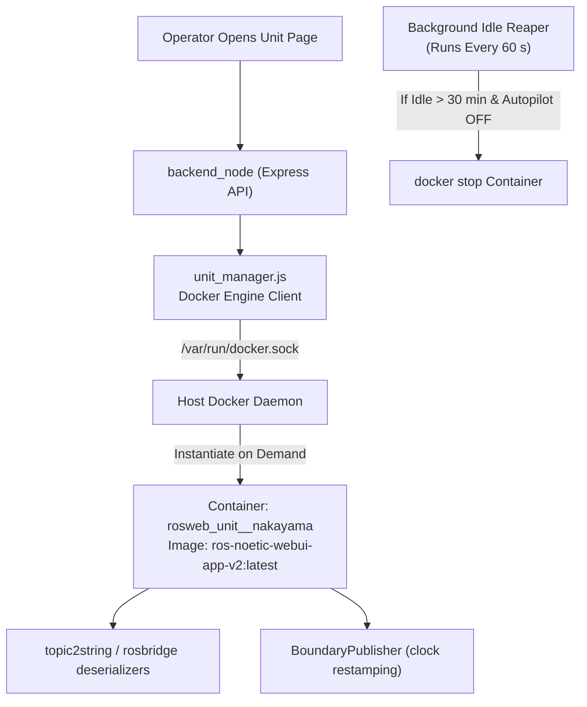
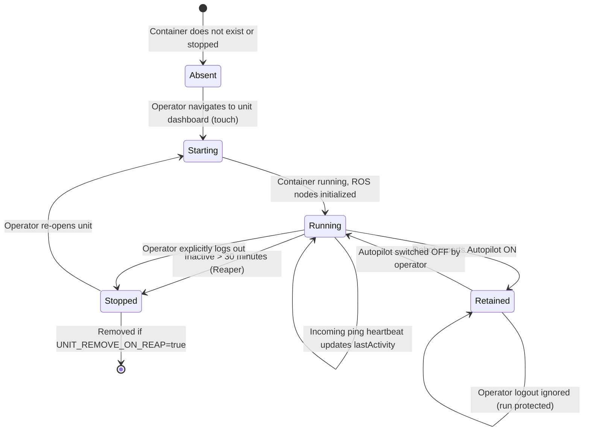

# ユニットコンテナライフサイクル管理(レガシー)

<RoleBadge role="developer" />

::: warning 置き換えられたアーキテクチャに関する注意
`unit_manager.js` が管理する 1ユニット1コンテナのライフサイクルオーケストレーションは、下記の [Fleet Relay: すべてのユニットに1つのコンテナ](#fleet-relay-one-container-for-every-unit) で説明されているフリートリレーによって**置き換えられており**、これが現在のデフォルトです。ユニットごとの経路は依然として提供されており、環境変数1つで切り替えられます。このドキュメントは両方を扱います。
:::

このドキュメントは、Docker ソケット経由で `unit_manager.js` によって管理される、クラウドサーバー上のユニット単位のリレーコンテナ(`rosweb_unit_<ULID>`)の動的なライフサイクル管理、およびそれらを置き換えるフリートリレーについて詳述します。

## コンテナアーキテクチャ概要(レガシー)

アイドル状態のマシンにサーバーの CPU と RAM を浪費することなく大規模なロボットフリート全体にスケールするため、サーバーはオペレーターがそのロボットのダッシュボードを開いたときにのみ、専用の ROS リレーコンテナを起動します。



## コンテナライフサイクルのステートマシン



## ライフサイクルのルールとポリシー

### 1. Autopilot ミッションの保持
ロボットが **Autopilot モード**で自律ミッションを実行している間、そのリレーコンテナは **Retained** 状態に入ります。Retained 状態のコンテナは30分のアイドルリーパーの対象外となり、オペレーターのログアウト時に**決して停止されません**。これにより、オペレーターがラップトップを閉じたり Wi-Fi の範囲外に出たりしても、自律運用は中断なく継続することが保証されます。

### 2. アイドルタイムアウトリーパー
バックグラウンドのリーパーは60秒ごと(`UNIT_REAP_INTERVAL_MS: 60000`)に掃引します。コンテナが30分間(`UNIT_IDLE_TIMEOUT_MS: 1800000`)アクティブなオペレーターのハートビート ping を受けておらず、Autopilot によって Retained にもなっていない場合、マネージャーは `docker.stop()` を呼び出します。

### 3. 再起動ポリシー: `unless-stopped`
ユニット単位のコンテナは、Docker の再起動ポリシー `unless-stopped` で実行されます。ホストサーバーが再起動すると、Docker は以前実行されていたユニットコンテナを自動的に復活させます。逆に、リーパーが明示的にコンテナを停止した場合、Docker はその停止状態を尊重し、復活させません。

## 設定パラメータ

| 環境変数 | デフォルト値 | 説明 |
| --- | --- | --- |
| `UNIT_MANAGER_ENABLED` | `true`(サーバー)、`false`(ユニット) | マスタースイッチ。オフにすると holder の追跡も無効になり、ログアウト時のリース返却が壊れる。 |
| `UNIT_CONTAINERS_ENABLED` | `false` | デフォルトはフリートモード。`true` に設定するとロボットごとに1コンテナに戻り、その後リレーを停止する。 |
| `FLEET_RELAY_CONTAINER` | `UNIT_MODE` から導出 | reconciler が再起動する単一のリレーコンテナの名前。 |
| `FLEET_ROSTER_POLL_MS` | `60000` | `units` からロスターが再読み込みされる頻度。見逃した変更に対するバックストップであり、その仕組み本体ではない。 |
| `MULTI_UNIT_LIST` | (未設定) | 任意のオーバーライド。カンマまたはスペース区切りの ULID。これを設定すると、ロスターは登録に追従しなくなる。 |
| `FLEET_CLIENT_ID` | `fleet_nakayama_cloud`(本番)、`fleet_dev_nakayama_cloud`(開発) | フリートリレー専用。1つの共有接続のための MQTT クライアント ID。`clean_session` が true であるためブローカーごとに一意である必要があり、重複する ID はもう一方のクライアントを切断し、両者がフラップし合う。 |
| `FLEET_MAX_INFLIGHT` | `200` | フリートリレー専用。フリート全体のインフライトメッセージ数を制限する。ユニット単位の値では `20` が1台のロボットを制限していた。低いままにすると、1台のロボットのマップバーストが他のすべてのロボットのポーズ更新を停滞させる。 |
| `UNIT_IMAGE` | `ros-noetic-webui-app-v2:latest` | ユニットリレー用にインスタンス化される対象の Docker イメージ。 |
| `UNIT_IDLE_TIMEOUT_MS` | `1800000`(30分) | アイドルコンテナが停止されるまでの非アクティブ時間の閾値。 |
| `UNIT_REAP_INTERVAL_MS` | `60000`(1分) | バックグラウンドリーパー掃引の実行周期。 |
| `UNIT_REMOVE_ON_REAP` | `false` | true の場合コンテナを削除し、false の場合は停止状態を保持する。 |
| `UNIT_MODE` | `prod`(または `dev`) | コンテナ命名サフィックス(`_nakayama` vs `_nakayama_dev`)を設定する。 |

## フリートリレー: すべてのユニットに1つのコンテナ

ユニット単位の設計は、ロボット1台ごとに丸ごと1つのコンテナ、つまり独自のワークスペースビルド、独自の約10個の Python リレーノードのセット、そして独自のブローカーへの TLS 接続というコストを払っています。ROS の何ものもそれを必要としませんでした。すべてのトピックは既に `/unit_<ULID>/...` で完全修飾されており、すべての MQTT ブリッジエントリは `primitive: true` の `std_msgs/String` パススルーであるため、1つのプロセスがユニットごとに1組のサブスクライバー/パブリッシャーペアを保持することで、フリート全体にサービスを提供できます。

フリートリレーは、データプレーンの**両方の半分**を1つのコンテナ `ros_web_ui_v2_unit_relays`(開発スタックでは`_dev`サフィックス)に統合します。

| 半分 | ユニット単位の経路 | フリート経路 |
| --- | --- | --- |
| ROS リレー | `topic2string/launch/cloud.launch`、ユニットごとに1つのノードセット | `topic2string/launch/cloud_multi.launch`、全ユニットで1つのノードセット |
| MQTT ブリッジ | `aws_mqtt/launch/nakayama_cloud.launch`、ユニットごとに1つの nodelet | `aws_mqtt/launch/nakayama_cloud_multi.launch`、1つの nodelet、1つの接続 |

`bringup_cloud.launch` は `use_multi_unit_bridge:=true` の背後で両方を同時に切り替えるため、この2つが半分だけ有効化されることは決してありません。

### トピックマップはどこから来るか

roslaunch の XML はループできません。これがブリッジマップがかつてユニット単位だった唯一の理由です。`aws_mqtt/scripts/gen_bridge_params.py` がそのループを行います。ULID のロスターにわたってマップを展開し、フリート launch が1つの `<rosparam command="load">` で読み込む YAML ファイルを書き出します。これは roslaunch **より前**に実行されなければなりません。ファイルは XML がパースされる際に読み込まれるためです。

生成された設定は、同じトピック名と同じ `primitive` フラグを持つ、同じ標準の `mqtt_client/MqttClient` nodelet に供給されるため、ロボット側はどちらの経路が動いているかを判別できません。`scripts/test/test_gen_bridge_params.py` は、1台だけのロスターが `nakayama_cloud.launch` のインラインマップをエントリごとに再現することをアサートします。これが、両方が存在する間、2つが乖離するのを防いでいるものです。

### ロスターはデータベースから来る

ロスターは**設定されるものではありません**。`fleet_roster.js` は `units` テーブルのすべての行を読み取り、各 `BINARY(16)` の id をその ULID にデコードします。そのため、ロボットを到達可能にするために誰かがしなければならないことは、そのロボットを登録することだけです。`MULTI_UNIT_LIST` は依然としてこれをオーバーライドでき、デバッグ中にサブセットを固定するために使えますが、固定されたロスターはその後登録に追従しなくなります。

これは意図的に、あるアカウントがアクティブなレンタルプロファイルを通じて見えるユニットではなく、**すべての**ユニットです。レンタルが失効したロボットでも、電源を入れて発行し続けられるロボットであることに変わりはなく、アイドル状態のユニットをブリッジすることのコストは、決して発火しない数個のサブスクライバー分に過ぎません。フィルタリングはより悪い方向に失敗します。課金状態のために到達不能になっている稼働中のロボットは、誰も探そうとは思わない類の接続不良です。

1つのクエリが2つの呼び出し元にサービスを提供するのは意図的です。`backend_node` はそれを、自身が既に持っているプールとともにモジュールとして使用します。リレーコンテナはその中にバックエンドが一切動いていないため、それを CLI として実行します。2つの実装があれば、リレーがある1つのユニット集合をブリッジしている一方でバックエンドは別の集合をブリッジしていると信じている、という事態を招きかねません。

### 登録がリレーを自動的に再起動させる

MQTT ブリッジ nodelet のトピックマップは読み込み時に固定されるため、リレーはそのロスターを起動時に一度だけ読み込みます。そのため「ユニットが登録された」は「リレーが再起動された」にならなければならず、`unit_manager.js` の `startRosterReconciler()` がそれを行うものです。デフォルトで `FLEET_ROSTER_POLL_MS`(デフォルト60秒)ごとにロスターを再読み込みし、変化していればリレーを再起動します。

登録エンドポイントにフックするのではなくポーリングしているのは、登録がそのテーブルを変更する唯一の方法ではないためです。削除、プロファイルのリストア、あるいは管理者が手動で行を修正することもすべてカウントされ、すべてを捕捉するバックストップは、よくあるケースだけを捕捉するイベントより優れています。

空のロスターは、終了するのではなく**待機します**。新規インストールではまだユニットが存在せず、クラッシュループするコンテナが新規デプロイの通常の状態であってはなりません。リレーは待機中であることをログに記録し、最初のユニットが登録されると自ら動作を開始します。到達できないデータベースは、ユニットが存在しないデータベースとは別に報告されます。両者は正反対の対応を求めるためです。

### リレーは決して ROS master を作成しない

リレーのコマンドは master を待ち、60秒以内に何も現れなければ終了します。roslaunch に1つ起動させるのではなく。もしリレーが master を所有していたら、リレーを再起動すると master が、そして他のすべてのコンテナが一緒に落ちてしまいます。

逆のケースも処理されています。master は `backend_node` の内部で稼働しているため、バックエンドの再起動は**新しい** master を意味し、リレーのノードはそれに対して孤児になります。それらのプロセスは生きていますが、単にもう登録されていないだけであり、どれだけ ping してもそれは治りません。そのため `unit_manager.init()` はバックエンドの起動のたびにリレーを再起動します。これが、バックエンドの再デプロイを乗り越え可能にしているものです。

### これが節約するもの、しないもの

これは帯域幅を削減**しません**。メッセージ量はロボットによって決まるのであり、クラウドが何個のコンテナを実行しているかによるものではなく、ブローカーはどちらの場合でも同じメッセージを配送します。ワイヤー上で唯一節約されるのは、引退した接続1本あたりの keepalive ストリームです。

これが節約するのはサーバー側です。プロセス数(N x 10個のリレーノードが10個になる)、RAM、ディスク(N個ではなく1つのワークスペースビルド)、コールドスタート時間(ユニットごとの `catkin_make` なし)、ブローカー接続数、そしてユニット単位のライフサイクル問題の表面全体です。

### なぜバックエンドコンテナに統合しないのか

そうすると、バックエンドの再デプロイがフリート全体のデータプレーンを道連れにダウンさせることになります。リレーを独自のコンテナに保つことで、コードのデプロイがフリート全体の停止にならずに済みます。これは `hivemq` をアプリイメージの外に置いているのと同じ理由です。

### ブラスト半径の形が変わる

各リレータイプは依然としてそれぞれ独自のプロセスであるため、クラッシュはすべてではなく1つの機能だけを失わせます。しかし今やその機能を**すべてのロボットについて**失わせます。1台のロボットについてだけではなく。以前: ロボット A が停止しても、ロボット B は影響を受けない。現在: 位置、マップ、ナビゲーションは動き続ける一方で、すべてのロボットが lidar オーバーレイを失う。単一の MQTT 接続は、本当にフリート全体に影響する唯一のポイントです。それが切断されると、再接続するまで(`reconnect_delay`、5秒)すべてのロボットがブリッジを失います。

### 実行方法

設定すべきことは何もありません。リレーは通常のプロファイルの一部であり、フリートモードがデフォルトであるため、通常の bring-up を行うだけで統合されたアーキテクチャが得られます。

```bash
docker compose --profile server_prod up -d   # or --profile server_dev
```

| | Dev | Prod |
| --- | --- | --- |
| リレーコンテナ | `ros_web_ui_v2_unit_relays_dev` | `ros_web_ui_v2_unit_relays` |
| イメージ | `ros-noetic-webui-app-v2:dev` | `ros-noetic-webui-app-v2:latest` |
| ロスターオーバーライド(任意) | `MULTI_UNIT_LIST_DEV` | `MULTI_UNIT_LIST_PROD` |

両方のリレーは、意図的に1つの start コマンド(`docker-compose.yml` の `x-fleet-relay-command` アンカー)を共有しています。一方のスタックだけを守り、もう一方を守らないプリフライトは、何もないよりも悪いものだからです。

### ロボットごとに1コンテナへ戻す

バックエンドサービスで `UNIT_CONTAINERS_ENABLED=true` を設定し、リレーを停止してください。

::: danger 同じユニットに対して両方の経路を決して同時に実行しない
同じ MQTT トピックをサブスクライブする2つのブリッジは、すべてのメッセージを2回配信します。重複した `move_base` の `/result` はウェイポイント ACK ループを2回進め、これはダッシュボード上ではロボットが**ピンポイントをスキップした**ように見えます。2つのノードセットは異なる名前を持つため、ROS はこれを自動的に防ぐことができず、何も自動でキルされません。
:::

この間違いを静かにではなく大きな音で知らせる2つのガードがあります。

- リレーの start コマンドは、`/unit_<ULID>/cloud_mqtt_client` が既に master に登録されている場合、起動を拒否します。
- `unit_manager.init()` は、フリートモード中に依然として稼働しているのを見つけたユニット単位のコンテナすべてを名指ししてエラーをログに記録します。

### `UNIT_CONTAINERS_ENABLED` は `UNIT_MANAGER_ENABLED` ではない

マネージャー全体をオフにすると、`holders` の記録も停止してしまいます。holder は `listActorUnits()` が、ログアウト時に operating lease を返却するために読み取るものです。リース は**ロボット上**で保持され、どのコンテナよりも長く存続するため、このモジュールを丸ごと無効化すると、ログのどこにも両者を結びつける記録がないまま、ログアウトのたびにリースが取り残されてしまいます。

したがって `UNIT_CONTAINERS_ENABLED=false` は Docker の半分だけをゲートします。holder の追跡はオンのままで、マネージャーはデーモンに接続することは一切なく、`getRunningForUser()` は空を返すため、verified-shutdown オーバーレイは、決して現れないコンテナを待つのではなく「既に停止済み」と報告します。

## Docker ソケットのセキュリティ

`backend_node` は、`/var/run/docker.sock` のバインドマウントを通じてホストの Docker エンジンと通信します。コンテナの実行は `rosweb_unit_*` 名前空間に一致するユニットの管理に制限されており、ホスト上での任意のコンテナ操作を防いでいます。

## 関連ドキュメント

- [アーキテクチャ](/ja/development/architecture): 高レベルのシステム構造と2マシンモデル。
- [State and Behavior](/ja/development/state-and-behavior): ロボットのアクティビティ状態と Autopilot ハンドオーバー。
- [セットアップ: Docker リファレンス](/ja/setup/docker-reference): compose プロファイルの完全な仕様。
