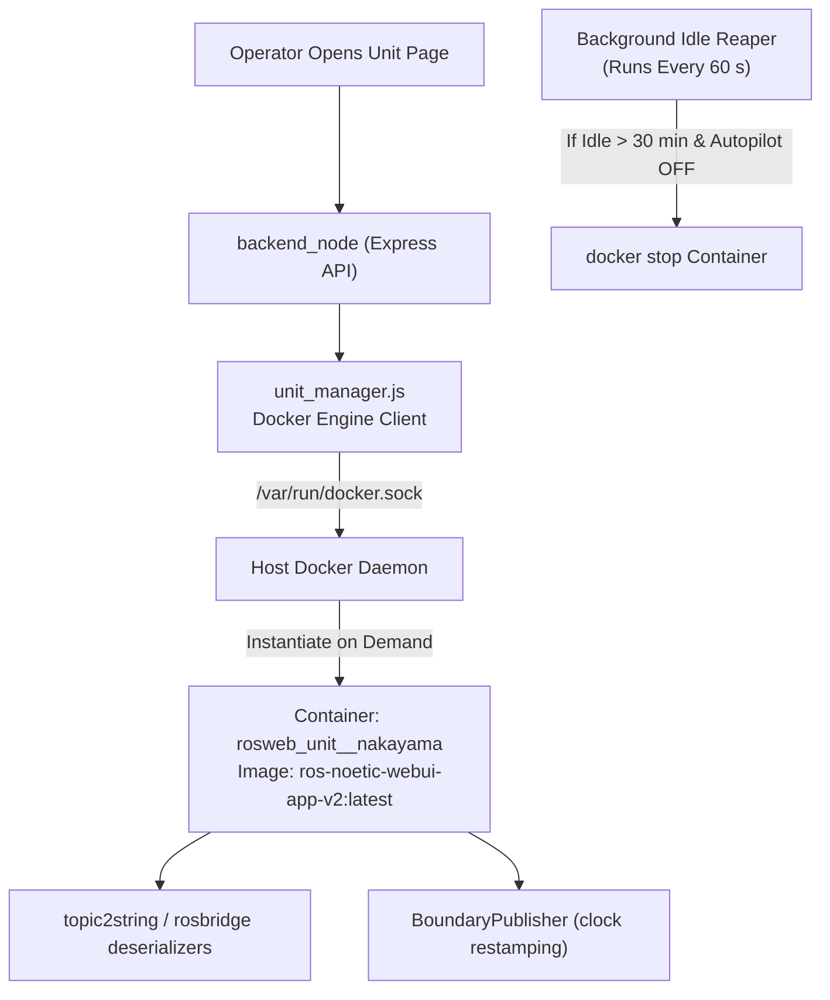
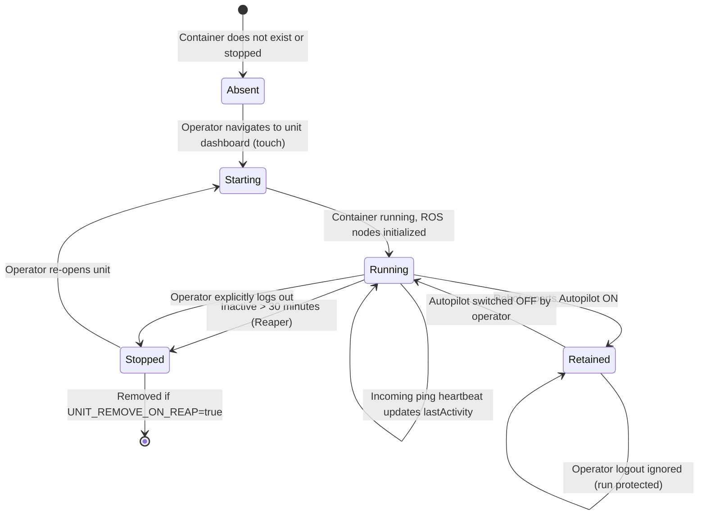

# ユニットコンテナのライフサイクル管理

<RoleBadge role="developer" />

このドキュメントでは、Docker ソケットを介して `unit_manager.js` によって自動的に管理される、クラウド サーバー上のユニットごとのリレー コンテナー (`rosweb_unit_<ULID>`) の動的なライフサイクル管理について詳しく説明します。

## コンテナアーキテクチャの概要

アイドル状態のマシンでサーバーの CPU と RAM を無駄にすることなく、大規模なロボット フリート全体に拡張するために、サーバーは、オペレーターがロボットのダッシュボードを開いたときにのみ専用の ROS リレー コンテナーを起動します。

## コンテナのライフサイクル ステート マシン

## ライフサイクルのルールとポリシー

### 1. 自動操縦ミッションの保持
ロボットが **オートパイロット モード**で自律ミッションを実行すると、その中継コンテナは **保持** 状態になります。保持されたコンテナは 30 分間のアイドル リーパーから免除され、**オペレーターのログアウト時に停止されることはありません**。これにより、オペレーターがラップトップを閉じたり、Wi-Fi 範囲外に運転したりしても、自律操作が中断されることなく続行されることが保証されます。

### 2. アイドル タイムアウト リーパー
バックグラウンド リーパーは 60 秒ごとにスイープします (`UNIT_REAP_INTERVAL_MS: 60000`)。コンテナーにアクティブなオペレーターのハートビート ping が 30 分間存在せず (`UNIT_IDLE_TIMEOUT_MS: 1800000`)、オートパイロットによって保持されない場合、マネージャーは `docker.stop()` を呼び出します。

### 3. 再起動ポリシー: `unless-stopped`
ユニットごとのコンテナは、Docker 再起動ポリシー `unless-stopped` を使用して実行されます。ホストサーバーが再起動すると、Docker は以前に実行していたユニットコンテナを自動的に復活させます。逆に、リーパーがコンテナを明示的に停止すると、Docker は停止状態を尊重し、コンテナを復活させません。

## 設定パラメータ

|環境変数 |デフォルト値 |説明 |
| --- | --- | --- |
| `UNIT_MANAGER_ENABLED` | `true` (サーバー)、`false` (ユニット) |動的コンテナオーケストレーションを有効にするかどうかを制御します。 |
| `UNIT_IMAGE` | `ros-noetic-webui-app-v2:latest` |ユニットリレー用にインスタンス化されたターゲット Docker イメージ。 |
| `UNIT_IDLE_TIMEOUT_MS` | `1800000` (30分) |アイドル状態のコンテナが停止されるまでの非アクティブのしきい値。 |
| `UNIT_REAP_INTERVAL_MS` | `60000` (1 分) |バックグラウンドリーパースイープの実行期間。 |
| `UNIT_REMOVE_ON_REAP` | `false` | true の場合、コンテナーを削除します。 false の場合、停止状態が保持されます。 |
| `UNIT_MODE` | `prod` (または `dev`) |コンテナの命名サフィックスを設定します (`_nakayama` と `_nakayama_dev`)。 |

## Docker ソケットのセキュリティ

`backend_node` は、`/var/run/docker.sock` のバインド マウントを介してホスト Docker エンジンと通信します。コンテナーの実行は、`rosweb_unit_*` 名前空間に一致するユニットの管理に制限され、ホスト上での任意のコンテナー操作が防止されます。

## 関連ドキュメント

- [アーキテクチャ](/ja/development/architecture): 高レベルのシステム構造と 2 台のマシン モデル。
- [状態と動作](/ja/development/state-and-behavior): ロボットのアクティビティの状態とオートパイロットのハンドオーバー。
- [セットアップ: Docker リファレンス](/ja/setup/docker-reference): 構成プロファイルの仕様を完了します。