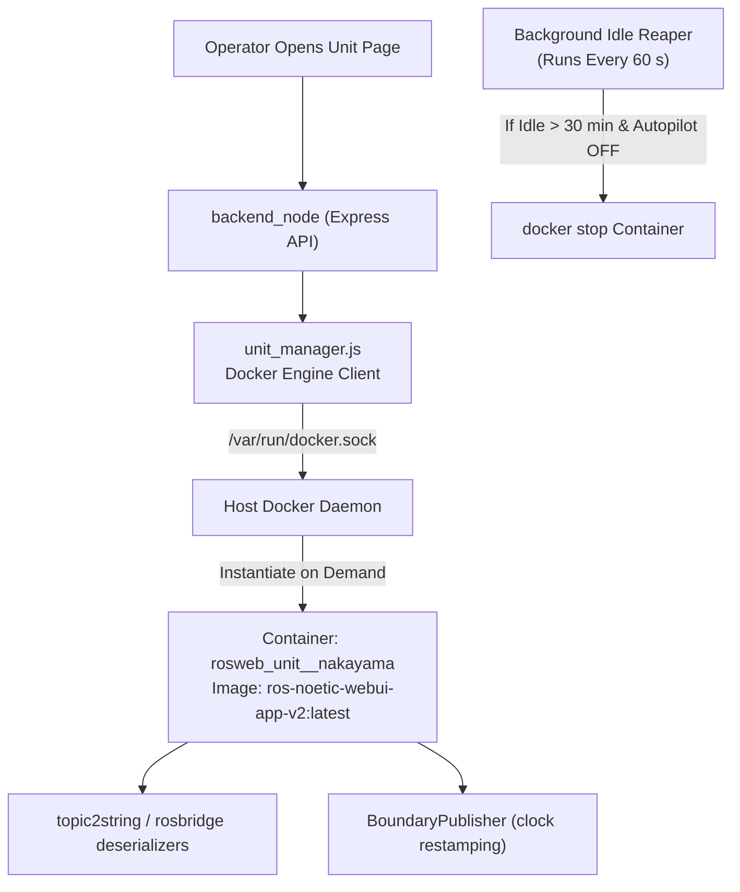
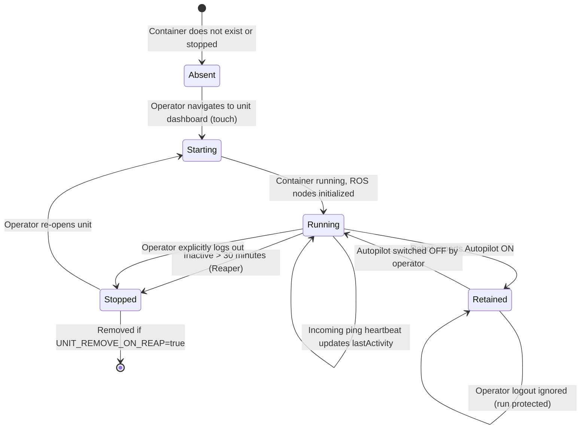

# Unit Container Lifecycle Management (Legacy)

<RoleBadge role="developer" />

::: warning Deprecated Architecture Notice
`unit_manager.js` によるユニットごとのコンテナ管理は、フリートリレーに**置き換えられました**。フリートリレーは、名前空間付きトピック (`/unit_<ULID>/...`) を用いて艦隊全体を 1 つのコンテナで処理し、データプレーンの両側 (リレー `cloud_multi.launch` と MQTT ブリッジ `nakayama_cloud_multi.launch`) をまとめます。現在も両方の経路が利用可能で、ユニットごとの経路が既定のままです。切り替えはユニット単位で完全に行う必要があります。両方を同時に動かすとすべてのメッセージが二重化し、ロボットがピンポイントを飛ばしたように見えます。詳細は [Unit Container Lifecycle](/development/unit-container-lifecycle#fleet-relay-one-container-for-every-unit) を参照してください。
:::

This document details the dynamic lifecycle management of legacy per-unit relay containers (`rosweb_unit_<ULID>`) on the cloud server, previously managed by `unit_manager.js` over the Docker socket.

## Container Architecture Overview (Legacy)

To scale across large robot fleets without wasting server CPU and RAM on idle machines, the server spins up a dedicated ROS relay container only when an operator opens that robot's dashboard.

## Container Lifecycle State Machine

## Lifecycle Rules and Policies

### 1. Autopilot Mission Retention
When a robot executes an autonomous mission in **Autopilot Mode**, its relay container enters the **Retained** state. Retained containers are exempt from the 30-minute idle reaper and are **never stopped upon operator logout**. This guarantees that autonomous operations proceed uninterrupted even if operators close their laptops or drive out of Wi-Fi range.

### 2. Idle Timeout Reaper
The background reaper sweeps every 60 seconds (`UNIT_REAP_INTERVAL_MS: 60000`). If a container has no active operator heartbeat pings for 30 minutes (`UNIT_IDLE_TIMEOUT_MS: 1800000`) and is not retained by Autopilot, the manager calls `docker.stop()`.

### 3. Restart Policy: `unless-stopped`
Per-unit containers run with the Docker restart policy `unless-stopped`. If the host server reboots, Docker automatically revives previously running unit containers. Conversely, when the reaper explicitly stops a container, Docker respects the stop state and does not revive it.

## Configuration Parameters

| Environment Variable | Default Value | Description |
| --- | --- | --- |
| `UNIT_MANAGER_ENABLED` | `true` (server), `false` (unit) | Controls whether dynamic container orchestration is enabled. |
| `UNIT_IMAGE` | `ros-noetic-webui-app-v2:latest` | Target Docker image instantiated for the unit relay. |
| `UNIT_IDLE_TIMEOUT_MS` | `1800000` (30 minutes) | Inactivity threshold before an idle container is stopped. |
| `UNIT_REAP_INTERVAL_MS` | `60000` (1 minute) | Execution period of the background reaper sweep. |
| `UNIT_REMOVE_ON_REAP` | `false` | When true, deletes the container; when false, preserves stopped state. |
| `UNIT_MODE` | `prod` (or `dev`) | Sets container naming suffix (`_nakayama` vs `_nakayama_dev`). |

## Docker Socket Security

`backend_node` communicates with the host Docker engine via a bind mount of `/var/run/docker.sock`. Container execution is restricted to managing units matching the `rosweb_unit_*` namespace, preventing arbitrary container manipulation on the host.

## Related Documentation

- [Architecture](/ja/development/architecture): High-level system structure and two-machine model.
- [State and Behavior](/ja/development/state-and-behavior): Robot activity states and Autopilot handover.
- [Setup: Docker Reference](/ja/setup/docker-reference): Complete compose profile specifications.
