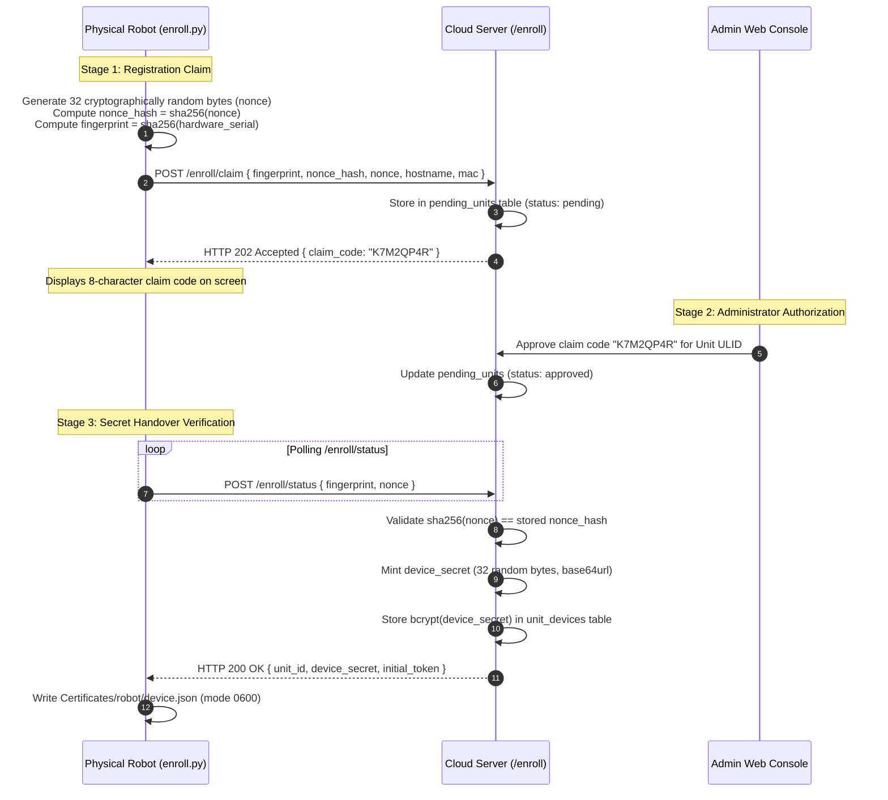

# アカウント & アクセス: ハードウェア登録

<RoleBadge role="developer" />

物理ロボットがクラウドサーバーに自身を登録し、自らのデバイス認証情報を受け取るための完全な暗号プロトコ
ルである。ロボット側にいる人間がすることといえば、画面に表示されたクレームコードを読み上げることだけ
である。このプロトコルは[セキュリティ & トークン](/ja/development/webui/accounts/security-and-tokens)
で説明したRobot Cloud Domainの認証情報を生成する。結果として得られる `device.json` とトークンキャッシ
ュがロボットホスト上のどこに置かれるかについては、
[ROS連携](/ja/development/webui/accounts/ros-integration)を参照のこと。

## 暗号によるハードウェア登録(nonceプロトコル)

未登録のロボットは、三段階の暗号ハンドシェイクを通じてクラウドサーバーに自身を登録する。

### 32バイトのnonceプロトコルがなぜ重要なのか

- **MAC/フィンガープリントのなりすまし対策**: ハードウェアのMACアドレスやシリアル番号はローカルネッ
  トワーク上にブロードキャストされ、管理コンソールでも見える。秘密のnonceがなければ、MACアドレスをな
  りすました攻撃者が、物理ロボットの電源が切れている間に認証情報を騙し取ることができてしまう。
- **一回限りの検証**: 平文のnonceは、認証情報の引き渡し時にTLS経由でPOSTボディに載せて送信され(クエ
  リ文字列には決して載せないため、リバースプロキシのアクセスログには残らない)、後述するself-heal復旧
  時にも再び送信される。サーバーは何かを発行する前に、必ず `sha256(nonce)` を保存済みのハッシュと照合
  して検証する。
- **生の秘密情報をゼロにする保存方式**: クラウドデータベースには `device_secret` の `bcrypt` ハッシュ
  のみが保存される。データベースが完全に流出したとしても、稼働中のロボットのデバイスシークレットが危
  険にさらされることはない。

### Self-heal復旧: 承認をやり直さずに失われた`device.json`を復旧する

ローカルの `device.json` を失ったロボット(ディスクの消去、コンテナのバインドマウントが空のディレクト
リを作ってしまうケース、過去のバグなど)は、通常であれば**pending**プールに再び現れ、管理者はそのたび
に手作業でそれを元のユニットへ再び割り当てなければならない。バインディング自体が実際には何も変わって
いない場合、これは単なる遅延にすぎず、オペレーターがそのうち機械的に承認するだけのキューと化してしま
う。

`POST /enroll/claim` は現在、**三つすべて**が成立するときにこの経路を短絡する。

1. `pending_units` の該当行がすでに `claimed` である(このハードウェアは以前に登録を完了している)。
2. リクエストに**生のnonce**が含まれており、`sha256(nonce)` がその行に保存された `nonce_hash` と一致
   する。これは引き渡しの前に `/enroll/status` がクリアするのと同じ基準であり、なりすましたフィンガー
   プリントがnonceを持っていることは決してない。
3. 生きている `unit_devices` の行が、この正確な `fingerprint` を、その行が承認されたときのユニットに
   今もなお結びつけている(`revoked_at IS NULL`)。

このときサーバーは `device_secret` をその場で再発行し、管理者の操作を一切介さずに、登録バウチャーの経
路とまったく同様にクレームレスポンスの中でそれを返す。`unit_connection_log` のエントリには `recovery`
というタグが付けられる。

これらのチェックのいずれかに失敗した場合は、これまでどおり人間が対応するpendingプールへと落ちる。
nonceが変わっている場合(本物の再イメージ化か、あるいはなりすまし)や、生きたバインディングが存在しな
い場合(そのハードウェアが別のユニットへ採用された、または管理者が意図的にバインドを解除した場合)がこ
れに当たる。

### `secret_prev_hash`: 一世代分の猶予

`issueCredential` は、**同一の `fingerprint` が再収集している場合に限り**、送出済みの `secret_hash`
を `secret_prev_hash` として保持する。新しい `device.json` を書き込んだロボットが、リトライや競合する
二回目の呼び出しの中で、直前まで持っていた古いコピーを提示したとしても、それによってロックアウトされ
ることはない。`/enroll/token` は、ロボットが現在の秘密を保持していることを証明した瞬間に
`secret_prev_hash` をクリアするため、その猶予ウィンドウは正確に「最初の成功利用まで」となる。乗っ取り
(`fingerprint` が変わった場合)は、置き換えられる機体に対する猶予なしに、即座に切り替わる。

## 関連項目

- [概要](/ja/development/webui/accounts/overview): Accounts & Accessの4画面とその関係。
- [セキュリティ & トークン](/ja/development/webui/accounts/security-and-tokens): JWTキーリング、信頼ド
  メイン、TLS終端。
- [ROS連携](/ja/development/webui/accounts/ros-integration): トークンと運用リースがどのようにロボットへ
  届くか。
- [アーキテクチャ](/ja/development/architecture): プラットフォーム全体のトポロジーと信頼ドメイン。
- [State & Behavior](/ja/development/state-and-behavior): リースの強制を含む、ロボット側のステートマシン。
