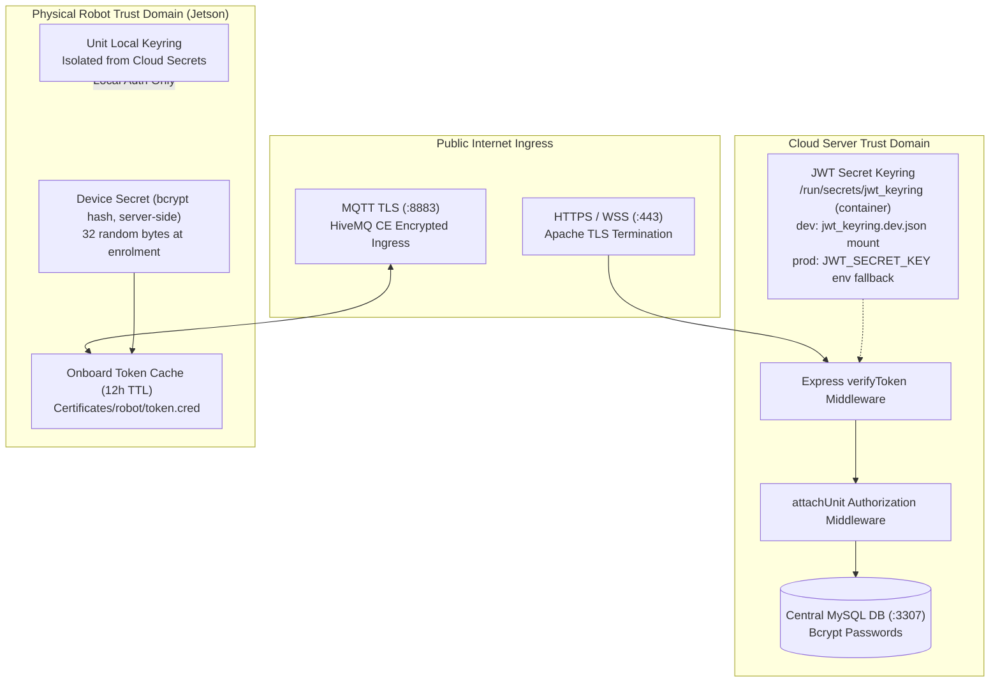

# アカウント & アクセス: セキュリティ & トークン

<RoleBadge role="developer" />

[アカウント & アクセスの画面群](/ja/development/webui/accounts/overview)の背後にあるバックエンドの仕組
み: トークンを署名・検証するJWTキーリング、それらのトークンが存在する三つの独立した信頼ドメイン、そして
転送中にそれらを保護するTLS終端について説明する。ロボットが自身の認証情報を最初に取得する方法について
は[ハードウェア登録](/ja/development/webui/accounts/enrolment)を、その認証情報がロボットホストへどう届
くかについては[ROS連携](/ja/development/webui/accounts/ros-integration)を参照のこと。

## 信頼ドメインのアーキテクチャ

MSD700は、Webフロントエンド、クラウドバックエンド、メッセージブローカー、そして物理的なJetsonシングル
ボードコンピュータ(SBC)全体にわたって多層防御(defense-in-depth)を適用している。



## 三つの独立した信頼ドメイン

セキュリティ境界は、互いに互換性のない三つの信頼ドメインに分離されている。

| 信頼ドメイン | 発行者 | トークンの目的 | 検証エンドポイント | 分離ルール |
| --- | --- | --- | --- | --- |
| **Operator Domain** | クラウドサーバーバックエンド (`backend_node`) | Webダッシュボードにアクセスする人間のオペレーターを認証する。 | すべての `/api/*` ルートでの `verifyToken` | オペレータートークンは `/api/*` 用。`/local/*` ルートにはトークンチェック自体がなく(一部はループバック制限)、受け付けも拒否もしない。 |
| **Robot Cloud Domain** | クラウド登録サービス (`/enroll/token`) | HiveMQおよびクラウドメディアサーバーに接続する物理ロボットを認証する。 | HiveMQ TLS + クラウド `media-server` | 当該ロボットに割り当てられたULIDに厳密に限定される。有効期間は12時間。 |
| **Unit Local Domain** | オンボードローカルバックエンド (`backend_local`) | ローカルLAN上のオペレーターとオンボードの動画ストリーミングクライアントに提供する。 | `/local/*` エンドポイント(認証ミドルウェアなし) | オフライン利用のためローカルエンドポイントは設計上トークンなしで到達可能。分離はトークン拒否ではなくLAN境界による。 |

この表が定めているのは、ロボット自身がブラウザ発行のトークンをいかなる種類であっても決して受け付けず、
[ハードウェア登録](/ja/development/webui/accounts/enrolment)で扱う登録フローを通じて発行された認証情
報のみを受け付けるということである。

## JWTキーリングとダウンタイムゼロの鍵ローテーション

認証トークンは、単一の静的な環境変数ではなく**JWTキーリング**に対して検証される。コンテナ内でのファ
イルは `/run/secrets/jwt_keyring` であり、パーサーは `msd-jwt-keyring` 文書でないものを拒否し、古い秘密鍵
で動き続けずにプロセスを終了する。

```json
{
  "format": "msd-jwt-keyring",
  "keys": [
    { "kid": "key_2026_08_a", "secret": "9a8b7c6d5e4f3a2b1c0d...", "status": "active" },
    { "kid": "key_2026_07_b", "secret": "1f2e3d4c5b6a7f8e9d0c...", "status": "accepted" }
  ]
}
```

### キーリングのローテーションルール

1. **アクティブ署名鍵**: 新たに発行されるアクセストークンとリフレッシュトークンはすべて、
   `status` が `active` の鍵で署名される。
2. **猶予ウィンドウ検証**: トークンが届くと、`verifyToken` はその署名をまずアクティブ鍵に対して検証し、
   次に猶予ウィンドウ内の `accepted` 鍵を試してからHTTP 401で拒否する。
3. **セッション中断ゼロ**: 本番環境で鍵をローテーションしても、アクティブな全オペレーターが一斉に再ログ
   インを強制されることはない。

## ネットワークセキュリティとTLS終端

1. **Apacheリバースプロキシ**: 外部からのHTTP、SSE、WebSocketトラフィックはすべて、Let's Encrypt
   (`/etc/letsencrypt/live/`) の証明書を使い、Apacheの443番ポートでTLSを終端する。
2. **HiveMQの相互トランスポートセキュリティ**: ロボットはHiveMQの8883番ポートにTLS経由で接続する。
   PKCS#12形式のキーストア証明書は `/srv/msd/secrets/hivemq/keystore.p12` に置かれている。
3. **コンテナ分離**: バックエンドコンテナはDocker内部のブリッジネットワーク(`ros_webui_prod_net` / `ros_webui_dev_net`)を介し
   て通信し、内部データベースやrosbridgeのポートを公開インターネットに直接露出させない。

## 関連項目

- [概要](/ja/development/webui/accounts/overview): Accounts & Accessの4画面とその関係。
- [ハードウェア登録](/ja/development/webui/accounts/enrolment): ロボットが自身を登録する際に使うnonce
  プロトコル。
- [ROS連携](/ja/development/webui/accounts/ros-integration): トークンと運用リースがどのようにロボットへ
  届くか。
- [アーキテクチャ](/ja/development/architecture): プラットフォーム全体のトポロジーと信頼ドメイン。
- [State & Behavior](/ja/development/state-and-behavior): リースの強制を含む、ロボット側のステートマシン。
