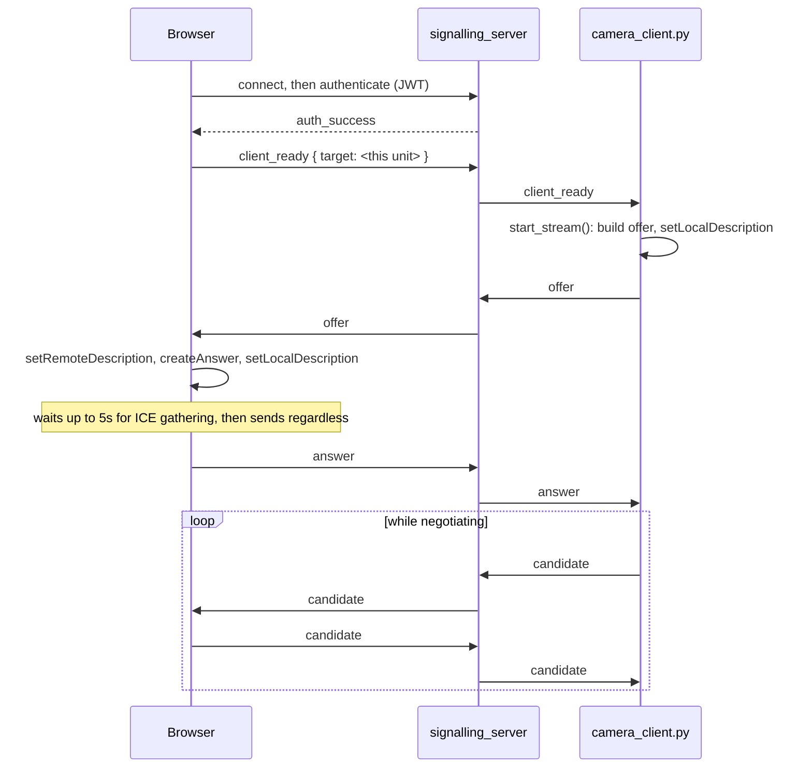

# カメラ & ライブビュー

<RoleBadge role="developer" />

MappingおよびNavigation画面のダッシュボードサイドバー(`src/components/sidebar/sidebar.tsx`)に表示さ
れるライブ動画ウィジェットについて説明する。`VideoStreamComponent` がロボットのカメラへのWebRTC接続を
どのように確立するか、そしてその接続が静かに切れたことをブラウザがどう検知するかを扱う。Databaseペー
ジのサイドバーは同じ場所に、ライブ動画ではなく静的なマッププレビューのサムネイルを表示する。このハンド
シェイクのロボット側の半分、`camera_client.py` のICE設定、および再接続ロジックについては、
[ROS連携](/ja/development/webui/camera/ros-integration)を参照のこと。

::: info 動画はピアツーピアであり、サーバーを経由するのはネゴシエーションのみ
`signalling_server` は、`camera_client.py` とブラウザの間でSDPオファー、アンサー、ICE候補を交換する。
接続が確立された後、動画フレームがそこを通ることは一切ない。ロボットとブラウザの間を直接流れるか、直
接経路が存在しない場合は `coturn` を経由する。
:::

## ハンドシェイク

`VideoStreamComponent` は、ページ読み込み時に即座にではなく、このやり取りの相手側から `offer` が届い
た時点で初めて、ブラウザの `RTCPeerConnection` を生成する。`signalling_server` 自体は `target` で振り
分けられるステートレスなリレーであり、SDPの内容を検査することは一切なく、そこに名指しされた二者のピア
の間でメッセージをルーティングするだけである。認証に必要なのは、`userId` または `username` を含む、キ
ーリングで検証済みの有効なトークンだけである。`userId` を持たないロボットトークンはここで即座に拒否さ
れる。これが、クラウド側とユニットローカル側両方のトークン発行者がそれを明示的に含めている理由である
([アーキテクチャ § 信頼ドメイン](/ja/development/architecture#マルチティア・トラストドメインとセキュリティ)を参照)。

## ブラウザ側でのスタール検知

ブラウザ標準の `oniceconnectionstatechange`(状態が `failed` になるとブラウザ自身の `restartIce()` を
発火させる)に加えて、別立てのウォッチドッグが2秒ごとに `getStats()` をポーリングし、受信側の動画トラ
ックの `framesDecoded` が引き続き進んでいるかを確認する。トランスポートが `connected` と報告している
にもかかわらず6秒間この値が動かない場合、そのストリームは `stalled` と判定される。これは、ICE自身のス
テートマシンでは検知できない唯一の障害モードである。ロボットのプロセスが落ちた、あるいはネットワーク
が静かに途絶えたにもかかわらず、ピア接続自体は何も異常に気づいていないというケースである。

## ビルド時に決まるシグナリングURL

あるダッシュボードのビルドがどのシグナリングバックエンドと通信するかは、実行時ではなく**ビルド時**に
決まる。`NEXT_PUBLIC_SIGNALLING_URL` は `frontend_prod` / `frontend_dev` / `frontend_local` それぞれ
に個別に焼き込まれる(
[リポジトリ構成 § ROS-dashboard-next-ts](/ja/development/repository-structure)を参照)。ユニットローカ
ル向けビルドはさらに一歩進み、これを含むすべての `NEXT_PUBLIC_*` サービスURLの*ホスト*部分を、実行時に
`window.location.hostname` へと置き換える。ビルド時のポート番号だけはそのまま維持される。これにより、
同じ `frontend_local` イメージは、DHCPリースの変更やオペレーターが別のホスト名でユニットにアクセスす
る状況を乗り越えて動き続けられる。ビルド時のみで決まる純粋なURLでは、これは不可能である。

## 関連項目

- [ROS連携](/ja/development/webui/camera/ros-integration): `camera_client.py`、ICE/STUN/TURN設定、
  mDNS候補のバグ、再接続ロジック
- [アーキテクチャ](/ja/development/architecture): `signalling_server` と `coturn` がより広いシステムの
  中でどこに位置するか、そしてここで使われるトークンに信頼ドメインがどう適用されるか
