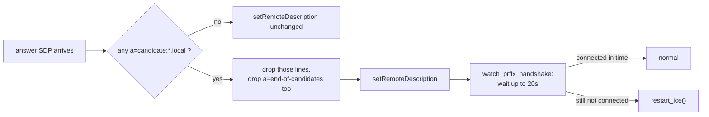

# カメラ & ライブビュー: ROS連携

<RoleBadge role="developer" />

[概要](/ja/development/webui/camera/overview)で説明したライブビュー・ハンドシェイクのロボット側の半分
にあたる: `camera_client.py` のICE設定、インターネットのないユニットでそれを壊してしまったmDNS候補の
バグ、そして不安定な接続の中でもカメラを生かし続ける再接続ロジックについて説明する。

::: warning `camera_client.py` はROSノードではない
ロボットホスト上で動作しているにもかかわらず、`camera_client.py` は `run_msd.sh` によって `camera_client`
というtmuxウィンドウで起動される、ただのPythonプロセス(`aiortc` ベースのWebRTCクライアント)である。ト
ピックもサービスもノード登録も持たない。このページはこのセクションの他のページとの一貫性のために「ROS
連携」というタイトルを付けているが、ここで指し示せる `.launch` ファイルは存在しない。
:::

## 一台のカメラ、二つのピア接続

一台の物理カメラは、その一つのプロセスの中にある**二つ**の独立した `CameraClient` オブジェクト(一方
はクラウドとピアリングし、もう一方はユニット自身のLAN上で開かれているダッシュボードとピアリングする)
によって共有され、それぞれが自前のWebSocket接続と自前の `RTCPeerConnection` を持つ。

| ターゲット | シグナリングWebSocket | メディア / バックエンド | STUN/TURN |
| --- | --- | --- | --- |
| クラウド本番環境 | `wss://msd.nglobal.jp/services/signalling` (Apacheが `:3001` にプロキシ) | media `:3003`, backend `:5000` | Google STUN + 本番の `coturn` リレー |
| クラウド開発環境 | `ws://<server-ip>:4001` | media `:4003`, backend `:5001` | 本番環境と同一(同じリレーを共有) |
| ユニットローカル | `ws://<unit-ip>:3001` | media `:3003`, backend `:5002` | **デフォルトではなし** |

## ユニットローカル経路にデフォルトでSTUN/TURNがない理由

インターネット経路を持たないユニットは、`stun.l.google.com` を名前解決しようとする `getaddrinfo` に失
敗し、`aiortc` はその失敗をそのまま `setLocalDescription` から投げ返す。これは劣化した接続ではなく、
カメラも、シグナリングサーバーも、ダッシュボードもすべて正常であるにもかかわらず、`start_stream()` が
完全に死んで映像がまったく出ないという事態である。このケースではオペレーターのブラウザとロボットが同
じLANを共有しているため、ホスト候補はすでに到達可能であり、リレーが解決すべき問題は何も残っていない。

`camera_client.py` とダッシュボードの `VideoStreamComponent` は、両者ともICEサーバー一覧について同じ
規約を読み取る。未設定の場合はクラウドのデフォルト(Google STUNと本番のTURN認証情報)にフォールバックし、
リテラル文字列の `none` は未設定のまま放置するのではなく一覧を完全に空にする。
`LOCAL_STUN_URLS` / `LOCAL_TURN_URL` / `LOCAL_TURN_USERNAME` / `LOCAL_TURN_CREDENTIAL`
は、まさにこの理由からコード(`camera_client.py`)内ではリテラル文字列 `none` をデフォルトとする — 
`msd700_noetic/docker/.env` ではコメントアウトされているため、適用されるのはコードのデフォルトである。これらはユニットのLANが本当に
リレーを必要とする場合(セグメント化されたネットワーク、ロボットとオペレーターの間にあるキャプティブ
Wi-Fiブリッジなど)にのみ設定する価値がある。

## mDNS候補のバグ (2026-08-14)

最近のChromeは、ホストの実際のLANアドレスをICE候補に載せない。代わりにランダムな `<uuid>.local` とい
う名前を発行し、それをマルチキャストDNSで解決することに頼る。これは、受信側がmDNSに参加できることを前
提としたプライバシー機能である。デフォルトルートを持たないユニットではそれができない。

```
OSError: [Errno 19] No such device
  at aioice/mdns.py, joining 224.0.0.251 with INADDR_ANY
  raised out of add_remote_candidate()
```

重要なのは、これがどこで投げられるかという点である。候補ごとではなく、`add_remote_candidate` 自体の
中から投げられ、`setRemoteDescription` の呼び出しそのものを中断させてしまう。アンサーの中に解決不能な
候補が一つあるだけで、ネゴシエーション全体が失敗するのに十分だった。しかもブラウザ側のアンサー自体は
使用可能なパブリックIPも運んでいたのだから、これはまさにDNSの問題のように見える症状であり、それが上
述の無関係なSTUN解決失敗と混同されやすくしていた原因でもある。

### 修正内容

`_strip_mdns_candidates()` は、アドレスが `.local` で終わる `a=candidate:` 行をすべて、`aiortc` に渡
す前にアンサーから取り除く。また `handle_ice_candidate` でトリクルされる候補についても同じ処理を行う。
接続性にとって最も重要と思われる候補はいずれにせよ失われるため、この修正が機能するのは次に起きること
があるからにほかならない。

- **他に何かが取り除かれるときは、`a=end-of-candidates` も必ず取り除かれる。** これを残したままにす
  ると、`aioice` に「これ以上候補は来ない」と伝えてしまい、リモート候補がゼロで待つべきものが何もない
  エージェントは、ブラウザ自身の接続性チェックが到着する前に接続失敗を宣言してしまう。
- **回復メカニズムは名前解決ではなく、peer-reflexive discovery(RFC 8445 §7.2.1.3)である。** ロボット
  は自身のホスト候補を引き続き広告し続ける。ブラウザ側のSTUN接続性チェックがそのいずれかに到達した時
  点で、`aioice` はそのパケットの送信元からブラウザの実アドレスを学習する。`.local` という名前を解決
  する必要は一切ない。だからこそ、この候補を取り除くことは接続性への唯一の経路を失うことではなく、単
  に*不要な重荷を捨てる*ことなのである。
- **境界付きの待機が、`aioice` 自身には存在しないタイムアウトの代わりを果たす。** リモート候補もなく
  end-of-candidatesのマーカーもない状態では、`aioice` は無期限に待ち続ける。それは、peer-reflexive
  discoveryがまだこれから届く場合には正しい挙動だが、ブラウザのタブがハンドシェイクの途中で閉じられた
  場合には誤った挙動になる。`_watch_prflx_handshake()` は `MDNS_PRFLX_WAIT_S`(デフォルト20秒。実際の
  接続性チェックが通常1秒未満で届くLANにとっては十分に余裕のある値)だけ待機し、その時点で接続がまだ
  `connected`/`completed` になっていなければ `restart_ice()` を呼び出す。



::: warning この除去処理はユニットローカルだけでなく両方のターゲットに適用される
mDNS候補は、クラウドターゲットにとっても等しく無意味である。DNSの問題とは関係なく、インターネット越し
には到達できないアドレスを指しているからだ。そのため、この修正はどの `CameraClient` インスタンスがア
ンサーを処理しているかによって切り替わることのない、無条件のものになっている。
:::

## 再接続とリトライ

`camera_client.py` の接続ループは決して永久には諦めない。以前のバージョンは、固定の試行回数の上限に達
すると停止し、誰かが手動で `run_msd.sh` を再起動するまでカメラを死んだままにしていた。リトライの間隔
は、ジッターを伴う指数バックオフである。基準値は2秒で、失敗するたびに倍増し、最大60秒で頭打ちになり、
ランダム化されている。これにより、一つのクラウドシグナリングサーバーを共有するユニットの群れが、共有
障害の後に足並みを揃えてリトライしてしまうことを防いでいる。

トランスポートレベルのICE失敗(`iceConnectionState` が `failed` に達する場合)は、`restart_ice()` を直
接引き起こす。古いピア接続が解体され、同じICE設定で新しい接続が構築され、トラックとデータチャネルが再
び取り付けられ、`isRestart` フラグを伴う新しいオファーが送信される。これは物理カメラ自体の再起動とは
別物であり、後者は15秒に一回にレート制限されており、進行中のリブートとは排他的である。両方の
`CameraClient` インスタンスが共有する同じ `/dev/videoN` を、どちらも電源サイクルさせるためである。

## ここでの変更をデプロイする

`camera_client.py` は、クラウドのみの経路でも `local_dev` の経路でも、常にバインドマウントされている。
ホスト上での編集は、次に `run_msd.sh` がtmuxウィンドウを(再)起動したときに、イメージのビルドを一切伴
わずに反映される。対照的にシグナリングサーバーは、ユニットのローカルスタックイメージ内に同梱される。
`Dockerfile.webui-local` は `./src/ros-web-ui/source` ツリー全体を **`COPY`** する(条件付きの
依存関係インストール付き)。そこでの変更には、`docker-manager.sh` が
ダッシュボードとバックエンドのイメージに対してすでにチェックしているのと同じ再ビルドが必要になる(
[Docker Reference § `up` が行うこと、その順序](/ja/setup/docker-reference#up-が行うこと-順番)を参
照)。これを忘れると、そこで文書化されている陳腐化(staleness)の失敗とまったく同じように見える。スタッ
クは何事もなく正常に起動し、編集前のシグナリングロジックをそのまま提供し続けてしまう。

## 関連項目

- [概要](/ja/development/webui/camera/overview): 同じハンドシェイクのブラウザ側、
  `VideoStreamComponent`、ブラウザ側のスタール検知
- [アーキテクチャ](/ja/development/architecture): `signalling_server` と `coturn` がより広いシステムの
  中でどこに位置するか、そしてここで使われるトークンに対する信頼ドメイン
- [Server Setup § TURNリレー](/ja/setup/server-setup#_6-the-turn-relay-production-only): 本番のTURN
  リレー自体の設定
- [Docker Reference § Unit: run_msd.sh](/ja/setup/docker-reference#ユニット-run-msd-sh): `camera_client`
  のtmuxウィンドウが起動される場所
