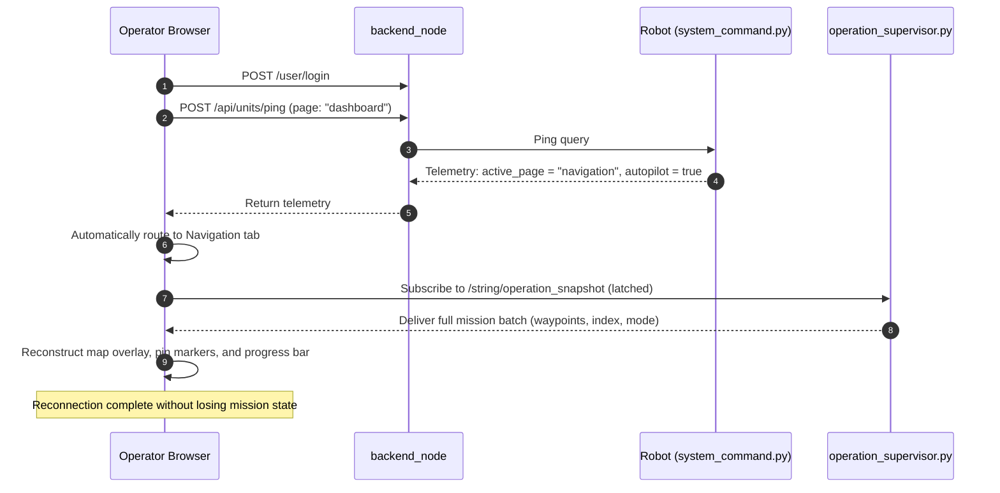

# ナビゲーション: 手動操作 & オートパイロット

<RoleBadge role="developer" />

ナビゲーションページの視点から見た`ManualAutopilotPanel`サイドバーコンポーネント、アクティビティキーからダッシュボードタブへのRobot
Activity State Machineのマッピング、そして本ページにおけるセッションの再接続・復旧を支えるフロントエンド実装の仕組みを扱う。このパネルが並んで配置されるMode
List/Action Barパターンとcanvasパイプラインについては[概要](/ja/development/webui/navigation/overview)を参照。このパネルが連携するポイント・アンド・ゴー系モードについては[ピンポイント &
ルート](/ja/development/webui/navigation/pinpoint-and-routes)を参照。

## ナビゲーションページにおけるManual OverrideとAutopilot

`ManualAutopilotPanel`はサイドバーに配置されており、Mappingページでレンダーされるのと同じコンポーネントだが、この2つのトグルはここでは実務上異なる重みを持つ。

- **Manual Override**は、このページで実行中の自律動作(送信済みのピンポイント、複数点ルート、またはカバレッジ清掃の掃引)を停止し、`twist_mux`をキーボードに引き渡す。これによりWASD入力がロボットを直接操作する。
- **Autopilot**は、ブラウザタブを開いたままにしなくても送信済みのrunを維持する。ユニット側の`operation_supervisor`がrunの送信そのものを引き継ぐためである。

同じパネルはMappingページのサイドバーにも表示されるが、そこでは2つのトグルはナビゲーションのrunではなくアクティブなSLAMセッションを制御する。そのページ独自の説明では、そちらでのManual
OverrideとAutopilotの意味を扱っている。

## アクティビティステートマシン: ダッシュボードタブへのルーティング

`RobotStateTracker`が追跡し、ハートビートpingのたびに報告されるロボットのアクティビティ文字列が、オペレーターがどのダッシュボードタブに着地するかを決める。これは再接続時も同様である(下記[セッションの再接続と復旧](#session-reconnection-and-recovery)を参照)。このページの2つのトグルは、それぞれロボットを特定のアクティビティへと駆動する。

- **Manual Override**を有効にすると、ロボットのアクティビティは`manual`になり、これはNavigationではなく**Idle**タブへルーティングされる。Manual
  Overrideがこのページのパネルから有効化されたかMappingのパネルからかは関係ない。
- 送信済みのrun中に**Autopilot**を有効にすると、ロボットのアクティビティは`supervisor_navigating`になり、**Navigation**タブへルーティングされる。

アクティビティの完全な一覧は以下のとおりである。

| アクティビティキー | 対象UIタブ | 説明 |
| --- | --- | --- |
| `idle` | Idle | システム初期化済み。モーターコントローラーは有効だがアクティブなゴールはない。 |
| `manual` | Idle | WASDキーボード操作による手動テレオペがアクティブ。 |
| `mapping_active` | Mapping | `explore_lite`のフロンティア探索によるアクティブなSLAMマッピング。 |
| `mapping_paused` | Mapping | オペレーターによってSLAM探索が一時的に停止されている。 |
| `mapping_stop_failed` | Mapping | マップ保存に失敗。オペレーターが再試行できるようSLAM状態はアクティブなまま維持される。 |
| `navigation_ready` | Navigation | マップがロード済みで`move_base`が稼働中、ゴール送信を待機している。 |
| `navigation_point_published` | Navigation | ロボットがナビゲーションゴールに向けて実際に走行中。 |
| `boustrophedon_initializing` | Navigation | カバレッジの掃引ラインを生成中(idle/stuckタイムアウトの対象外)。 |
| `boustrophedon_ready` | Navigation | boustrophedonカバレッジの掃引ラインを実行中。 |
| `supervisor_navigating` | Navigation | `operation_supervisor`が管理する自律ウェイポイント送信。 |
| `arrived` | Navigation | ウェイポイント目的地への到達、またはカバレッジエリアの完了に成功。 |
| `coverage_failed` | Navigation | カバレッジ計画または経路実行が中断された。 |
| `auto_aligning` | Navigation | Auto Alignのパーティクルフィルターによる向き較正を実行中。 |
| `paused` | Navigation | オペレーターの明示的なコマンドによりミッションが一時停止。 |
| `paused_due_to_ping_loss` | (内部) | ハートビートpingの喪失によりセーフティウォッチドッグがロボットの動作を一時停止。 |
| `emergency_stopped` | Idle | ハードウェアの緊急停止が作動(優先度255でゼロ速度に固定)。 |
| `emergency_cleared` | Idle | 緊急停止が解除され、モーターは再初期化準備完了。 |

完全な状態遷移図と`paused_due_to_ping_loss`の裏にあるセーフティウォッチドッグの挙動は[状態 &
挙動](/ja/development/state-and-behavior)で扱う。本ページにこの表を再掲しているのは、これこそが新規ログインや再接続の際にオペレーターがそもそもNavigationへ戻されるかどうかを決める、まさにそのものだからである。

## セッションの再接続と復旧

このセクションは本質的にフロントエンド実装寄りの内容である。オペレーターが閉じたブラウザタブを再度開いたとき、あるいは新しいワークステーションからログインしたときに`mapComponent.tsx`が実行するReactのstateとcanvasの仕組みを、高レベルの挙動だけでなく扱う。

### 復旧の原則

1. **`active_page`によるルーティング**: フロントエンドは、上記のアクティビティ表を使い、ロボットのライブテレメトリに基づいてオペレーターをアクティブな操作タブ(NavigationまたはMapping)へ直接リダイレクトする。
2. **ラッチされたスナップショットの再構築**: ミッションの全state(アクティブなウェイポイント、現在のインデックス、進行方向、カバレッジのポリゴン)は、ラッチされたROSトピック`/string/operation_snapshot`から復元される。
3. **ゴーストステート検証**: ブラウザキャッシュが進行中のミッションを示している一方でロボットが8回連続のテレメトリサンプルで`idle`を報告している場合、フロントエンドは幻の実行表示を防ぐため自動的に`idle`にリセットする。

### 何がスナップショット再構築を引き起こすか

再構築は真新しいタブに限られない。次のいずれかに該当し、タブに保持する価値のあるローカルセッションがない場合は常に実行される。

- ログインルーターが`nav_recovery_pending`をセットした(復帰のためオペレーターをここへルーティングした)、または
- キャッシュに何もなかったタブに対して、ページが操作対象のマップを自動的に解決した、または
- `navStatus`が存在しない**か`Idle`**であり、かつモードが選択されていない。

3つ目の条件が「またはIdle」と書かれているのには理由がある。Databaseページからマップを再度開くと、タブのナビゲーションstate全体が意図的に破棄され(`flushNavigationRecoveryState`)、その後Navigationページは自身の初期state`Idle`から`navStatus`を少し遅れて播種する。この条件はキーが**存在しない**ことを要求していたが、意図的にローカルstateを破棄した唯一のエントリーポイントこそが、それを再構築できない唯一のものでもあった。マップから離れて実行途中に戻ってきたオペレーターは、カバレッジエリアのオーバーレイが消え、ピンもなく、新規ログイン以外にそれらを取り戻す方法がない状態を目にすることになった。現在では、ページもマップコンポーネントもマウント時に永続化されたstatusやmodeを書き込むことはなく、復旧経路だけがそれらのキーを播種する。

タブが開いているものと**異なる**マップを指すスナップショットは、適用されずに無視される。再構築はrunが属するマップを再選択するが、これはマップなしで到着したタブには正しく、オペレーターが手動でマップを選んだ直後には誤りとなる。

ラッチされた値が真新しいMQTTサブスクライバーに届くとは限らないため、ダッシュボードは0秒、0.9秒、3.4秒、9.4秒の時点でもsupervisorに再パブリッシュを促す。idleなロボットはこれらのどれにも応答しないため回数は少なく抑えられているが、回数よりも**到達すること**の方が重要である。これはブラウザからrosbridge、MQTT、ユニットへの往復であり、数秒で諦めるスケジュールは、まさに帯域幅対策の取り組み全体が生き延びさせようとしている弱いリンク上で、実行中のrunを見捨ててしまう。サブスクリプションはスケジュールより長く生き続けるため、後から届いたスナップショットも適用される。

### 再構築が最初に描くもの

順序は内容と同じくらい重要である。以前の再構築ではマップ一覧を取得し、ライブグリッドがステージをスケーリングするのを(最大8秒)待ってから初めてカバレッジオーバーレイを描画していたため、実行中の掃引にログインし直したオペレーターは、エリアが表示されるまで何秒も何もないマップを眺めることになった。このオーバーレイはどちらも必要としない。メートル単位でシーンに直接描画され、スナップショットにはすでに計画が含まれている。現在はこのオーバーレイが最初に描画され、カバレッジrunに対してはピンをスケーリングする必要がないため、ステージスケールの待機は完全にスキップされる。ピンの復元はそれでも待機する。スケーリングされていないステージに追加されたマーカーは、見えないほど小さい0.01スケールでレンダーされてしまうためである。

同じ規則はrunが**開始**するときにも適用される。エリアは計画が送信された時点で描画され、ロボットがそれを確認応答した時点ではない。`POST
/api/boustrophedon/init`は`switch_mode`がロボット上でカバレッジスタックを立ち上げてから初めて応答するため、オペレーターは何もないマップを数秒間見つめることになる。拒否されたrunは再びオーバーレイをクリアし、拒否された単一のカスタムエリアはシアンのドロワーポリゴンを再描画し、オペレーターが再試行できるエリアを残す。

## 関連

- [概要](/ja/development/webui/navigation/overview): このパネルと復旧ロジックが並んで配置される
  Mode List/Action Barパターンとcanvasパイプライン。
- [ピンポイント & ルート](/ja/development/webui/navigation/pinpoint-and-routes): 上記の復旧フローが復元するピンとルートを持つポイント・アンド・ゴー系モード。
- [マップ同期 & アラインメント](/ja/development/webui/navigation/map-sync-and-alignment)
- [カバレッジ清掃](/ja/development/webui/navigation/coverage-cleaning)
- [ROS連携](/ja/development/webui/navigation/ros-integration)
- [アーキテクチャ](/ja/development/architecture)
- [状態 & 挙動](/ja/development/state-and-behavior): 完全なアクティビティ状態遷移図と
  `paused_due_to_ping_loss`の裏にあるセーフティウォッチドッグの挙動。
