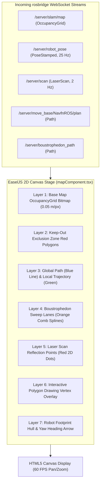

# ナビゲーション

<RoleBadge role="developer" />

ナビゲーション機能は`unit/navigation`画面である。`pages/unit/navigation/index.tsx`は薄いレイアウトシェルに過ぎず、実際の機能のほぼすべては`src/components/navigationMap/mapComponent.tsx`(`MapComponent`)とそれがレンダーするサブコンポーネントにあり、「Mode List」ドロップダウン(`ModeListPanel.tsx`)と常時表示のアクションバー(`actionBar.tsx`)からアクセスする。本ページでは、この画面のすべてのモードに共通する仕組みを扱う。モード切り替えのパターン自体、各モードがその上に成り立つcanvasレンダリングパイプラインと座標計算、そしてどのモードがアクティブでも表示される小さな補助UI部品である。

各モードにはそれぞれ専用のページがある。

| モード / 機能 | 記載先 |
| --- | --- |
| Single Pinpoint、Multiple Pinpoint、Save/Load Route、Round Trip/Loop Route、Set Home Base、Delete All Pinpoints | [ピンポイント & ルート](/ja/development/webui/navigation/pinpoint-and-routes) |
| 手動テレオペ(WASD)、Autopilotトグル、ロボットのアクティビティによるダッシュボードタブのルーティング、セッションの再接続/復旧 | [手動操作 & オートパイロット](/ja/development/webui/navigation/manual-and-autopilot) |
| Map Sync / Auto Align | [マップ同期 & アラインメント](/ja/development/webui/navigation/map-sync-and-alignment) |
| Coverage Area(boustrophedon清掃) | [カバレッジ清掃](/ja/development/webui/navigation/coverage-cleaning) |
| 上記すべての裏にあるROS側のワイヤー契約 | [ROS連携](/ja/development/webui/navigation/ros-integration) |

## 1つのページ、多数のモード

これは明示的に述べておく価値がある。そうでないと誤解しやすいからだ。ナビゲーションは**1つのルート**が**1つの長命なコンポーネントツリー**をレンダーするものであり、複数の別ページの集合ではない。`ModeListPanel.tsx`でSingle Pinpoint、Multiple Pinpoint、Set Home Base、Delete All Pinpoints、Map Sync/Auto Align、Coverage Areaを選ぶことは、`MapComponent`自身のstate内でのモード選択であって、Next.jsのルート変更でもマップcanvasの新規マウントでもない。アクションバー(`actionBar.tsx`)はモードリストと並んで配置され、モードごとではなくモード横断で利用可能なアクションを提供する。ナビゲーションのPlay/Pause、Stop、Return to Home Base、Focus View(canvas上でカメラがロボットを追従する)である。

canvas自体はオペレーターがモードを切り替えても再マウントされないため、以下で説明するレンダリングパイプライン、座標変換ヘルパー、補助UIは各モードの下にある共有インフラであり、各モードがそれぞれ再実装するものではない。

## Canvasレンダリングパイプライン

`MapComponent`は、rosbridgeのWebSocketトピックから供給されるEaselJSレイヤーのスタックとして、1つのHTML5 Canvasステージ上にビューを構成する。



レイヤー6、インタラクティブな頂点オーバーレイは、オペレーターがcanvasをクリックしたときにSingle Pinpoint、Multiple Pinpoint、Set Home Baseが描画する場所である。このオーバーレイがどう駆動されるかは[ピンポイント & ルート](/ja/development/webui/navigation/pinpoint-and-routes)を参照。レイヤー2と4(keep-outポリゴンとboustrophedonの掃引レーン)は、兄弟ページが扱うモードに属する。

## 座標変換: メートル空間から画面ピクセルへ

ROSの座標フレームはメートル法(メートル単位、マップ原点が$(0, 0)$)であるのに対し、HTML5 Canvasは左上を原点とするピクセル座標$(p_x, p_y)$を使う。canvas上のすべてのクリックとそこに描画されるすべてのロボットポーズは、この境界を横断する。

マップ解像度$r$(メートル毎ピクセル)、画像の高さ$H$(ピクセル)、マップ原点$\mathbf{o} = [x_0, y_0]^T$が与えられたとき、

**メートルからcanvasピクセルへ**(ロボット、パス、ラッチされた状態をマップに描画する際に使用):

$$p_x = \frac{x - x_0}{r}$$

$$p_y = H - \frac{y - y_0}{r}$$

*($y$軸が反転しているのは、ROSの$Y$が上に増加するのに対し、Canvasの$Y$は下に増加するため。)*

**canvasピクセルからメートルへ**(オペレーターのクリックを送信するゴールに変換する際に使用):

$$x = x_0 + (p_x \cdot r)$$

$$y = y_0 + ((H - p_y) \cdot r)$$

## `createjs.Stage.prototype`パッチ

`rosScriptLoader.ts`内の、canvasが構築される前に`createjs.Stage.prototype`をパッチするコードは、文脈なしに見ると奇妙に映るため、その存在理由を説明する価値がある。このダッシュボードのようなReact SPAでは、ページやモードの遷移中にコンポーネントが素早くマウント・アンマウントされる。標準の`ROS2D.js`は座標変換関数(`globalToRos`、`rosToGlobal`)を生成時にstageの*インスタンス*にバインドする。そのバインディングはReactの再レンダー時に失われることがあり、対処しないままだとオペレーターがcanvasをクリックした瞬間に致命的な`TypeError: this.stage.globalToRos is not a function`として表面化する。

canvasがこの形で決してクラッシュしないことを保証するため、`rosScriptLoader.ts`はインスタンス化に先立って、変換関数を`createjs.Stage.prototype`自体にパッチする。インスタンスごとのバインディングが毎回のremountを生き延びることに頼るのではない。

```typescript
// scripts/rosScriptLoader.ts
export function patchEaselJSStage(): void {
  if (typeof window === "undefined" || !(window as any).createjs) return;

  const StageProto = (window as any).createjs.Stage.prototype;

  if (!StageProto.globalToRos) {
    StageProto.globalToRos = function (x: number, y: number) {
      const rosX = (x - this.x) / (this.scaleX * this.ros2dViewer.scaleToDimensions);
      const rosY = -(y - this.y) / (this.scaleY * this.ros2dViewer.scaleToDimensions);
      return { x: rosX, y: rosY };
    };
  }

  if (!StageProto.rosToGlobal) {
    StageProto.rosToGlobal = function (rosX: number, rosY: number) {
      const x = rosX * this.scaleX * this.ros2dViewer.scaleToDimensions + this.x;
      const y = -rosY * this.scaleY * this.ros2dViewer.scaleToDimensions + this.y;
      return { x, y };
    };
  }
}
```

本ページの各モードのクリック処理(ピンポイント配置、ホームベース配置、ポリゴン描画)は最終的にすべて`stage.globalToRos`を呼び出すため、このパッチは特定の1モードだけの詳細ではなく、そのすべての前提条件となる。

## 補助UI

特定の1つのモードに属するのではなく、モード横断で現れるコンポーネントがいくつかある。

- **`RobotStuckNotification`**: ロボットが現在のゴールに向けて進めていないように見えるときに表示される画面上の警告。
- **`HoverTooltip`**: オペレーターがcanvas上の要素にカーソルを合わせたときに表示されるコンテキストツールチップ。
- **`TopToast`**: save/load操作(たとえばルートの保存や読み込みの失敗)によるエラーを、ブロッキングダイアログではなく一時的なトーストとして表示する。
- **`PreviewMap`**: フルインタラクティブなcanvasとは別の、マップのサムネイル表示。

## 関連

- [ピンポイント & ルート](/ja/development/webui/navigation/pinpoint-and-routes): Single/Multiple
  Pinpoint、Save/Load Route、Round Trip/Loop Route、Set Home Base、Delete All Pinpoints。
- [手動操作 & オートパイロット](/ja/development/webui/navigation/manual-and-autopilot): 共有される
  `ManualAutopilotPanel`、アクティビティからタブへのルーティング、セッションの再接続/復旧。
- [マップ同期 & アラインメント](/ja/development/webui/navigation/map-sync-and-alignment)
- [カバレッジ清掃](/ja/development/webui/navigation/coverage-cleaning)
- [ROS連携](/ja/development/webui/navigation/ros-integration)
- [アーキテクチャ](/ja/development/architecture)
- [状態 & 挙動](/ja/development/state-and-behavior)
