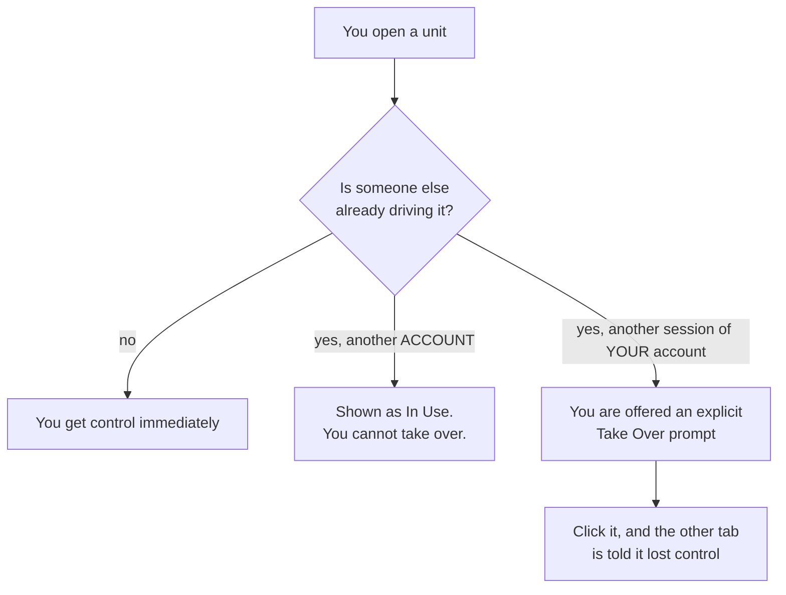
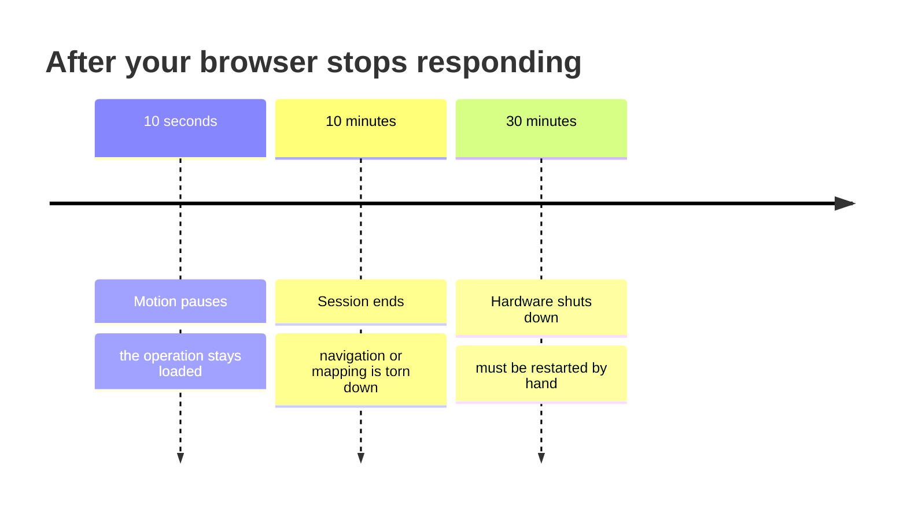
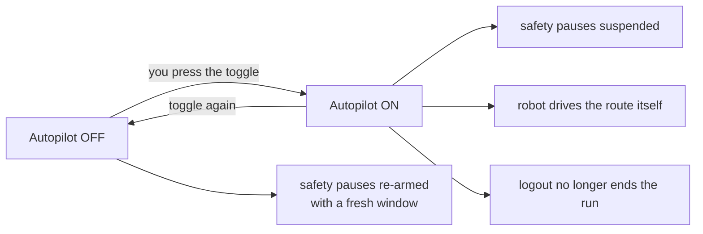
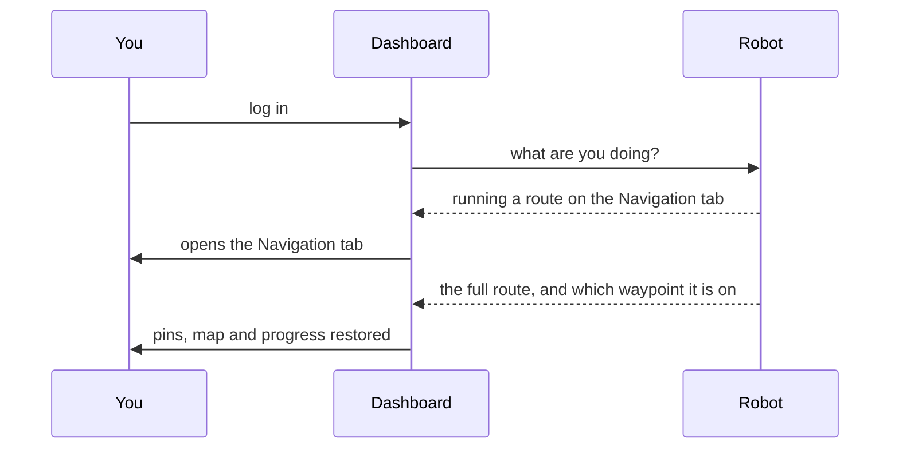

# ロボットの動作

<RoleBadge role="user" />

MSD700 は、頼まれてもいないのに、いくつかのことを自動的に実行します。あなたがいなくなると一時停止し、拒否します。
2人が同時に運転できるようにすると、戻ってきたときに何をしていたかを記憶します。そんなことはありません
は任意であり、ルールを知っているかどうかで、「ロボットが何か奇妙なことをした」かどうかが変わります。
そして「もちろんそうなりました。」

このページは平文版です。エンジニアリングの詳細については、
[状態と動作](/ja/development/state-and-behavior)。

## ロボットは今何をしているのか

ダッシュボードには、ロボットのステータスが常に 1 つ表示されます。これらは実際に見ることになるものです。

|ステータス |手段 |普通？ |
| --- | --- | --- |
| **アイドル** |何も実行されていません。コマンドの準備ができました。 |はい |
| **マニュアル** | W-A-S-D で運転しています。 |はい |
| **進行中** |ある地点まで運転する、またはルートを実行する。 |はい |
| **到着** |ゴールに到達したか、取材を終えた。 |はい |
| **マッピング** |地図を構築する。 |はい |
| **一時停止中** |あなたはそれを一時停止しました。中断したところから再開されます。 |はい |
| **ロボットがスタックした** |動いているはずなのに動いていない。 | [下記](#robot-stuck)を参照してください。
| **緊急停止** |非常停止が作動しています。それが解放されない限り何も動きません。 |あなたがそれをしたときだけ |

::: info The robot is the one keeping score, not your browser
これらの状態はすべてロボット自体に存在します。そのため、タブを閉じるか、更新するか、
別のコンピュータに切り替えても操作が失われることはありません。また、トグルが切り替わる理由も教えてください。
パネルは、最後にクリックしたものではなく、ロボットが実際に操作したものにスナップバックします。
:::

## 一度に運転できるのは 1 人のみ

|目に見えるもの |意味 |あなたにできること |
| --- | --- | --- |
|特別なことは何もありません |本体は無料です |ドライブ |
|ユニットリストの **使用中** バッジ |別の **アカウント** が運転中です |待つか、彼らに尋ねてください。ユニットを開けても問題ありません。あなたはただコントロールを得ることができません。
| **引き継ぎ**プロンプト | **あなた自身** アカウントの別のセッションが制御します: 2 番目のタブ、またはユニット独自のローカル ダッシュボード |意図的に引き継ぐと、もう一方が目に見えて立ち止まる |

::: warning Two of your own tabs cannot both drive
それは意図的なものです。 2 つのタブがそれぞれ 1 台のロボットにコマンドを送信し、どちらのタブも送信しません
相手について語られることはありません。どちらのタブが引き継いでも勝ち、もう一方のタブは負けたと言われます。
黙ってコマンドを送信するよりも、誰も適用されません。
:::

管理は**リース**であり、更新する必要があります。ブラウザが更新を停止すると、約 15 時間が経過します。
数秒後、そのユニットは次の人のために無料になります。それがクラッシュしたタブや
ノートパソコンを閉じて、誰も使えないロボットを立ち往生させるのはやめましょう。

## 切断するとどうなるか

ロボットはダッシュボードを監視します。あなたからの連絡が途絶えると、次の 3 つのことが起こります。
間隔が増えていく。

|後 |何が起こるか |自然に回復しますか？ |
| --- | --- | --- |
| **10 秒** |ロボットの動きが止まります。何をしていても、下に読み込まれたままになります。 | **はい。** 再接続すると、停止したところから再開します。
| **10 分** |操作全体が中止され、ロボットはアイドル状態になります。 |いいえ。操作をやり直してください。
| **30 分** |すべてのハードウェアの電源がオフになります。 |いいえ。技術者または明示的な再起動が必要です。

::: info Which page you have open matters
10 秒間の一時停止は、実行中の操作を所有するページが応答を停止したときにのみカウントされます。
ユニット リストやログイン ページに座っていても、ロボットは実行されません。これらのページは
意図的に読み取り専用になっているため、ダッシュボードを開いたままにしても、管理者としてカウントされることはありません。
ロボット。
:::

### 一時停止を意図的にオフにする: オートパイロット

自動操縦は、「私はそこから立ち去ることを許可されています」と言う方法です。それをオンにした状態:

- ロボットは **ブラウザがまったく接続されていない**状態でも実行され続けます。
- 切断一時停止、10 分間のアイドル、および 30 分間のシャットダウンはすべて一時停止されます。
- ブラウザーがウェイポイントを通過する代わりに、ロボット自体がウェイポイントの通過を引き継ぎます。
- ログアウトしても実行は**停止しません**。

::: danger Autopilot means the robot will keep moving with nobody watching
それが重要なポイントであり、長い無人のルートには正しい選択です。それは
人の近くや、これまで走ったことがない空間では間違った選択をしてしまいます。オフに戻す
すべての安全一時停止をすぐに再設定します。
:::

::: info Autopilot keeps the robot running; it does not reserve your seat
コントロール リースは、15 秒間更新しないと失効します。他の人がユニットを選択できます
立ち上がって、進行中の実行を引き継ぎます。どちらにしても走行は継続します。
:::

## 戻ってきます

すべてを閉じてから再度ログインすると、ダッシュボードが元の状態に戻ります。

ロボットは操作全体 (ウェイポイント、ロボットがいる場所、地図、その他の情報) をすべて返します。
カバーエリア。これらはいずれもブラウザからのものではないため、別のコンピュータでもブラウザが生き残ることができます。

|状況 |得られるもの |
| --- | --- |
|途中で更新 |すべて、そしてルートは続く |
|タブを閉じて、新しいタブを開いた |すべて、そしてルートは続く |
|別のマシンにログインしています |すべて、そしてルートは続く |
|ロボットは一時停止しました |すべてが、まだ一時停止しています。再生 | を押します。
|あなたがいない間にロボットが完成しました |幻の走行ではなく完成した状態 |

::: info Opening a map from the Database page is a deliberate reset
これは、現在のセッション状態を復元するのではなくクリアする 1 つのアクションです。ご希望であれば
実行中の内容を再開するには、マップを再度開くのではなく、ユニットに戻ります。
:::

## ロボットがスタックしてしまう

バナーは、ロボットが自分が動いているはずだと信じているのに、実際には動いていないことを意味します。

|表示されるとき |通常 |
| --- | --- |
|簡単に言えば、小回り中 |普通。無視してください |
|エリア カバレッジ実行開始直後 |普通。スイープ パスを計算しているため、最大 1 分かかる場合があります。
|明らかに動かない数分間 |実際の障害、または計画の失敗 |
|ロボットが目に見えて運転している間 |バグです。回避せずに報告してください。

数分間起動したままの場合は、カメラのフィードに障害物がないか確認してから、次の点を確認してください。
[トラブルシューティング](/ja/getting-started/troubleshooting)。

## 緊急停止

E-Stop は通常のコマンドではなく、何かの後ろに待機することはありません。

- ロボットの他のすべての動きのソースよりも優先されるため、何が起こってもすぐに効果が発揮されます。
  他は実行中です。
- 明示的に解放されるまで、関与したままになります。
- 誰が制御しているかに関係なく、どのページでも常に利用できます。

::: warning Test it once on every new unit
できれば必要になる前に、ロボットの周囲に空きスペースを確保してください。ユニットは完全に見える
コマンドパスが一方向に切断されている間に接続されている場合、非常停止はまさにあなたが行うことです
それを発見したくない。
:::

## 関連

- [クイックスタート](/ja/getting-started/quick-start)
- [機能](/ja/getting-started/features)
- [よくある質問](/ja/getting-started/faq)
- [トラブルシューティング](/ja/getting-started/troubleshooting)