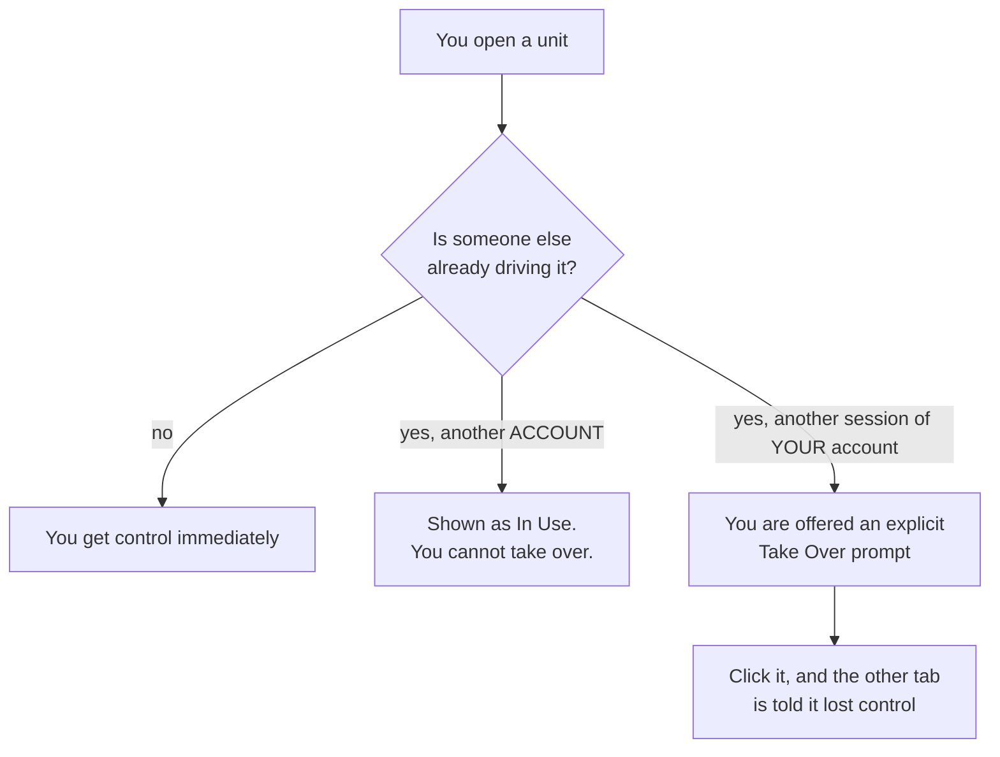
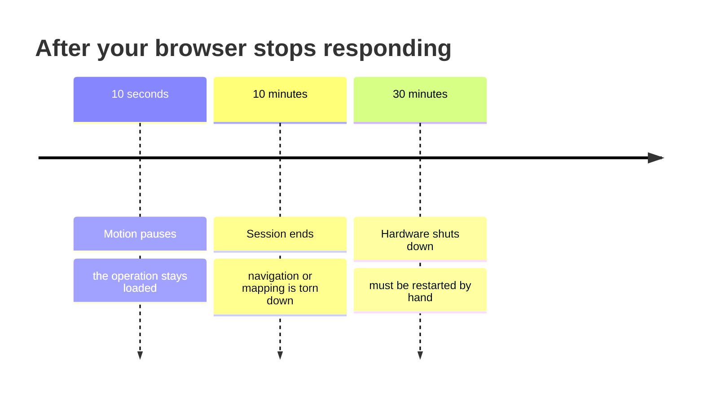
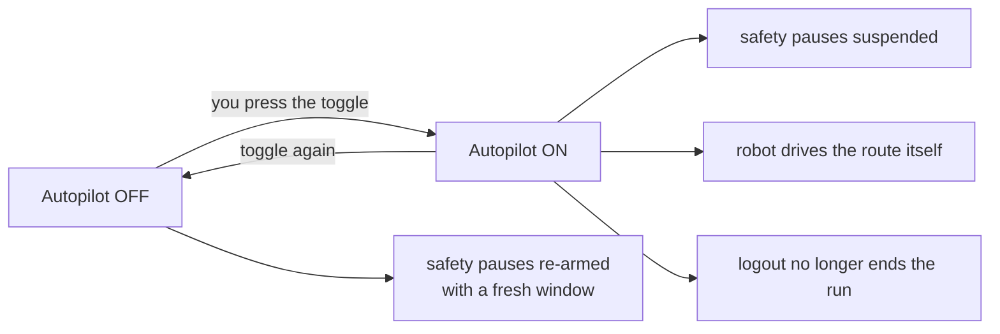
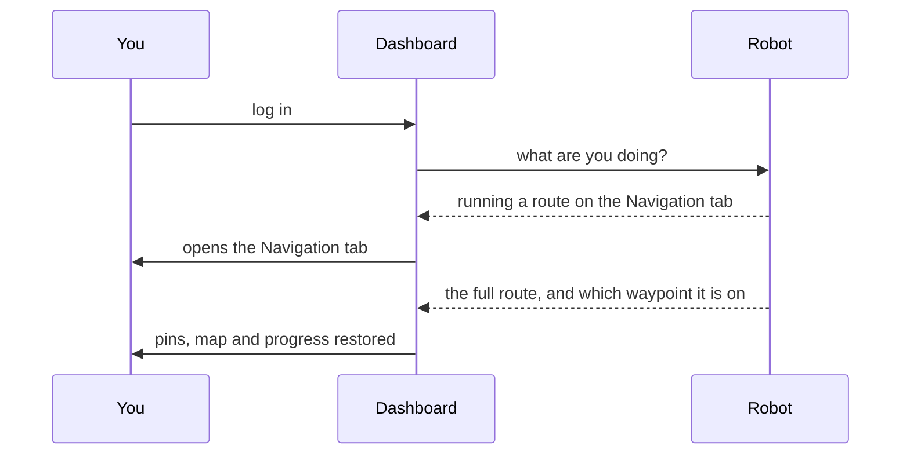

# ロボットの動作仕様

<RoleBadge role="user" />

MSD700は、頼まれなくてもいくつかのことを自分で行います。あなたがいなくなると一時停止しますし、
2人が同時に操作することを拒否しますし、あなたが戻ってきたときには自分が何をしていたかを覚えています。そのどれも
気まぐれではありません。ルールを知っていれば、「ロボットが何か変なことをした」ではなく
「なるほど、そうなるのか」と理解できるようになります。

このページは平易な言葉での説明です。技術的な詳細は
[State and Behavior](/ja/development/state-and-behavior)にあります。

## ロボットが今何をしているか

ダッシュボードには常にロボットの状態が1つ表示されます。実際に目にするのは以下のものです。

| ステータス | 意味 | 正常か |
| --- | --- | --- |
| **Idle** | 何も実行していません。コマンド待機中です。 | はい |
| **Manual** | W-A-S-Dで手動操作中です。 | はい |
| **On Progress** | 地点へ移動中、またはルートを実行中です。 | はい |
| **Arrived** | ゴールに到達した、またはカバレッジ実行が完了しました。 | はい |
| **Mapping** | マップを構築中です。 | はい |
| **Paused** | あなたが一時停止しました。中断した地点から再開します。 | はい |
| **Robot Stuck** | 動くはずなのに動いていません。 | [下記参照](#robot-stuck) |
| **Emergency Stopped** | E-Stopが作動中です。解除されるまで何も動きません。 | あなたが作動させた場合のみ |

::: info スコアを管理しているのはロボット自身であり、あなたのブラウザではありません
上記のすべての状態はロボット自体に保持されています。そのため、タブを閉じたり、リロードしたり、
別のコンピュータに切り替えたりしても操作は失われません。また、パネルのトグルスイッチが、
最後にあなたがクリックした状態ではなく、実際にロボットで作動している状態に戻るのもこのためです。
:::

## 一度に操作できるのは1人だけ

| 表示される内容 | 意味 | できること |
| --- | --- | --- |
| 特に何も表示されない | このユニットは空いています | 操作できます |
| ユニット一覧の **In Use** バッジ | 別の**アカウント**が操作中です | 待つか、その相手に確認してください。ユニットを開くこと自体は問題なく、単に制御権が得られないだけです |
| **Take Over** プロンプト | **あなた自身**の別セッション(2つ目のタブ、またはユニット自体のローカルダッシュボード)が制御権を持っています | 意図的に引き継ぐと、もう一方には制御権を失ったことが明示的に通知されます |

::: warning 自分自身の2つのタブが同時に操作することはできません
これは意図的な仕様です。2つのタブがそれぞれ1台のロボットにコマンドを送ると互いに干渉し合い、
どちらのタブももう一方の存在を知ることができません。引き継いだタブが勝ち、もう一方は
誰にも適用されないコマンドを黙って送り続けるのではなく、制御権を失ったことを通知されます。
:::

制御権は更新が必要な**リース**です。ブラウザが更新を止めると、約15秒後にリースが失効し、
そのユニットは次の人のために空きます。これにより、クラッシュしたタブや閉じたノートPCが
誰も使えない状態でロボットを占有し続けることがなくなります。

## 接続が切れたときに起こること

ロボットはあなたのダッシュボードを監視しています。あなたからの応答が途絶えると、
段階的に間隔を広げながら3つのことが起こります。

| 経過後 | 起こること | 自動で回復するか |
| --- | --- | --- |
| **10秒** | ロボットは動きを止めます。実行していた内容はその下に保持されたままです。 | **はい。** 再接続すれば中断した地点から再開します |
| **10分** | 操作全体が破棄され、ロボットはアイドル状態になります。 | いいえ。操作を最初からやり直す必要があります |
| **30分** | すべてのハードウェアの電源が切れます。 | いいえ。技術者による対応、または明示的な再起動が必要です |

::: info どのページを開いているかが重要です
10秒の一時停止は、実行中の操作を保持しているページが応答を止めた時間だけをカウントします。
ユニット一覧やログインページを開いているだけでは、ロボットを監視しているとはみなされません。
これらのページは意図的に読み取り専用になっており、どこかでダッシュボードを開いたままにしていることが
ロボットの監視とみなされることがないようにしています。
:::

### 意図的に一時停止を無効にする: オートパイロット

オートパイロットは「離れてもよい」と伝える手段です。オンにすると:

- ロボットは**ブラウザが一切接続されていない状態**でも走行を続けます。
- 切断時の一時停止、10分のアイドル、30分のシャットダウンはすべて停止(一時的に無効化)されます。
- ウェイポイントを進める処理は、ブラウザではなくロボット自身が引き継ぎます。
- ログアウトしても実行中のミッションは**停止しません**。

::: danger オートパイロットは、誰も見ていない状態でロボットが動き続けることを意味します
それこそがオートパイロットの目的であり、長時間の無人ルートには適切な選択です。一方で、
人の近くや、まだ走行実績のない空間では誤った選択です。オフに戻すと、
すべての安全一時停止が即座に再有効化されます。
:::

::: info オートパイロットはロボットを動かし続けるだけで、あなたの操作権を予約するものではありません
あなたの制御リースは、15秒間更新がなければそれでも失効します。他の誰かがユニットを引き継ぎ、
進行中の実行を制御できます。どちらの場合でもミッション自体は継続します。
:::

## 戻ってきたとき

すべてを閉じた後に再度ログインすると、ダッシュボードは元の状態に戻します。

ロボットは操作全体を返します。ウェイポイント、現在どこにいるか、マップ、カバレッジエリアなど
すべてです。これらはいずれもあなたのブラウザ由来のものではないため、別のコンピュータでも
そのまま引き継がれます。

| 状況 | 戻ってくるもの |
| --- | --- |
| ルート途中でリロード | すべて。ルートは継続します |
| タブを閉じて新しいタブを開いた | すべて。ルートは継続します |
| 別のマシンでログインした | すべて。ルートは継続します |
| ロボットが一時停止中だった | すべて。一時停止したままです。再生ボタンを押してください |
| あなたが離れている間にロボットが完了していた | 完了状態そのもの。幻の実行ではありません |

::: info Databaseページからマップを開くことは意図的なリセットです
これは、現在のセッション状態を復元するのではなく消去する唯一の操作です。実行中の処理を
再開したい場合は、マップを開き直すのではなくユニットに戻ってください。
:::

## Robot Stuck

このバナーは、ロボットが「動くべきだ」と認識しているのに動いていないことを意味します。

| 表示されるタイミング | 通常の状況 |
| --- | --- |
| 急旋回中に一瞬だけ | 正常です。無視してください |
| エリアカバレッジ実行を開始した直後 | 正常です。清掃経路を計算中で、最大1分ほどかかることがあります |
| 明らかに動いていない状態が数分続く | 実際の障害物、または経路計画の失敗です |
| ロボットが目に見えて走行中の場合 | バグです。回避せず報告してください |

数分経っても表示され続ける場合は、カメラ映像で障害物がないか確認し、
[トラブルシューティング](/ja/getting-started/troubleshooting)を参照してください。

## 緊急停止

E-Stopは通常のコマンドではなく、他の処理の後ろに並ぶこともありません。

- ロボット上のあらゆる他の動作要因より優先されるため、他に何が実行中であっても即座に作動します。
- 明示的に解除されるまで作動し続けます。
- 誰が制御権を持っているかに関わらず、すべてのページで常に利用可能です。

::: warning 新しいユニットごとに一度テストしてください
できれば実際に必要になる前に、ロボットの周囲に十分なスペースを確保した状態で行ってください。
ユニットは一見完全に接続されているように見えても、コマンド経路が一方向だけ壊れていることがあり、
E-Stopはまさにそれを本番で発見したくない機能です。
:::

## 関連ページ

- [クイックスタート](/ja/getting-started/quick-start)
- [機能](/ja/getting-started/features)
- [FAQ](/ja/getting-started/faq)
- [トラブルシューティング](/ja/getting-started/troubleshooting)
