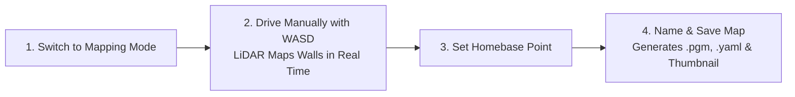
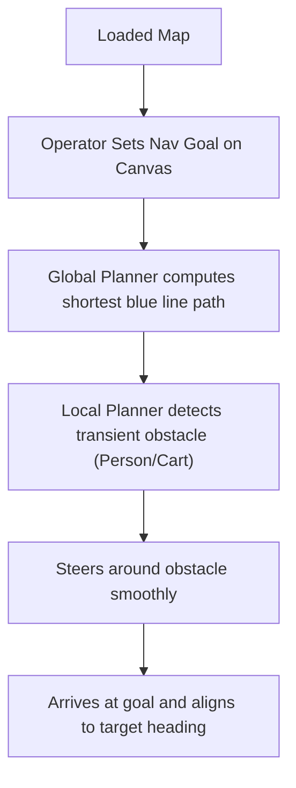
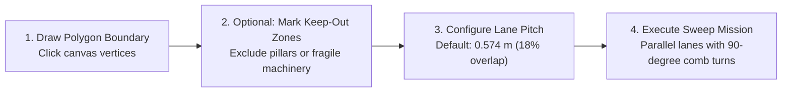
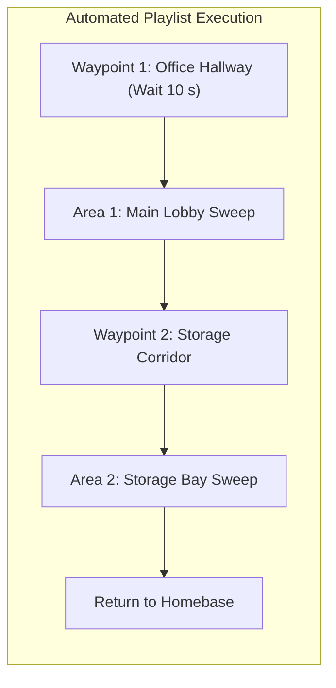

# システム機能 & ユーザーガイド

<RoleBadge role="user" />

本ドキュメントは、MSD700 Webダッシュボードで利用可能なすべての機能に関する包括的な操作ガイドです。

---

## 1. 自律SLAMマッピング

Simultaneous Localization and Mapping(SLAM)は、新しい施設のデジタル2D床図を生成するために使用されます。

### マッピング手順(ステップバイステップ):
1. 上部ナビゲーションバーで **Mapping** タブをクリックします。
2. **Start Mapping Session** をクリックします。ロボットは360度LiDARを初期化し、新しい空のグリッドキャンバスを開きます。
3. キーボードの `W`、`A`、`S`、`D` キーを使い、ロボットをゆっくり(約`0.15 m/s`)走行させて環境を巡回します。
4. 黒い線(壁/障害物)と明るいグレーの領域(開けた空きスペース)が現れる様子をライブマップキャンバスで確認します。
5. すべての部屋と廊下がきれいにマッピングされたら、ロボットを想定している開始/充電ステーションまで戻します。
6. ツールバーの **Set Homebase Here** をクリックします。これにより、今後のミッションの基準原点がマークされます。
7. **Save Map** をクリックし、わかりやすい名前(例: `First_Floor_Warehouse`)を入力して **Confirm** をクリックします。
8. マップはロボットにローカル保存されると同時に、自動的にクラウドリポジトリへ同期されます。

---

## 2. 地点間ナビゲーション

自動経路計画と動的な障害物回避により、ロボットを正確な座標へ送ることができます。

### 経路キャンバスの視覚的インジケーター:
- **青い線**: 静的なマップ形状全体で計算されたグローバル計画経路です。
- **緑/赤の軌跡**: リアルタイムに計算されるアクティブなローカル軌跡です(最大4メートル先まで)。
- **赤いレーザードット**: リアルタイムの障害物を示すライブ2D LiDAR反射点です。
- **半透明のハル**: ロボットを取り囲む安全フットプリントのエンベロープです。

---

## 3. ボウストロフェドン(往復走査)エリアカバレッジ清掃

床清掃、紫外線消毒、表面検査のために、ロボットはカスタムポリゴン境界内で体系的な往復清掃パスを実行します。

### カバレッジ設定オプション:
1. **ポリゴンの描画**: **Draw Area** ツールをクリックし、キャンバス上を順にクリックして清掃領域の輪郭を描きます。ダブルクリックするか最初の頂点をクリックしてポリゴンを閉じます。
2. **立入禁止ゾーン**: エリア内に **No-Cover** としてマークされたポリゴンを描き、ロボットが危険区域や制限区域に進入しないようにします。
3. **清掃方向**: 旋回回数を最小限に抑えるため、清掃角度を部屋の長軸に合わせます。
4. **レーンピッチ**: デフォルトは `0.574 m` で、100%のカバレッジを保証するために、0.70 mのシャーシ幅と18%のレーンオーバーラップから算出されています。

---

## 4. マルチウェイポイントルート & 連続プレイリスト

複数のナビゲーションゴールとカバレッジエリアを連結し、自動ミッションプレイリストとして実行できます。

### プレイリストの作成と実行:
1. **Playlists** タブに移動します。
2. **Create New Playlist** をクリックし、名前を付けます(例: `Nightly_Sanitization_Routine`)。
3. **Add Step** をクリックし、ライブラリから保存済みのウェイポイントまたはカバレッジエリアを選択します。
4. 特定のウェイポイントでオプションの一時停止時間を設定します(例: 点検チェックポイントで30秒待機)。
5. **Autopilot Mode ON** を切り替え、**Start Playlist** をクリックします。
6. ロボットはすべてのステップを順に実行し、完了後にホームベースへ戻ります。

---

## 5. 回転レスな向き合わせ(オートアライン)

マップがすでに記録されている部屋にロボットを配置する場合、従来のロボットは向きを見つけるために360度回転する必要があり、近くの壁やパレットに衝突する可能性があります。

MSD700には **Zero-Spin Auto-Align** が搭載されています。

- ナビゲーションツールバーの **Auto Align** をクリックします。
- ロボットは静的マップに対してCorrelative Scan Matching(CSM)を実行し、**動かずに50ミリ秒未満**で処理を完了します。
- ロボットが対称的な廊下にいる場合は、その場で回転することなく向きを確定するため、前後15cmのわずかなジョグ動作を行います。

---

## 6. ライブHD映像ストリーミング

右上のパネルでは、搭載カメラからのリアルタイム低遅延WebRTC映像ストリームが提供されます。

- **フルスクリーン表示**: 拡大アイコンをクリックして映像フィードを拡大します。
- **フリーズ検出**: 一時的なネットワーク障害により映像ストリームがフリーズした場合、プレーヤーは自動的にpeer-reflexive ICE再接続をトリガーします。

---

## 7. オフラインローカル運用

インターネットやセルラー接続のない施設でロボットを展開する場合:

1. コンピュータまたはタブレットを、ロボット搭載のWi-Fiホットスポット(`MSD700_Unit_<ULID>`)に接続します。
2. ブラウザで `http://<jetson-ip>:3000` を開きます。
3. ヘッダーの **Local Mode Badge** がオフライン運用を確認します。
4. マッピング、ナビゲーション、エリアカバレッジのすべての機能がフル機能で動作します。
5. ロボットがインターネットWi-Fiに再接続したら、Local Badgeをクリックして **Sync Now** を選択し、記録済みのマップをクラウドデータベースへ送信します。

---

## 関連ドキュメント

- [クイックスタートガイド](/ja/getting-started/quick-start): 5分で始める導入手順。
- [ロボットの動作仕様](/ja/getting-started/behavior): セーフティウォッチドッグとセッション復旧。
- [オペレーター向けトラブルシューティング](/ja/getting-started/troubleshooting): よくあるオペレーター問題の診断。
