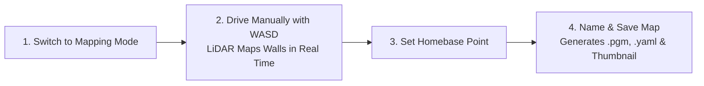
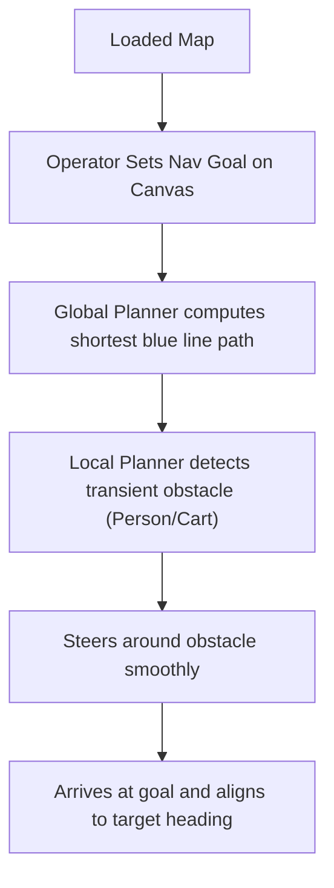
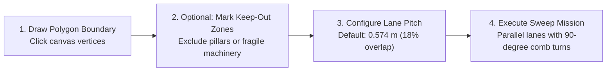
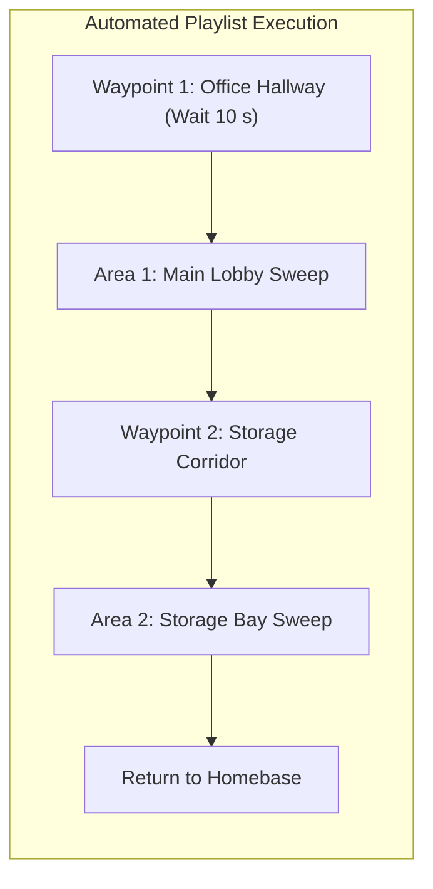

# システム機能とユーザーガイド

<RoleBadge role="user" />

このドキュメントは、MSD700 Web ダッシュボードで利用できるすべての機能についての包括的な操作ガイドを提供します。

---

## 1. 自律的な SLAM マッピング

Simultaneous Localization and Mapping (SLAM) は、新しい施設のデジタル 2D フロアプランを生成するために使用されます。

### 段階的なマッピング手順:
1. 上部のナビゲーション バーで、[**マッピング**] タブをクリックします。
2. [**マッピング セッションの開始**] をクリックします。ロボットは 360 度 LiDAR を初期化し、新しい空白のグリッド キャンバスを開きます。
3. キーボードのキー `W`、`A`、`S`、`D` を使用して、環境内でロボットをゆっくりと (約 `0.15 m/s`) 運転します。
4. ライブ マップ キャンバスに黒い線 (壁/障害物) と明るい灰色の領域 (開いた空きスペース) が現れるのを観察します。
5. すべての部屋と廊下がきれいにマッピングされたら、ロボットを目的の始動/充電ステーションに戻します。
6. ツールバーの **ここにホームベースを設定** をクリックします。これは、将来のミッションの基準となる原点を示します。
7. [**マップの保存**] をクリックし、わかりやすい名前 (例: `First_Floor_Warehouse`) を入力し、**確認** をクリックします。
8. マップはロボットにローカルに保存され、クラウド リポジトリに自動的に同期されます。

---

## 2. ポイントツーポイントのナビゲーション

自動経路計画と動的な障害物回避により、ロボットを正確な座標に送信することができます。

### パス キャンバスの視覚的インジケーター:
- **青線**: 静的マップ ジオメトリ全体で計算されたグローバル計画パス。
- **緑/赤の軌道**: リアルタイムで計算されたアクティブなローカル軌道 (最大 4 メートル先)。
- **赤色レーザー ドット**: リアルタイムの障害物を示すライブ 2D LiDAR 反射ポイント。
- **半透明のハル**: ロボットを囲む安全フットプリントのエンベロープ。

---

## 3. ボストロフェドンエリアの網羅範囲の徹底的な調査

床の清掃、紫外線消毒、または表面検査の場合、ロボットはカスタムの多角形の境界内で体系的な蛇行スイープ パスを実行します。

### カバレッジ設定オプション:
1. **多角形の描画**: **領域の描画** ツールをクリックし、キャンバス上の連続した点をクリックして、クリーニング領域の輪郭を描きます。ダブルクリックするか、最初の頂点をクリックして多角形を閉じます。
2. **立ち入り禁止ゾーン**: **立ち入り禁止**とマークされたエリア内に多角形を描画し、ロボットが危険ゾーンまたは制限ゾーンに入らないようにします。
3. **掃引方向**: 旋回サイクルを最小限に抑えるために、掃引角度を部屋の長軸に合わせます。
4. **レーン ピッチ**: デフォルトは `0.574 m` で、100% のカバレッジを保証するために 18% のレーン オーバーラップを持つ 0.70 m のシャーシ幅から計算されます。

---

## 4. マルチウェイポイントルートとシーケンスプレイリスト

複数のナビゲーション目標とカバーエリアを自動化されたミッションプレイリストに連鎖させることができます。

### プレイリストの作成と実行:
1. [**プレイリスト**] タブに移動します。
2. [**新しいプレイリストの作成**] をクリックし、名前を付けます (例: `Nightly_Sanitization_Routine`)。
3. [**ステップの追加**] をクリックし、ライブラリから保存されたウェイポイントまたはカバレッジ エリアを選択します。
4. 特定のウェイポイントでオプションの一時停止滞留時間を設定します (例: 検査チェックポイントで 30 秒待機します)。
5. **オートパイロット モードをオン**に切り替え、**プレイリストの開始**をクリックします。
6. ロボットは各ステップを順番に実行し、完了するとホームベースに戻ります。

---

## 5. ゼロスピンヘディングアライメント (自動アライメント)

地図がすでに記録されている部屋にロボットを配置する場合、従来のロボットは進行方向を見つけるために 360 度回転する必要があり、近くの壁やパレットに衝突する可能性があります。

MSD700 には **ゼロスピン自動調整** が含まれています:
- ナビゲーション ツールバーの [**自動位置合わせ**] をクリックします。
- ロボットは、移動することなく **50 ミリ秒未満**で静的マップに対して相関スキャン マッチング (CSM) を実行します。
- ロボットが対称の廊下にある場合、その場で回転せずに方向を確立するために、微妙に 15 cm 前後にジョグを実行します。

---

## 6. ライブ HD ビデオ ストリーミング

右上のパネルは、オンボード カメラからリアルタイムの低遅延 WebRTC ビデオ ストリームを直接提供します。

- **全画面表示**: ビデオ フィードを拡大するには、展開アイコンをクリックします。
- **ストール検出機能**: 一時的なネットワークの中断によりビデオ ストリームがフリーズした場合、プレーヤーは自動的にピア反射 ICE 再接続をトリガーします。

---

## 7. オフラインでのローカル操作

インターネットまたは携帯電話接続のない施設にロボットを導入する場合:

1. コンピューターまたはタブレットをロボットのオンボード Wi-Fi ホットスポット (`MSD700_Unit_<ULID>`) に接続します。
2. ブラウザで `http://<jetson-ip>:3000` を開きます。
3. ヘッダーの **ローカル モード バッジ** は、オフライン操作を示します。
4. すべてのマッピング、ナビゲーション、エリア カバレッジ機能は完全な機能で動作します。
5. ロボットがインターネット Wi-Fi に再接続したら、ローカル バッジをクリックし、**今すぐ同期** を選択して、記録されたマップをクラウド データベースにプッシュします。

---

## 関連ドキュメント

- [クイック スタート ガイド](/ja/getting-started/quick-start): 5 分で開始できます。
- [ロボットの動作](/ja/getting-started/behavior): 安全監視とセッション回復。
- [オペレーターのトラブルシューティング](/ja/getting-started/troubleshooting): オペレーターの一般的な問題を診断します。