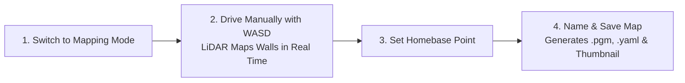
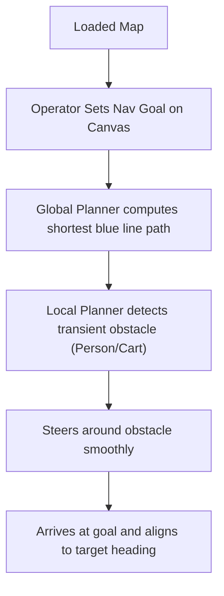
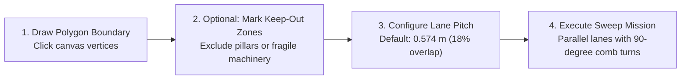
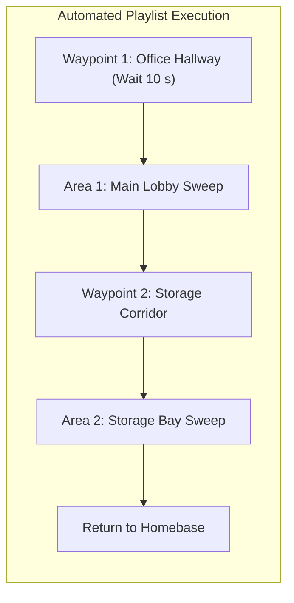

# System Features & User Guide

<RoleBadge role="user" />

This document provides a comprehensive operational guide to all features available in the MSD700 web dashboard.

---

## 1. Autonomous SLAM Mapping

Simultaneous Localization and Mapping (SLAM) is used to generate a digital 2D floorplan of a new facility.

### Step-by-Step Mapping Procedure:
1. In the top navigation bar, click the **Mapping** tab.
2. Click **Start Mapping Session**. The robot initializes its 360-degree LiDAR and opens a fresh blank grid canvas.
3. Drive the robot slowly (approx. `0.15 m/s`) through the environment using keyboard keys `W`, `A`, `S`, `D`.
4. Observe the live map canvas as black lines (walls/obstacles) and light gray areas (open free space) emerge.
5. Once all rooms and corridors are cleanly mapped, drive the robot back to its intended starting/charging station.
6. Click **Set Homebase Here** on the toolbar. This marks the reference origin for future missions.
7. Click **Save Map**, enter a descriptive name (e.g. `First_Floor_Warehouse`), and click **Confirm**.
8. The map is saved locally to the robot and synchronized to the cloud repository automatically.

---

## 2. Point-to-Point Navigation

Allows sending the robot to precise coordinates with automatic path planning and dynamic obstacle avoidance.

### Path Canvas Visual Indicators:
- **Blue Line**: The global planned path computed across static map geometry.
- **Green/Red Trajectory**: The active local trajectory calculated in real time (up to 4 meters ahead).
- **Red Laser Dots**: Live 2D LiDAR reflection points showing real-time obstacles.
- **Translucent Hull**: The safety footprint envelope surrounding the robot.

---

## 3. Boustrophedon Area Coverage Sweeping

For floor cleaning, ultraviolet disinfection, or surface inspection, the robot performs systematic serpentine sweep passes within custom polygonal boundaries.

### Coverage Configuration Options:
1. **Polygon Drawing**: Click the **Draw Area** tool, then click sequential points on the canvas to outline the cleaning region. Double-click or click the first vertex to close the polygon.
2. **Keep-Out Zones**: Draw polygons inside the area marked as **No-Cover** to prevent the robot from entering hazardous or restricted zones.
3. **Sweep Direction**: Align the sweep angle to the long axis of the room to minimize turning cycles.
4. **Lane Pitch**: Default is `0.574 m`, calculated from the 0.70 m chassis width with 18% lane overlap to guarantee 100% coverage.

---

## 4. Multi-Waypoint Routes & Sequence Playlists

You can chain multiple navigation goals and coverage areas into automated mission playlists.

### Creating and Running a Playlist:
1. Navigate to the **Playlists** tab.
2. Click **Create New Playlist** and give it a name (e.g. `Nightly_Sanitization_Routine`).
3. Click **Add Step** and select saved waypoints or coverage areas from your library.
4. Set optional pause dwell times at specific waypoints (e.g. wait 30 seconds at an inspection checkpoint).
5. Toggle **Autopilot Mode ON** and click **Start Playlist**.
6. The robot will execute every step in sequence and return to its homebase when finished.

---

## 5. Zero-Spin Heading Alignment (Auto-Align)

When placing the robot in a room whose map is already recorded, traditional robots must rotate 360 degrees to find their heading, which can collide with nearby walls or pallets.

MSD700 includes **Zero-Spin Auto-Align**:
- Click **Auto Align** on the navigation toolbar.
- The robot performs Correlative Scan Matching (CSM) against the static map in **less than 50 milliseconds without moving**.
- If the robot is in a symmetric corridor, it performs a subtle 15 cm forward/backward jog to establish heading without rotating in place.

---

## 6. Live HD Video Streaming

The top-right panel provides a real-time, low-latency WebRTC video stream directly from the onboard camera.

- **Full Screen View**: Click the expand icon to enlarge the video feed.
- **Stall Detector**: If the video stream freezes due to temporary network disruption, the player automatically triggers peer-reflexive ICE reconnection.

---

## 7. Offline Local Operation

When deploying the robot in facilities without internet or cellular connectivity:

1. Connect your computer or tablet to the robot's onboard Wi-Fi hotspot (`MSD700_Unit_<ULID>`).
2. Open `http://<jetson-ip>:3000` in your browser.
3. The **Local Mode Badge** in the header confirms offline operation.
4. All mapping, navigation, and area coverage features operate with full functionality.
5. When the robot reconnects to internet Wi-Fi, click the Local Badge and select **Sync Now** to push recorded maps to the cloud database.

---

## Related Documentation

- [Quick Start Guide](/ja/getting-started/quick-start): Getting started in 5 minutes.
- [How the Robot Behaves](/ja/getting-started/behavior): Safety watchdogs and session recovery.
- [Operator Troubleshooting](/ja/getting-started/troubleshooting): Diagnosing common operator issues.
