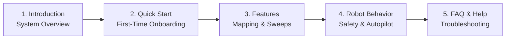

# Getting Started

<RoleBadge role="user" />

Welcome to the **MSD700 Operator User Guide**. This documentation is designed for fleet operators, researchers, and field technicians who use the web dashboard to control, map, and supervise MSD700 autonomous robots.

No programming or robotics experience is required to operate the robot via the web interface.

<LinkCards>
  <LinkCard icon="📖" title="Introduction" details="Learn about the MSD700 platform, hardware capabilities, and cloud architecture." link="/ja/getting-started/introduction" />
  <LinkCard icon="🚀" title="Quick Start Guide" details="Step-by-step instructions to log in, select a robot, and execute your first mission." link="/ja/getting-started/quick-start" />
  <LinkCard icon="✨" title="System Features" details="Comprehensive guide to teleoperation, SLAM mapping, area sweeps, and camera streaming." link="/ja/getting-started/features" />
  <LinkCard icon="🤖" title="How the Robot Behaves" details="Understand safety watchdogs, operating leases, Autopilot persistence, and session recovery." link="/ja/getting-started/behavior" />
  <LinkCard icon="❓" title="Frequently Asked Questions" details="Answers to common operational questions regarding battery, maps, and connectivity." link="/ja/getting-started/faq" />
  <LinkCard icon="🛠️" title="Operator Troubleshooting" details="Quick solutions for common operator symptoms like video stalls and goal aborts." link="/ja/getting-started/troubleshooting" />
</LinkCards>

## Recommended Reading Path for Operators

## System Requirements

- **Supported Browsers**: Google Chrome (recommended) or Microsoft Edge (modern Chromium-based browser with WebRTC support).
- **Display Resolution**: Optimized for desktop and laptop displays (1366 x 768 or higher) to display map canvases, live camera feeds, and telemetry side-by-side.
- **Network**: Internet access for cloud dashboard (`msd.nglobal.jp`), or local Wi-Fi connection when operating robots offline in the field.
