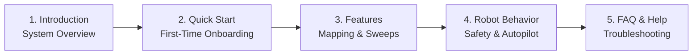

# はじめに

<RoleBadge role="user" />

**MSD700 オペレーター ユーザー ガイド**へようこそ。このドキュメントは、Web ダッシュボードを使用して MSD700 自律型ロボットを制御、マッピング、および監督するフリート オペレーター、研究者、およびフィールド技術者を対象に設計されています。

Web インターフェイス経由でロボットを操作するのに、プログラミングやロボット工学の経験は必要ありません。

<LinkCards>
  <LinkCard icon="📖" title="導入" details="MSD700 プラットフォーム、ハードウェア機能、クラウド アーキテクチャについて学びます。" link="/ja/getting-started/introduction" />
  <LinkCard icon="🚀" title="クイックスタートガイド" details="ログインし、ロボットを選択し、最初のミッションを実行するための段階的な手順。" link="/ja/getting-started/quick-start" />
  <LinkCard icon="✨" title="システムの特徴" details="遠隔操作、SLAM マッピング、エリア スイープ、カメラ ストリーミングに関する包括的なガイド。" link="/ja/getting-started/features" />
  <LinkCard icon="🤖" title="ロボットの動作" details="安全性ウォッチドッグ、オペレーティング リース、オートパイロットの永続性、およびセッションの回復について理解します。" link="/ja/getting-started/behavior" />
  <LinkCard icon="❓" title="よくある質問" details="バッテリー、マップ、接続に関する一般的な操作に関する質問への回答。" link="/ja/getting-started/faq" />
  <LinkCard icon="🛠️" title="オペレーターのトラブルシューティング" details="ビデオの停止や目標の中止など、オペレーターの一般的な症状に対する迅速な解決策。" link="/ja/getting-started/troubleshooting" />
</LinkCards>

## オペレーター向けの推奨読書パス

## システム要件

- **サポートされているブラウザ**: Google Chrome (推奨) または Microsoft Edge (WebRTC をサポートする最新の Chromium ベースのブラウザ)。
- **ディスプレイ解像度**: デスクトップおよびラップトップのディスプレイ (1366 x 768 以上) に最適化され、マップ キャンバス、ライブ カメラ フィード、テレメトリを並べて表示します。
- **ネットワーク**: クラウド ダッシュボード (`msd.nglobal.jp`) 用のインターネット アクセス、または現場でロボットをオフラインで操作する場合のローカル Wi-Fi 接続。