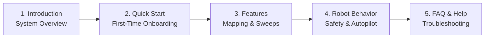

# 導入ガイド

<RoleBadge role="user" />

**MSD700 オペレーター向けユーザーガイド**へようこそ。本ドキュメントは、Webダッシュボードを使ってMSD700自律ロボットの操作、マッピング、監視を行うフリートオペレーター、研究者、フィールド技術者を対象としています。

Webインターフェースからロボットを操作するにあたり、プログラミングやロボティクスの知識は一切必要ありません。

<LinkCards>
  <LinkCard icon="📖" title="概要" details="MSD700プラットフォーム、ハードウェアの能力、クラウドアーキテクチャについて学びます。" link="/ja/getting-started/introduction" />
  <LinkCard icon="🚀" title="クイックスタートガイド" details="ログイン、ロボットの選択、最初のミッション実行までのステップバイステップの手順です。" link="/ja/getting-started/quick-start" />
  <LinkCard icon="✨" title="システム機能" details="テレオペレーション、SLAMマッピング、エリア清掃、カメラストリーミングの包括的なガイドです。" link="/ja/getting-started/features" />
  <LinkCard icon="🤖" title="ロボットの動作仕様" details="セーフティウォッチドッグ、操作リース、オートパイロットの持続性、セッション復旧について理解します。" link="/ja/getting-started/behavior" />
  <LinkCard icon="❓" title="よくある質問 (FAQ)" details="バッテリー、マップ、接続に関する一般的な運用上の質問への回答です。" link="/ja/getting-started/faq" />
  <LinkCard icon="🛠️" title="オペレーター向けトラブルシューティング" details="映像のフリーズやゴール中断など、よくあるオペレーターの症状に対する迅速な解決策です。" link="/ja/getting-started/troubleshooting" />
</LinkCards>

## オペレーター向け推奨読了順序

## システム要件

- **対応ブラウザ**: Google Chrome(推奨)またはMicrosoft Edge(WebRTCに対応したモダンなChromiumベースのブラウザ)。
- **表示解像度**: マップキャンバス、ライブカメラ映像、テレメトリを並べて表示できるよう、デスクトップおよびノートPC向けディスプレイ(1366 x 768以上)に最適化されています。
- **ネットワーク**: クラウドダッシュボード(`msd.nglobal.jp`)へのインターネットアクセス、またはフィールドでロボットをオフライン運用する際のローカルWi-Fi接続。
