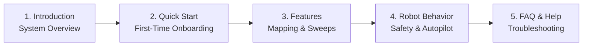

# はじめに

<RoleBadge role="user" />

**MSD700 オペレーター ユーザー ガイド**へようこそ。このドキュメントは、Web ダッシュボードを使用して MSD700 自律型ロボットを制御、マッピング、および監督するフリート オペレーター、研究者、およびフィールド技術者を対象に設計されています。

Web インターフェイス経由でロボットを操作するのに、プログラミングやロボット工学の経験は必要ありません。

<LinkCards>
  <LinkCard icon="📖" title="Introduction" details="Learn about the MSD700 platform, hardware capabilities, and cloud architecture." link="/getting-started/introduction" />
  <LinkCard icon="🚀" title="Quick Start Guide" details="Step-by-step instructions to log in, select a robot, and execute your first mission." link="/getting-started/quick-start" />
  <LinkCard icon="✨" title="System Features" details="Comprehensive guide to teleoperation, SLAM mapping, area sweeps, and camera streaming." link="/getting-started/features" />
  <LinkCard icon="🤖" title="How the Robot Behaves" details="Understand safety watchdogs, operating leases, Autopilot persistence, and session recovery." link="/getting-started/behavior" />
  <LinkCard icon="❓" title="Frequently Asked Questions" details="Answers to common operational questions regarding battery, maps, and connectivity." link="/getting-started/faq" />
  <LinkCard icon="🛠️" title="Operator Troubleshooting" details="Quick solutions for common operator symptoms like video stalls and goal aborts." link="/getting-started/troubleshooting" />
</LinkCards>

## オペレーター向けの推奨読書パス

## システム要件

- **サポートされているブラウザ**: Google Chrome (推奨) または Microsoft Edge (WebRTC をサポートする最新の Chromium ベースのブラウザ)。
- **ディスプレイ解像度**: デスクトップおよびラップトップのディスプレイ (1366 x 768 以上) に最適化され、マップ キャンバス、ライブ カメラ フィード、テレメトリを並べて表示します。
- **ネットワーク**: クラウド ダッシュボード (`msd.nglobal.jp`) 用のインターネット アクセス、または現場でロボットをオフラインで操作する場合のローカル Wi-Fi 接続。