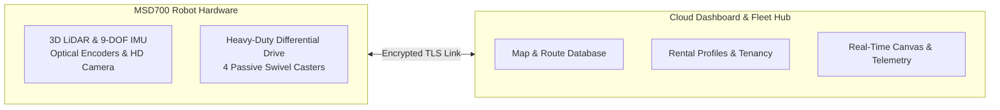

# MSD700 の紹介

<RoleBadge role="user" />

## MSD700とは何ですか?

**MSD700** は、**ITB de Labo Research Lab** によって開発された産業グレードの自律移動ロボットです。これは、倉庫、オフィスの廊下、トンネル、オープンな工業用フロアなどの複雑な屋内環境で、自律的な環境マッピング、ポイントツーポイントのナビゲーション、体系的なエリア カバレッジを実行できるように特別に設計されています。

このロボットは 360 度 3D LiDAR センサー、慣性測定ユニット (IMU)、高解像度光学カメラを備えており、同時位置特定とマッピング (SLAM) を使用してセンチメートル精度の占有グリッド マップをリアルタイムで構築します。

## キーオペレーターの機能

1. **同時ローカリゼーションとマッピング (SLAM)**: ロボットを新しい環境で駆動して 2D フロアプランを作成します。
2. **ポイントツーポイント ナビゲーション**: 地図上の任意の場所をクリックすると、自律的な障害物回避によりロボットがその場所に派遣されます。
3. **ボストロフェドン エリア スイープ**: 部屋や廊下の周囲にポリゴンを描画し、平行なレーンでフロア全体を体系的に掃除するようにロボットに命令します。
4. **自動ミッション プレイリスト**: 複数のウェイポイント ルートと清掃エリアを無人シーケンス プレイリストにチェーンします。
5. **ゼロスピンヘディングアライメント (自動アライメント)**: マップされた部屋にロボットを配置し、360 度回転を妨げることなく即座に位置を調整します。
6. **ライブ HD ビデオ ストリーミング**: 超低遅延の WebRTC ストリーミングを通じてロボットの視点をリアルタイムで監視します。
7. **オフライン スタンドアロン操作**: インターネット アクセスのない遠隔施設で作業する場合は、ロボットのローカル Wi-Fi に直接接続して、完全なダッシュボードをオフラインで使用します。

## ユーザー向けのシステム アーキテクチャ

システムは 2 つの主要な層で構成されています。

|レイヤー |コンポーネント |ユーザーインタラクション |
| --- | --- | --- |
| **クラウド ダッシュボード** |中央サーバー (`https://msd.nglobal.jp`) |ログイン、マップの管理、ルートの割り当て、すべてのレンタル ロボットのフリート ステータスの監視を行う中心的な Web アプリケーション。 |
| **物理ロボット (ユニット)** |オンボード Jetson コンピューター |ナビゲーションの目標を実行する物理マシン。各ユニットには一意の識別子 (ULID) があり、クラウドに安全に接続します。 |

## ユーザーの役割とアクセス

ロボットへのアクセスは **レンタル プロフィール** によって管理されます:

- **フリート オペレーター**: 1 つ以上のレンタル プロファイルに割り当てられた標準ユーザー アカウント。割り当てられたロボットを運転し、地図を記録し、ルートを作成し、テレメトリを監視することができます。
- **ラボ管理者**: テナントのレンタル プロファイルを管理し、オペレーター アカウントをプロビジョニングし、新しいハードウェア ロボットの登録を承認します。

## 次のステップ

- [クイック スタート ガイド](/ja/getting-started/quick-start) に進み、ログインして最初のロボットを制御します。
- マッピングおよびナビゲーション機能の詳細については、[システム機能](/ja/getting-started/features) を参照してください。
- [ロボットの動作](/ja/getting-started/behavior) を参照して、安全ウォッチドッグと自動操縦の永続性を理解してください。