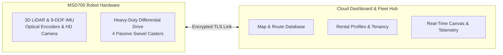

# MSD700 概要

<RoleBadge role="user" />

## MSD700とは

**MSD700**は、**Nakayama Iron Works Ltd.**が設計・製造した産業グレードの自律移動ロボットです。これを操作するための**ROS Web UI**ダッシュボードは**ITB de Labo**が開発しています。倉庫、オフィス廊下、トンネル、開放的な工業フロアといった複雑な屋内環境において、自律的な環境マッピング、地点間ナビゲーション、体系的なエリアカバレッジを行うために設計されています。

360度3D LiDARセンサー、慣性計測装置(IMU)、高解像度光学カメラを搭載し、Simultaneous Localization and Mapping(SLAM)を用いてセンチメートル単位の精度を持つオキュパンシーグリッドマップをリアルタイムに構築します。

## オペレーターが利用できる主な機能

1. **Simultaneous Localization and Mapping(SLAM)**: 新しい環境でロボットを走行させて2D床図を作成します。
2. **地点間ナビゲーション**: マップ上の任意の場所をクリックすると、自律的な障害物回避を伴ってロボットがその位置へ移動します。
3. **ボウストロフェドン(往復走査)エリア清掃**: 部屋や廊下の周囲にポリゴンを描画し、床全体を並行レーンで体系的に清掃するようロボットに指示します。
4. **自動ミッションプレイリスト**: 複数のウェイポイントルートと清掃エリアを、無人で実行できる連続プレイリストとして連結します。
5. **回転レスな向き合わせ(オートアライン)**: マッピング済みの部屋にロボットを配置すると、360度回転による中断なしに即座に位置を合わせます。
6. **ライブHD映像ストリーミング**: 超低遅延のWebRTCストリーミングにより、ロボット視点の映像をリアルタイムで監視できます。
7. **オフラインスタンドアロン運用**: インターネットに接続できない遠隔施設で作業する場合、ロボットのローカルWi-Fiに直接接続することで、ダッシュボードをオフラインでフル活用できます。

## ユーザー向けシステムアーキテクチャ

本システムは2つの主要レイヤーで構成されています。

| レイヤー | コンポーネント | ユーザーとの関わり |
| --- | --- | --- |
| **クラウドダッシュボード** | 中央サーバー(`https://msd.nglobal.jp`) | ログイン、マップ管理、ルート割り当て、レンタル中の全ロボットのフリートステータス監視を行う中央Webアプリケーションです。 |
| **物理ロボット(ユニット)** | 搭載Jetsonコンピュータ | ナビゲーションゴールを実行する物理マシンです。各ユニットは一意の識別子(ULID)を持ち、クラウドに安全に接続されます。 |

## ユーザーの役割とアクセス権

ロボットへのアクセスは**レンタルプロファイル**によって管理されます。

- **フリートオペレーター**: 1つ以上のレンタルプロファイルに割り当てられた標準ユーザーアカウントです。割り当てられたロボットの操作、マップの記録、ルートの作成、テレメトリの監視が可能です。
- **ラボ管理者**: テナントのレンタルプロファイルを管理し、オペレーターアカウントをプロビジョニングし、新しいハードウェアロボットの登録を承認します。

## 次のステップ

- [クイックスタートガイド](/ja/getting-started/quick-start)に進み、最初のロボットにログインして操作してみましょう。
- マッピングとナビゲーション機能の全体像については[システム機能](/ja/getting-started/features)を参照してください。
- セーフティウォッチドッグとオートパイロットの持続性については[ロボットの動作仕様](/ja/getting-started/behavior)を確認してください。
