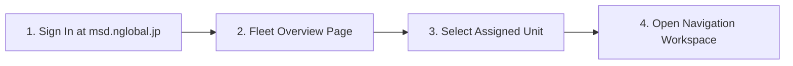
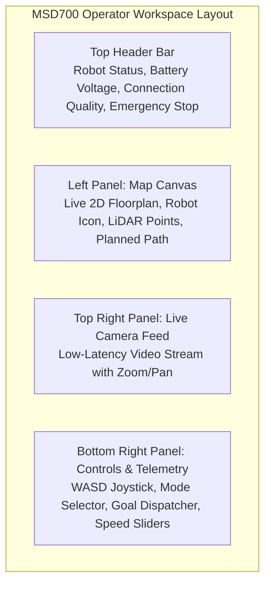
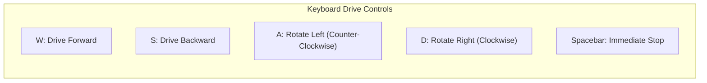
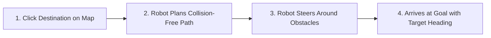

# クイックスタートガイド

<RoleBadge role="user" />

このガイドでは、MSD700 ダッシュボードへのログイン、割り当てられたロボット ユニットの制御、地図の読み込み、最初のナビゲーション ミッションの実行について説明します。

## 前提条件

始める前に、次のものが揃っていることを確認してください。
1. ダッシュボード上のアクティブなユーザー アカウント。
2. 管理者によってアカウントに少なくとも 1 つのロボットが割り当てられます。
3. ラップトップまたはデスクトップ コンピューター上の Google Chrome または Microsoft Edge。

---

## ステップ 1: ダッシュボードにログインする

1. ブラウザを開いて、`https://msd.nglobal.jp` に移動します。
2. ユーザー名とパスワードを入力し、[**サインイン**] をクリックします。

---

## ステップ 2: ロボット ユニットの選択

ログイン後、**フリート ダッシュボード** には、レンタル プロファイルに割り当てられているすべてのロボットが表示されます。

|ステータスバッジ |意味 |許可されるアクション |
| --- | --- | --- |
| <Badge type="tip" text="Online" /> |ロボットはアクティブで接続されており、コマンドの準備ができています。 |ユニットカードをクリックしてダッシュボードを開きます。 |
| <Badge type="warning" text="In Use" /> |別のオペレーターがアクティブに接続されています。 |ユニットを表示モードで開くことも、制御の引き継ぎを要求することもできます。 |
| <Badge type="danger" text="Offline" /> |ロボットの電源がオフになっているか、ネットワークから切断されています。 |ユニットが再接続されるまで待つか、ハードウェアの電源を確認してください。 |

任意の **オンライン** ロボット カードをクリックして、その制御ワークスペースに入ります。

---

## ステップ 3: オペレーター ワークスペースを理解する

オペレータ インターフェイスは 3 つの主要な操作パネルに分かれています。

---

## ステップ 4: マップをロードする

1. 左側のパネルのヘッダーで、[**マップの選択**] ドロップダウンをクリックします。
2. リストから事前に記録されたマップを選択します (例: `Warehouse_Floor_1`)。
3. 2D フロアプランがロボットの現在位置 (方向矢印が付いた青い円形のアイコン) とともにキャンバス上にレンダリングされます。

::: tip No map available?
ドロップダウンにマップが存在しない場合は、[新しいマップの構築 (SLAM)](/ja/getting-started/features#1-autonomous-slam-mapping) を参照して最初のマップを作成します。
:::

---

## ステップ 5: 手動運転 (遠隔操作)

キーボードまたは画面上の仮想ジョイスティックを使用してロボットを手動で操作できます。

### 遠隔操作制御:
- **直線速度スライダー**: 最大前進速度を調整します (デフォルト: `0.20 m/s`、範囲: `0.05` ～ `0.40 m/s`)。
- **角速度スライダー**: 回転回転速度を調整します (デフォルト: `0.40 rad/s`)。
- **仮想ジョイスティック**: 画面上のジョイスティック ハンドルをクリックして、希望の方向にドラッグします。

---

## ステップ 6: ナビゲーション ゴールのディスパッチ (ポイントツーポイント)

ロボットを目標の目的地に自律的に送信するには:

1. キャンバス ツールバーの [**目標のナビゲート**] ボタンをクリックします。
2. 地図上の目的の目的地をクリックします。
3. クリックして外側にドラッグして、ターゲットの見出し矢印の方向を合わせてから放します。
4. ロボットは衝突のないグローバル パス (青線) を計算し、目標まで自律的に移動します。

---

## ステップ 7: 緊急停止 (E-Stop)

**緊急停止** ボタンは、各ページの右上に目立つ位置にあります。

- **非常停止を有効にする**: 赤い **非常停止** ボタンをクリックします (または `Escape` キーを押します)。ロボットはただちにブレーキをかけ、すべての自律ルーチンを停止します。
- **非常停止をクリア**: 安全状態を解決し、**操作を再開**をクリックしてモーターの電源を回復します。

---

## 次のステップ

- [システム機能](/ja/getting-started/features) で体系的なエリア カバレッジを実行する方法を学習します。
- [ロボットの動作](/ja/getting-started/behavior) で安全タイマーと自動操縦を理解します。