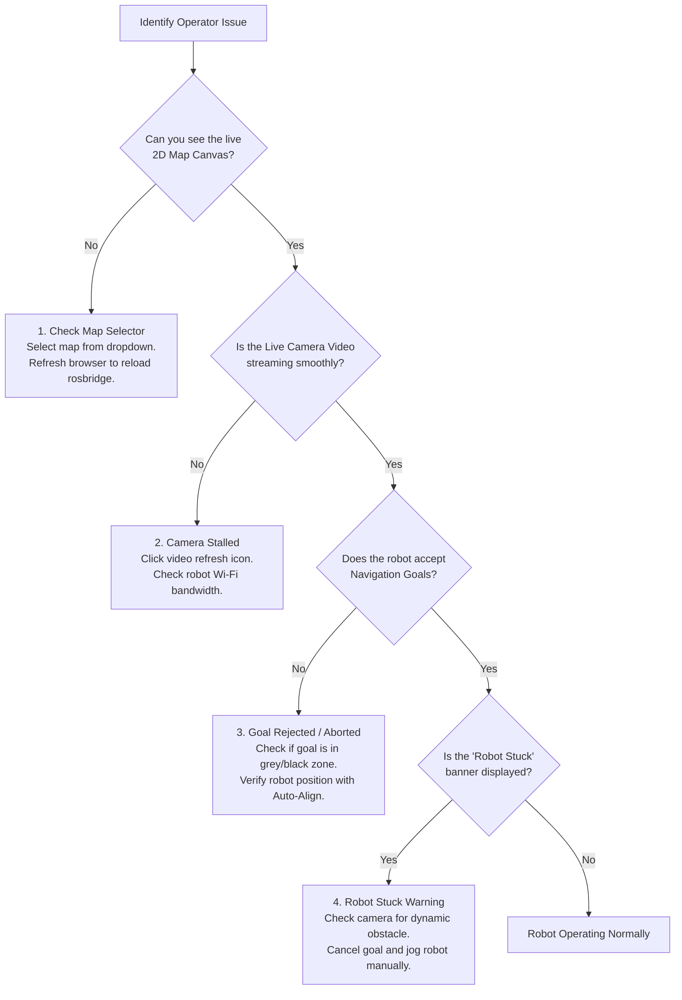

# オペレーターのトラブルシューティング ガイド

<RoleBadge role="user" />

このガイドでは、Web ダッシュボードから MSD700 ロボットを制御する際に発生する一般的な動作上の症状に対する迅速な解決策を提供します。

::: tip Technical or Hardware Diagnostics
低レベルのサーバー エラー、Docker コンテナ ログ、または ROS ドライバー診断については、[技術者用トラブルシューティング ガイド](/ja/setup/troubleshooting) または [開発者向け診断](/ja/development/troubleshooting-guide) を参照してください。
:::

## オペレーター診断フローチャート

---

## 一般的な問題と解決策

### 1. マップ キャンバスが空白または無限ロード スピナー
- **症状**: ナビゲーション ページは開きますが、中央領域はローダーが回転する暗い灰色の画面のままです。
- **考えられる原因**:
  - このユニットに対してアクティブなマップが選択されていません。
  - `rosbridge` へのブラウザの WebSocket 接続が一時的に中断されました。
- **オペレーターのアクション**:
  1. 左上の [**マップの選択**] ドロップダウンを確認します。 「地図が読み込まれていません」と表示された場合は、それをクリックして施設の地図を選択します。
  2. マップが選択されていても空白の場合は、ブラウザのタブを更新します (`Ctrl + F5` または `Cmd + Shift + R`)。
  3. ヘッダーのユニット ステータス バッジに **オンライン** (緑色) が表示されていることを確認します。

---

### 2. ライブカメラのビデオフィードがフリーズまたは真っ黒になる
- **症状**: カメラ ウィンドウに、フリーズしたフレーム、回転ホイール、または黒い四角形が表示されます。
- **考えられる原因**:
  - ロボットとサーバー間の Wi-Fi リンクでの一時的なパケット損失。
  - ブラウザーが WebRTC ICE ネゴシエーションをブロックしました。
- **オペレーターのアクション**:
  1. カメラのヘッダーにある小さな **ストリームの更新** アイコンをクリックします。
  2. Chrome を使用している場合は、ブラウザの設定でハードウェア アクセラレーションが有効になっていることを確認します。
  3. インターネットのないローカル施設ネットワークで動作している場合は、ロボットのローカル Wi-Fi に接続し、`http://<unit-ip>:3000` にアクセスしていることを確認してください。

---

### 3. ナビゲーション目標が中止された / ロボットが移動を拒否した
- **症状**: 2D ナビゲーション目標を設定するかルートを開始すると、ロボットからビープ音が鳴り、ステータスがすぐに `On Progress` から `Idle` または `Goal Aborted` に戻ります。
- **考えられる原因**:
  - 目的地が黒い壁の内側、障害物の内側、または致死膨張バッファー内 (壁から 0.575 m 以内) に配置されている。
  - ロボットはマップに対する位置座標を失いました。
- **オペレーターのアクション**:
  1. 壁や柱から十分に離れた、広くてオープンな空きスペース (明るい灰色の領域) でゴールをクリックします。
  2. ツールバーの **自動位置合わせ** ボタンをクリックして、ロボットの LiDAR スキャンを静的マップと再同期します。
  3. 自動位置合わせが失敗した場合は、ロボットを手動で 0.5 メートル前進させ、自動位置合わせを再トリガーします。

---

### 4.「ロボットがスタックしました」バナーが消えない
- **症状**: キャンバスの上部にあるオレンジ色のバナーに「ロボットのスタック: 回復中」と表示されます。
- **考えられる原因**:
  - 人、フォークリフト、または新たに設置されたボックスが計画された軌道パスを妨げている。
  - ロボットは、1.15 メートル未満の狭い廊下でエリア スイープを試みています。
- **オペレーターのアクション**:
  1. 近くに物理的な障害物がないか、ライブ カメラ フィードとキャンバス上の赤い LiDAR ドットを確認します。
  2. パスが一時的なオブジェクトによってブロックされている場合は、10 秒待ちます。クリアランスが開くと、ローカル プランナーが自動的に障害物を回避します。
  3. ロボットがピンチを解決できない場合は、**一時停止 / 目標のキャンセル** をクリックし、**手動運転** に切り替え、再開する前にロボットを空いた床スペースにジョギングします。

---

### 5. コントロールがロックされました: 「別のオペレーターが使用中」
- **症状**: ロボットを開くと、すべてのドライブ ボタンが「使用中」バナーで無効になります。
- **考えられる原因**:
  - 組織内の別のオペレーター アカウントが現在このユニットを駆動しています。
  - 同じロボットにログインした状態で、別のタブまたはラップトップを開いたままにした。
- **オペレーターのアクション**:
  1. バナーに別の同僚の名前が表示されている場合は、制御を要求する前にその同僚と調整してください。
  2. バナーに自分のアカウントが表示されている場合 (古いタブなど)、[**制御を引き継ぐ**] ボタンをクリックします。前のセッションは正常に切断され、コントロールはアクティブなウィンドウに転送されます。

---

### 6. 非常停止が作動しました
- **症状**: ヘッダーが「緊急停止が作動しました」という状態で赤く点滅し、すべての動きがロックされます。
- **考えられる原因**:
  - オペレーターが `Escape` キーを押すか、画面上の非常停止ボタンをクリックしました。
  - 技術者がロボットの物理ハードウェア非常停止バンパーを作動させました。
- **オペレーターのアクション**:
  1. 物理的なロボット環境が完全に安全であることを確認します。
  2. 物理ハードウェア非常停止が押された場合は、ロボット シャーシのハードウェア ボタンをひねって放します。
  3. Web ダッシュボードで、**緊急停止の解除** をクリックして、モーター コントローラーを再度作動させます。

---

## エスカレーション パス

上記の手順を実行しても問題が解決しない場合:
1. オンサイトの **フィールド技術者** に連絡して、ハードウェアの物理的な電源とセンサーを検査してください。
2. ロボットの ULID (ダッシュボードのヘッダーに表示される、`01JZ8P9WZ...` など) を技術者に提供します。
3. 技術者に「技術者向けトラブルシューティング ガイド」(@@MU3@@) を参照してもらいます。